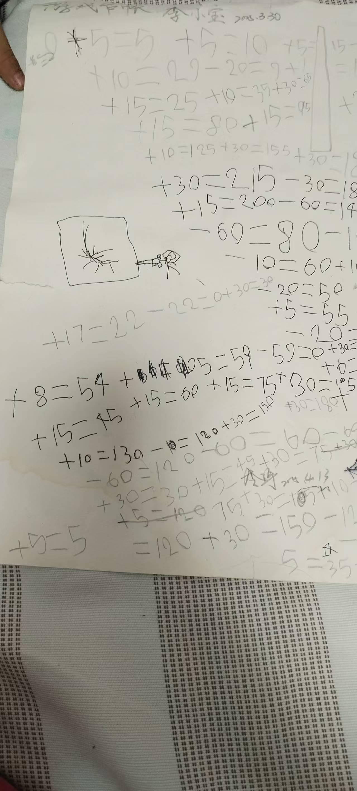

[toc]

# 问题

提问者：**<a href="https://www.zhihu.com/people/bu-yao-mei-ren-yao">手可摘星陈</a>**
提问时间: 2021-3-4 19:49:17

爸爸带大的孩子是什么样子？

# 回答

回答者： **<a href="https://www.zhihu.com/people/hel-87">Denny</a>**
回答时间: 2025-3-13 12:54:1
点赞总数: 16541
评论总数: 573
收藏总数: 23667
喜欢总数：890

儿子6岁，喜欢玩游戏，奶奶妈妈管不了（撒娇+发赖+哭 直接破防），就丢给我来管，要求控制游戏时间和作息。

花了1秒时间做了一个策划（拍脑袋）

我是让儿子做事换游戏时间，他喜欢玩MC。

按时完成作业，整理饭桌，端碗，扔垃圾，提前睡觉…

反正好事都可以换。以前妈妈奶奶舍不得干让他干的，现在啥都会，然后拿着小本本来和我对账，开开心心的玩会游戏。

有时时间不够用，自己创造“就业”机会，开发了整理鞋子，擦桌子，给妈妈按摩，生病吃药，拖地、把压岁钱给奶奶买菜…开展新业务来创收［大笑］

这些家务他能干一大半，虽然做的不是特别好。但是，还要什么自行车呢？［摊手］

他大概已经忘记以前啥都不做照样可以玩

嗯，父慈子孝，阖家欢乐，其乐融融

  

有时他也有小九九，比如兑换1小时他会在PAD上定1小时10分钟。

道高一尺魔高一丈，被他爱玩游戏+资深打工经历的老爸我一眼看穿：不定时飞检。发现一次，扣游戏时间双倍并且不低于30分钟［大笑］

几次拉扯之后，规则明确，神圣不可侵犯。

和儿子斗其乐无穷哈哈

他现在可以独立做很多事情，还能释放他无穷精力（6岁的小孩，精力真是∞），妈妈奶奶带他时，简直懒癌上身，一句话：饭来张口，衣来伸手。现在好了，劳动小能手。

PS:每次兑换游戏时间我搞得很仪式感“这是我们小宝的游戏时间，大家都不要打扰，儿子你自己定时间，开～～始～～！

姐姐看到弟弟玩游戏时有爸爸保护，不会被收手机，感觉大受震撼，踊跃加入。好嘛，来者不拒，愿者上钩

___

 **2025.4.26**   
更新一下

随口一答，没想到这么多人感兴趣，还有朋友要汇率我笑死哈哈！你可真别说，真有！【唉这是我得到最多的赞。。。】

独家秘籍，有缘人得之  
 **不要注重形式要领悟精神**   
孙子曰：故校之以计，而索其情，曰:主孰有道？将孰有能？天地孰得？法令孰行？士卒孰练？赏罚孰明？ **以上若无，啥法都不中** 。（狗头闪现）

 **其计如下：**   
 **\-----------------------------------------------------------------------------------------------**   
 **挣时间：** 

1.劳动技能：各种家务5-10分钟  
2.作息习惯：9点前睡觉奖励一半早睡时间  
3.学习能力：按时完成作业，根据质量10~15分钟  
4.学习效果：95分以上周末不用额外学习；考试100分一科奖励60分钟  
5.特别表现：全部100分周末随便嗨，另送自选美食一份  
  
 **汇率：**   
根据屏幕大小汇率不同，屏幕越小时间越贵。（主要是保护视力）  
电视 【1：2】（半小时内免费）  
电脑 【1：1.5】  
IPAD 【1：1】  
手机 【1：0.5】  
自己的时间随便花（截至晚上9：00，周末9：30），每次持续不能超过1小时，超过1小时就要休息2小时或数500辆汽车（阳台500米外有一条马路）。

不定时抽查视力（家里挂了个视力表），如果发下视力下降，根据情况暂停所有电子产品消费0.5天～1周。

 **消费规则：**   
1.每人一个时间存折，存款和消费以此为据  
2.账本丢失，时间抹零，若有负值则新帐从此值始  
3.自觉记录 挣/花时间，爸爸每周 **签字**   
4.拒绝寅吃卯粮超前消费，概不赊账（被罚除外）。  
5.时间可以自由交易（姐弟之间），大人不得干涉。  
6.禁止玩高于年龄分级的游戏（大人陪同除外）  
 **规则有调整时，全家宣导，全员维护** 

 **处罚：**   
弄虚作假者，一旦查证双倍时间惩罚。  
认错态度不诚恳者加重处罚，严重者直接抹零（可以扣到负值）。  
  
 **效果反馈：**   
和孩子们一起探讨、制定游戏规则。根据群众意见持续更新，大家都很有成就感，自觉维护规则。

一段时间下来，感觉利大于弊。  
1.自理能力+1  
2.丢三拉四现象-1  
3.自发学会规划游戏时间  
4.老二的算术能力提高了（什么加减，什么分钟小时换算...）  
5.姐弟通过时间交易关系融洽+1（该撕时还是要撕）  
6.和孩子互动增加，亲密度+1  
7.妈妈奶奶心情变好，不用天天催作业；焦虑-1，幸福感+1  
8.孩子更容易讲道理+1（通过参与制定游戏规则，相关技能点自动+1）  
9.学会分析如何提高挣钱（时间）效率

  
 **负作用？**   
主要是时间挤兑  
有时他们攒了不花，留在周末集中消费，这样当日游戏时间过长 ，对眼睛不好。  
我就会鼓励消费，搞点活动。比如：今天作业完成的很好，玩半小时可以再送5分钟...），减少时间挤兑。这样周末就可以带他们出去玩玩。

他们勉为其难的玩半小时，还觉得已经够给老爸面子了哈哈。

___

###  **抹零事件** 

###   
事件一：

老二第一次丢了帐本，攒了两三个小时，计划周末MC里盖三层楼的钻石房子。结果找不到本本了！面对要被清零的后果哭的惊天动地。他说，只要能让他今天盖房子，他后面挣时间双倍还。我深表同情然后含泪抹零:)。他哭完之后平静了心情说他要做一个挣分机器，然后当天就真的开始努力 挣时间（那天家里一尘不染，额....）并且给他姐姐宣导规则的重要性，这个让我有点意外。

##   
事件二：

老大也丢了一次帐本。然后发动全家人找，最后真的在厨房垃圾筒里找到了帐本残片（脏的要死），全家狂喜！我确认后认为证据有效，时间补回。  
  
目前还没有发现他们帐本再丢过。

其实这只是与孩子相处的一个小游戏。是他们成长中的一段小插曲。  
咱不是教育专家，只是一个普通的没有经验的家长，用心去感觉孩子的状态，和他们交流。给他们一个宽松的成长环境  
这个游戏，等他们大有自控能力了，自然就不需要了。  
姐姐问我爸爸我什么时候才能有自己的手机？我说要么18岁，要么你能控制自己玩手机时就可以有。她又多了一个动力和盼头。

  
如果大家有什么好的经验可以一起交流，互相学习。  
分享就到这了。  
  
 **PS：** 我发现更新方法后，收藏竟然大于点赞！ **发生了什么事？你们想干啥？…**   
  
 **难道都想用这个方法往孩子身上套？想法是好的，但千万别！**   
 **有句话咋说，橘生于淮北则为枳。**   
 **每家的情况不同，具体问题具体分析，这里只是给大家多一个视角，不要强行对号入座。**   
  
我的基本原则是尊重孩子，发现他们的优点，找到和他们的相处方式。并且以身做则，用PDCA的方式不断优化和改进，和他们一起成长。  
我给他们说呀，18岁以后老爸我就不管了，最多给点建议。想让我管？得加钱！（战术后仰.....）  
  
孩子的路最终是要靠他们自己走的，我们教他们学会走路，但不能陪他们走完整个人生，后面的路要怎么走，路在他们自己脚下。  
该放手时就要放手

___

## 20250610

你们？怎么这么多收藏！

你们是逼我收藏1w时汇报阶段性效果吗？请你们不要欺人太甚，耗子尾汁！！

___

20250610

最近实在太忙，没空更新，更新一张老大的微信吧（老大用奶奶的微信交友，妈妈看到她发朋友圈，截图给我哈哈）

 **20250929【明天国庆】** 

明天放假，简单汇报一下。

书上得中，求中得下，效果还是不错，不再详详述（其实写了不少，又删掉了）

每家有每家各自的情况，每一个孩子都有一个美好的灵魂，每家各有自家的相处之道。每个家长都有自己的观点的理念，我就不再展开了。

希望你，能和你的孩子（或未来的孩子），找到适合你们的相处方式，孩子在成长，大人也在修行。

一起加油！

  

原文地址：[(Denny)爸爸带大的孩子是什么样子？](https://www.zhihu.com/question/447602960/answer/123317498804) 

