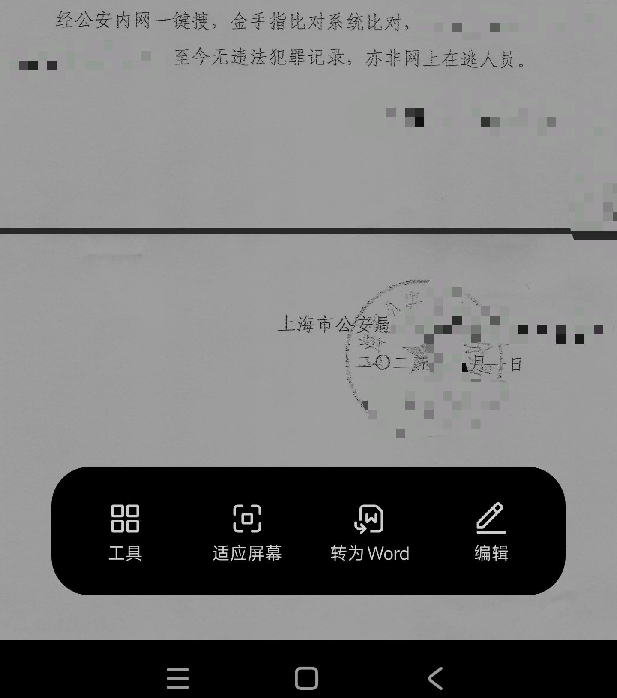
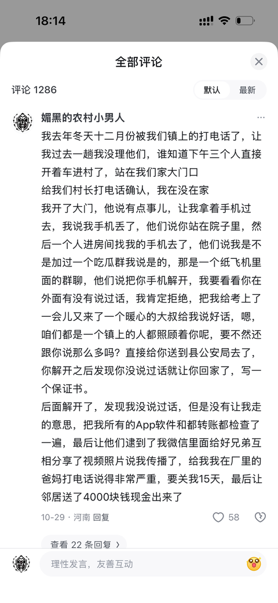
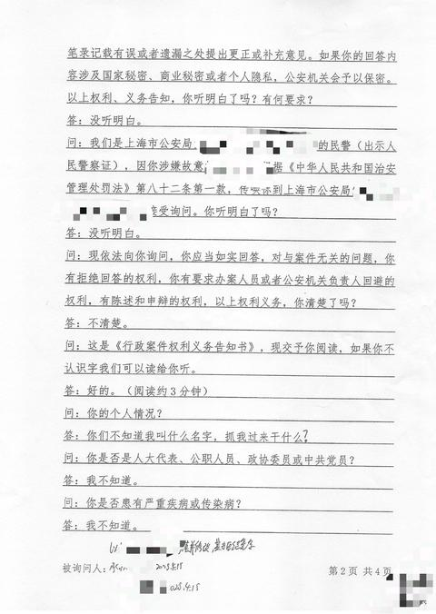

[toc]

# 问题

提问者：**<a href="https://www.zhihu.com/people/qwe196312">qwe196312</a>**
提问时间: 2025-7-24 16:19:46
总回答数: 284
总访问量: 3897492

派出所打电话过来，叫去问话怎么办？

# 回答

回答者： **<a href="https://www.zhihu.com/people/shwss">xijiadi</a>**
回答时间: 2025-11-20 22:3:54
点赞总数: 1527
评论总数: 160
收藏总数: 3496
喜欢总数：79

为啥老有人邀请我回答这些，我是个清清白白的好人呢！

1，开启录音，然后让他报姓名（可能只会报姓）、单位、警号，说现在电信诈骗太多了，你要核实的。最好再问下具体啥职务，问不出来就根据姓名和警号想办法查。比如是社区民警就不用理睬，案件办理队的那有可能真的是找你麻烦。

2，问他这个“问话”有手续么？是什么手续。如果没有手续你去送货上门干嘛？不要相信他们的话术，什么监控都拍到了流水都查到了之类，就一句“有证据就去走流程出手续，没有证据的事情你不要乱说，我也没有这个义务向你们讲清楚”。不要怂，有线索不等于有证据，有证据不等于能证明，这中间还有漫长的道路，别傻乎乎地给他们当带路党。

3，如果他说有传唤证，问他刑事的还是行政的，问清楚案由，并让他 **报传唤证号码** 给你（这一点非常重要，尽可能保留要素完整的录音）。如果是拘传证（刑事）呈批级别高而且只能提前办好，不能先请你回去再补这个手续，一般直接上门按了，不会给你打电话。他说有传唤证，就不能拒绝你问案由了，因为书面传唤必须告知原因和法律依据，案由直接印在传唤证上。知道案由你心理就有个准备，不过也别全信，等你去了聊完天后，他们有可能会改案由的。

4，随便糊弄他几句，先争取时间把证据处理好。行政的赶紧跑路躲几天，他几次来找不到你，说不定就放弃了。刑事的有点麻烦，你自己评估他们手里有啥证据，能不能把你挂网逃。挂网逃要刑拘证，这个证明标准比刑事传唤高一点，能批得出刑事传唤证，不一定能批得出刑事拘留证。另外因为开行政传唤证的门槛低（派出所领导就能批），还有很多叔叔，不管三七二十一先给你弄个案由差不多的行政传唤，把人忽悠来再说。派出所先请人来，能套出你的话，再立案补签传唤证的套路，非常普遍，严格地说其实程序违法的。

5，不管是啥案由，赶紧换个老旧备用手机随身，重要的话说三遍。另外做好他们会来强行请你去的准备：换套老旧衣服裤子鞋子，身上尽量减少金属、玻璃等材质的物品，也避免使用皮带裤带。最好穿一件带一个大帽子的卫衣，帽子一定要连在衣服上的那种，帽子越厚越好，拉下来能遮住眼睛的款，然后记得穿一双厚袜子越厚越好，衣服也尽量多穿一件，没准能脱下来睡觉时垫头。不过听说上海普陀的办案中心会把你扒到只剩小内内然后换他们的号服，但大部分地方都不会那么夸张，最多发你一双拖鞋、一个定位手环、一件黄（红、橙）马甲。这马甲学名叫作识别服，这估计连叔叔都不是每一个都知道的。

6，真去了心态要好，虽然条件艰苦，但该吃吃该睡睡，不养足精神，没有力气应付他们。记住十二字真经：看不清、听不懂、不明白、不记得。长痛不如短痛！脸皮一定要厚！

7，在邀请你的现场，执法记录仪对着你拍的时候，你说的话也是有法律效力的，千万不要乱认，不承认不否认，保持沉默就行，包括在去的路上和车上，叔叔一定会逗你说话，千万别理他！！！这是有判例的，千万不要在车上乱说话。不管叔叔路上说啥，你就当没听见！！！后悔椅上坐好，在叔叔没有开始告知权利义务之前，千万不要跟他聊什么鬼天！！！有什么好聊的，跟他多说一个字都是挖坑埋自己。

你们别瞎猜，我真的是清清白白的好人，有图有真相，连交通违章都没有一个的那种

  

  

原文地址：[(xijiadi)派出所打电话过来，叫去问话怎么办？](https://www.zhihu.com/question/1931750405999657026/answer/1974961163654674157) 

# 评论

1. <a href="https://www.zhihu.com/people/phantom-yang">幻影</a> (<small title="辽宁">2025-11-26 2:30:54</small>): 第三条不对。传唤可以现场口头，可以持传唤证书面，唯独不能用电话传唤，属于非法。
   - **xijiadi** (<small title="上海">2025-11-26 6:12:39</small>): 确实“不能”电话传唤，但你如果有跟我一样的爱好——看法院网上公示的判决书的话，就会发现大约25%的刑事判决书（我主要看上海的），被告是“经电话通知”到案的。
   - <a href="https://www.zhihu.com/people/mo-nan">漠南</a> (<small title="回复于 2025-11-26 13:1:22/陕西"> ✉️:xijiadi</small>): 传唤是针对证人还是嫌疑人
   - <a href="https://www.zhihu.com/people/phantom-yang">幻影</a> (<small title="回复于 2025-11-26 13:17:59/辽宁"> ✉️:xijiadi</small>): 法院判决书和传票的送达方式，有明确的法定几种，其中公告送达就是一种。但公安的传唤没有这个规定。在电话里只能是“麻烦您配合调查来一趟”，配合调查是义务，但没有强制性。传唤做为最轻的强制手段，必须合法合规的进行。所以电话让来“来一趟”，可以配合，但请另行安排时间，以不耽误我工作休息为主。但如果电话里主张是传唤，并且态度蛮横，多半是“临时工”装X，那就不用惯着他。因为你要是真有事，JC也不可能这么不紧不慢还给你打电话通知你。
   - **xijiadi** (<small title="回复于 2025-11-26 13:38:14/上海"> ✉️:漠南</small>): 嫌疑人
   - **xijiadi** (<small title="回复于 2025-11-26 15:51:3/上海"> ✉️:幻影</small>): 你没看懂我的意思，我说的是：其实轻刑事案件，嫌疑人是电话通知到案的（就是人家电话一打就乖乖去派出所了），很普遍，如果谁不相信，可以去看法院公示的刑事判决书。
   - <a href="https://www.zhihu.com/people/phantom-yang">幻影</a> (<small title="回复于 2025-11-26 19:21:21/辽宁"> ✉️:xijiadi</small>): 嗯，心里有鬼的就去了。
   - **xijiadi** (<small title="回复于 2025-11-26 21:11:4/上海"> ✉️:幻影</small>): 心里有鬼+好拿捏
   - <a href="https://www.zhihu.com/people/fan-zhao-hui-82">范朝晖</a> (<small title="回复于 2025-12-25 12:35:35/北京"> ✉️:xijiadi</small>): 这种算自首的。
   - <a href="https://www.zhihu.com/people/shi-xia-jun-5">时下郡</a> (<small title="重庆">2025-12-31 9:29:21</small>): 电话喊你你去了就叫自动投案了呗
   - **xijiadi** (<small title="回复于 2026-1-3 11:30:50/上海"> ✉️:时下郡</small>): 没犯案为啥要去投案自首？去了就是不打自招告诉叔叔你身上背着事情。
   - <a href="https://www.zhihu.com/people/john-john-89">陈一矛</a> (<small title="天津">2026-1-3 15:46:10</small>): 口头传唤，要求是事发时间和事发现场，不能事后口头传唤
   - <a href="https://www.zhihu.com/people/wang-guang-95">岁月如梭</a> (<small title="回复于 2026-1-10 10:31:27/山东"> ✉️:xijiadi</small>): 其实公安民警很忙的，没事的话找你干嘛？
   - **xijiadi** (<small title="回复于 2026-1-10 10:52:37/上海"> ✉️:岁月如梭</small>): 为了冤枉我咯
   - <a href="https://www.zhihu.com/people/phantom-yang">幻影</a> (<small title="回复于 2026-6-16 0:41:21/辽宁"> ✉️:xijiadi</small>): 电话通知，肯定不是电话传唤，是电话通知来配合调查，这个是义务，但没有强制性，问题是，你一去配合调查，搞不好当面就一张传唤证拍脸上了。这也是正常情况。
2. <a href="https://www.zhihu.com/people/binbin-liu-57">momo</a> (<small title="辽宁">2025-11-22 20:9:47</small>): 我就说上知乎能学到知识
   - <a href="https://www.zhihu.com/people/an-pang-zhi-42">两根腋毛</a> (<small title="辽宁">2025-11-23 13:46:46</small>): 答主是上海的，对于其他地方。。。。。不好说
   - <a href="https://www.zhihu.com/people/bei-hai-yi-bei-41-55">北海以北</a> (<small title="回复于 2025-12-10 2:31:55/山东"> ✉️:两根腋毛</small>): 确实，有一些刻板印象的地方。。。不点名了。。。直接黑你
   - <a href="https://www.zhihu.com/people/xiao-de-27-57">小德</a> (<small title="回复于 2026-3-28 15:4:33/上海"> ✉️:两根腋毛</small>): 看我的回答，对上海不要自己加莫名其妙的光环
   - <a href="https://www.zhihu.com/people/xiangxinzanma">波公</a> (<small title="回复于 2026-6-12 22:5:25/广东"> ✉️:两根腋毛</small>): 上海远洋捕捞这么多 也不见得比其他地方强多少
   - <a href="https://www.zhihu.com/people/64-4-77-80-1">momo</a> (<small title="回复于 2026-8-14 11:58:47/广东"> ✉️:两根腋毛</small>): 那就直接物理吧
3. <a href="https://www.zhihu.com/people/he-wei-3-8-62">少副白婕</a> (<small title="日本">2025-12-2 7:27:51</small>): 总结一下：直接跑路［打招呼］［打招呼］
   - <a href="https://www.zhihu.com/people/50-31-20-32">啊余呀</a> (<small title="广东">2025-12-3 1:14:39</small>): 你这IP［为难］［为难］［为难］
4. <a href="https://www.zhihu.com/people/yu-hao-59-26">进击的飞天意面</a> (<small title="辽宁">2025-11-28 17:8:39</small>): 点赞没多少，一看一大堆收藏［doge］［doge］
5. <a href="https://www.zhihu.com/people/xia-zhi-20-44-60">夏至</a> (<small title="广东">2025-12-11 9:13:21</small>): 要是早点看到，我老婆也不会进去行政48小时了，还带着小孩，先忽悠进去说手机号码是不是给被人用过，然后叫你去派出所看看，结果是因为直接帮人家招聘，说那个公司违法，牵连到了，态度可差了，第一上门，直接进入房间门，喊得人，（进入大门，进入最里面的主卧室开门）我只能说呵呵呵
6. <a href="https://www.zhihu.com/people/sha-bang-jun-88">九斤黑浜</a> (<small title="北京">2025-11-21 14:25:40</small>): 有个小问题“有线索不等于有证据，有证据不等于能证明”  
 
这种可以举例说明一下吗？我想了下死活没有核实的案例。（诈骗有流水，伤人伤财务有摄像头）
   - **xijiadi** (<small title="上海">2025-11-21 15:9:53</small>): 随便举个例子，比如入室盗窃：
 
  
 
有线索：研判出可能是谁，张三有前科，案发前去小区晃悠过，怀疑他，叔叔会想找他盘盘，但这种程度的怀疑，很难拿到手续。
 
  
 
有证据：指向性的间接证据，比如有一个目击者看到张三去过失窃楼栋并辨认出来，监控拍到张三空手进小区背个包出来，张三突然有钱了但流水看不出怎么来的钱，张三去多家回收店出手过烟酒（失物里有大量烟酒，但没有可供区分的特殊性）。感觉这种间接证据有一个，叔叔马上会传唤你来听你“解释”，解释得不好的话，叔叔会办手续去张三家里搜查。
 
  
 
能证明：有直接证据一个即可证明，比如失主家里监控拍到张三正脸了，张三在失主家里留下指纹或者DNA了，在张三家里直接搜到赃物了，张三存进ATM钱跟失主从ATM拿的钱有多个冠字号一致，小区监控拍到的衣着和现场脚印一致的鞋子都在张三家里搜到了。
 
  
 
间接证据可能需要多个才能构成完整证据链，才能证明，比如张三没法合理解释他去失窃楼栋干嘛，没法合理解释他出小区时的背包怎么来的，没法合理解释他为什么突然有钱了，没法合理解释他出手烟酒的来源，这些需要叠加，单一无法达到证明标准。
 
  
 
当然最好是张三看到这些心理防线崩溃，自己承认了。
 
  
 
反正你听个意思吧，就是这样。
   - <a href="https://www.zhihu.com/people/54-77-69-55-21">东京幽灵</a> (<small title="广东">2025-11-22 0:28:53</small>): 还有一个更简单的例子：  
 
假如我骗了你的钱，但我从你手里收的是现金，你实际上没有理由让警方相信我真的骗了你的钱。  
 
这就是你这个问题反过来推的例子。
7. <a href="https://www.zhihu.com/people/tian-cong-liu-yun">天丛流云</a> (<small title="湖北">2025-11-22 16:36:7</small>): 行政的躲几天是什么说法，这玩意还能躲过去吗
   - **xijiadi** (<small title="上海">2025-11-22 16:50:10</small>): 他们一般5天一个班（这个要你自己去查对应派出所的值班表），你算好你案子的承办民警的轮班时间，让他在24小时班的时候，上门找不到你就行，其他人一般不会去管别人的案子。主要风险是他会去找你的社区民警，我看下来社区民警应该会让物业保安盯着你家动静和你的车，通风报信。
   - <a href="https://www.zhihu.com/people/tian-cong-liu-yun">天丛流云</a> (<small title="回复于 2025-11-22 17:30:40/湖北"> ✉️:xijiadi</small>): 6 突然懂这是躲啥的了［捂脸］［捂脸］［捂脸］
   - **xijiadi** (<small title="回复于 2025-11-22 17:53:0/上海"> ✉️:天丛流云</small>): 有回叔叔为了我一口气上了36个小时的班（中间应该回宿舍睡过），他也崩了。
   - <a href="https://www.zhihu.com/people/cong-ming-de-da-sha-zi">gttry</a> (<small title="河北">2025-11-22 21:56:38</small>): 行政的应该没事，躲就过去了吧
   - **xijiadi** (<small title="回复于 2025-11-22 23:39:38/上海"> ✉️:gttry</small>): 就是赌他其实没立案，他要是觉得你太难缠，多半就不立案了。立案被录了嫌疑人就不好躲，老是找不到你，上头也会追责他。
   - <a href="https://www.zhihu.com/people/cong-ming-de-da-sha-zi">gttry</a> (<small title="回复于 2025-11-23 10:13:54/河北"> ✉️:xijiadi</small>): 立案了，两个月后也就没事了吧？
   - **xijiadi** (<small title="回复于 2025-11-23 10:31:4/上海"> ✉️:gttry</small>): 理论上，6个月后肯定安全
   - <a href="https://www.zhihu.com/people/39-27-33-74-89">FengMing</a> (<small title="回复于 2025-11-24 13:59:27/河南"> ✉️:xijiadi</small>): 你到底懂不懂？六个月是未被发现，只要立案了就可以一直查
   - **xijiadi** (<small title="回复于 2025-11-24 14:44:55/上海"> ✉️:FengMing</small>): 你到底懂不懂？立案6个月没结案的，就一直挂着了，除非条子跟你有深仇大恨，否则不会翻出来再查了。
   - <a href="https://www.zhihu.com/people/39-27-33-74-89">FengMing</a> (<small title="回复于 2025-11-24 16:51:23/河南"> ✉️:xijiadi</small>): 神人一个［尴尬］
   - <a href="https://www.zhihu.com/people/jin-yu-qi-zhi-79">金玉其质</a> (<small title="回复于 2025-11-25 6:28:38/广东"> ✉️:xijiadi</small>): 为什么他们明知不合法，还那样违规操作？能不能以此把他们的工作断掉？
   - **xijiadi** (<small title="回复于 2025-11-25 9:42:23/上海"> ✉️:金玉其质</small>): 上头领导同意或者授意，法院检察院偏袒
   - <a href="https://www.zhihu.com/people/2-18-61-72-43">我打我的</a> (<small title="回复于 2025-11-27 3:59:5/湖北"> ✉️:xijiadi</small>): 挂案会不会上网逃？
   - **xijiadi** (<small title="回复于 2025-11-27 8:56:24/上海"> ✉️:我打我的</small>): 治安案件怎么会挂网逃？立案后过了2个月，安全一点6个月，就不会再挖出来处理了，6个月是上级会抽查的期限。除非是有受害人的案件，受害人一直盯着不放，如果一直找不到你，可能会给你挂个临控最多了，不是本市的话，你不再去那地方，事情就算结束了，谁会没完没了地搞你，临控好像也有期限的。
   - <a href="https://www.zhihu.com/people/2-18-61-72-43">我打我的</a> (<small title="回复于 2025-11-27 14:59:5/湖北"> ✉️:xijiadi</small>): 专业🤙
   - <a href="https://www.zhihu.com/people/01t22">01t22</a> (<small title="回复于 2025-12-3 15:41:34/黑龙江"> ✉️:xijiadi</small>): 我也被打电话了，现在工作要去外地支援，也没办法回去调查，年底了
   - <a href="https://www.zhihu.com/people/shi-xia-jun-5">时下郡</a> (<small title="回复于 2025-12-31 9:32:10/重庆"> ✉️:xijiadi</small>): 看笑了，还以为你多专业想学习学习，这个立案后6个月是什么法律规定的
   - **xijiadi** (<small title="回复于 2025-12-31 9:36:33/上海"> ✉️:时下郡</small>): 没有法律规定，就是我去打听来的GA内部惯例，治安案件立案超过6个月没结案的，就一直挂着不会再主动去查了，除非有被害人不依不饶盯着。6个月之内的，法制部门会一直盯着让结案，超过6个月的直接扣掉一点绩效，不盯了。
   - <a href="https://www.zhihu.com/people/zhang-xiao-28-10">宇智波 晓</a> (<small title="回复于 2026-1-31 9:53:1/江苏"> ✉️:时下郡</small>): 他说的很专业 很多操作就是这样的 哪些自己乖乖送上门的才是冤大头
8. <a href="https://www.zhihu.com/people/xia-ri-yi-shi-fu-sheng-wei-xie">灵魂</a> (<small title="宁夏">2025-11-22 23:38:25</small>): 刑事传唤证怎么办？  
 
把手机清空然后老实过去吗？  
 
让解锁密码可以不解锁吗？可以直接不去一直躲吗？
   - **xijiadi** (<small title="上海">2025-11-22 23:47:58</small>): 这个就真的是赌了，你自己评估他们手里有啥证据呀，我原文写得很清楚了。
   - <a href="https://www.zhihu.com/people/01t22">01t22</a> (<small title="黑龙江">2025-12-3 15:32:52</small>): 刑事的可就只能老老实实了
9. <a href="https://www.zhihu.com/people/zhou-shao-49-29">周少</a> (<small title="广东">2025-11-22 23:33:13</small>): 牛的［大笑］，我直接收藏加转发
10. <a href="https://www.zhihu.com/people/local-86-63">风骚探长</a> (<small title="山东">2026-3-30 21:13:34</small>): 分清是去作证的，还是接受传唤调查的。
    - **xijiadi** (<small title="上海">2026-3-30 22:20:8</small>): 证人是不能用传唤证传唤的！所以关键的一步是要问他传唤证号码并录音，绝大部分这时还没有真的去走流程的帽子叔叔，就会放弃你这个KPI，撂几句狠话挣个面子就挂电话了。不会吃饱了撑的跟你硬杠的，这种帽子叔叔我一个也没碰到过。甚至于叔叔拿着“手续”上门找不到人，也不一定还会再来第二次。因为叔叔经常套打假手续，而并非用录进系统的真手续来请你，实在找不到人，叔叔也就算了。如果录进系统了，叔叔还真的会来反复找你，否则他不好结案。
11. <a href="https://www.zhihu.com/people/wu-yue-qiang-wei-47-66">五月蔷薇</a> (<small title="江苏">2026-2-15 17:32:14</small>): 坚决不去，让他们上门好了，怕什么，身正不怕影子斜［思考］
    - **xijiadi** (<small title="上海">2026-2-15 17:40:52</small>): 关于他们上门，我也有很多经验，有空了可以写个上门篇，绝对让你们大开眼界，哈哈哈
    - **xijiadi** (<small title="上海">2026-2-15 17:41:9</small>): 关于他们上门，我也有很多经验，有空了可以写个上门篇，绝对
12. <a href="https://www.zhihu.com/people/xiao-he-san-cheng">切己体察</a> (<small title="上海">2025-11-22 11:21:7</small>): ［感谢］收藏了，有备无患
13. <a href="https://www.zhihu.com/people/zhi-tian-69-38">杭城小警</a> (<small title="浙江">2026-1-4 17:18:8</small>): 比一般的人懂得多，但容易聪明反被聪明误，每个案子都不同的，都有自身的复杂性，盲目参考反而容易自陷囹圄。一顿操作，又是问这个又是问那个的，本来简单解决的，到最后反而被自己搞复杂了，被折腾的是自己罢了，对于👮‍♀️来说不过是个工作而已。
    - **xijiadi** (<small title="上海">2026-1-4 23:23:46</small>): 所以既然是工作何必非要挑战高难度的对吧，当事人表现得不好惹一点，一般条子也就放弃你这个KPI了，免得忙了24小时一无所获，没准还要被法制和领导骂一顿。
    - <a href="https://www.zhihu.com/people/zhi-tian-69-38">杭城小警</a> (<small title="回复于 2026-1-5 0:37:22/浙江"> ✉️:xijiadi</small>): 还是那句话，如果你没犯事，你确实可以挺直腰杆，甚至可以显得嚣张一点(但事实上这也很愚蠢，因为你认为你没犯事，可能只是你不懂法而已)，但犯事了的还嚣张的，就是纯粹就智仗了［飙泪笑］
    - <a href="https://www.zhihu.com/people/luohaohao">李大爷</a> (<small title="回复于 2026-1-29 11:34:48/四川"> ✉️:xijiadi</small>): 那人说话的态度，平时也是个要不完的样子
14. <a href="https://www.zhihu.com/people/wanghuan2013">昨天没吃饭</a> (<small title="湖北">2025-11-25 9:7:20</small>): 被老家的派出所的警察打电话要我去采集信息要去吗？还要带我去县城的派出所，说我之前有案底。我唯一一次进派出所是我上高中那会犯了点事做了个笔录。今年打了好几个电话我都没理，要么不接要么说在外地。
    - **xijiadi** (<small title="上海">2025-11-25 9:41:40</small>): 我的建议一直都是，除非他们手续齐全（手续很可能有假）+武力占优，你实在无法逃避再去。如果你自己不太心虚，准备扛一扛的，就从“不去”开始扛，你答应去了，甚至主动去了，就代表你有问题+好拿捏，你去了一定会被他们问出事情来的。
    - <a href="https://www.zhihu.com/people/phantom-yang">幻影</a> (<small title="辽宁">2025-11-26 13:21:6</small>): 问他警号，反手市局督察一个投诉。案底是你有过刑事犯罪，服刑后五年内在辖区内算重点人口，除此之外，他们没权利随意对你呼来喝去的。
    - <a href="https://www.zhihu.com/people/yodyxufug">yodyxufug</a> (<small title="回复于 2026-2-12 1:25:19/浙江"> ✉️:幻影</small>): 这种投诉一点用都没有
15. <a href="https://www.zhihu.com/people/xiao-zhong-63">星矢可否不要老</a> (<small title="广西">2025-11-21 17:16:50</small>): 啥时候出来的？
16. <a href="https://www.zhihu.com/people/zhou-zhe-wen">菲狄亚斯</a> (<small title="天津">2025-12-5 20:57:9</small>): 随便糊弄他几句，先争取时间把证据处理好  
 
教唆他人毁灭证据?
17. <a href="https://www.zhihu.com/people/bi-bo-de-xiao-mi-di-86">可爱的农村幼小男</a> (<small title="河南">2025-11-22 15:57:46</small>): 我也没理他们 但是人家上门了，我不知道怎么操作了，反正给了4000块钱 
    - <a href="https://www.zhihu.com/people/xia-ri-yi-shi-fu-sheng-wei-xie">灵魂</a> (<small title="宁夏">2025-11-22 23:33:24</small>): 下次换pixel，一键抹除所有数据。
    - <a href="https://www.zhihu.com/people/dd-24-52">DD</a> (<small title="广东">2025-11-23 11:1:8</small>): 请问是什么吃瓜群？是那种颜色小视频吗［捂脸］
    - <a href="https://www.zhihu.com/people/bi-bo-de-xiao-mi-di-86">可爱的农村幼小男</a> (<small title="回复于 2025-11-23 11:2:28/河南"> ✉️:DD</small>): 算是新闻频道
    - <a href="https://www.zhihu.com/people/xiao-xiao-xiao-xiao-29-47">风和9527</a> (<small title="广西">2025-12-2 2:30:10</small>): 怎么会被查？截图转发了什么东西被查到隐形水印了么
    - <a href="https://www.zhihu.com/people/cheems-1-7">王二</a> (<small title="重庆">2025-12-7 12:54:23</small>): 这包违法了
    - <a href="https://www.zhihu.com/people/bi-bo-de-xiao-mi-di-86">可爱的农村幼小男</a> (<small title="回复于 2025-12-7 13:33:57/河南"> ✉️:王二</small>): 怎么维权，没证据，现金，没有录音
    - <a href="https://www.zhihu.com/people/yin-bing-shi-yu-ren">MoMoMo</a> (<small title="回复于 2026-1-5 0:11:39/陕西"> ✉️:可爱的农村幼小男</small>): 维权成本肯定不止4000，算了吧
    - <a href="https://www.zhihu.com/people/zhi-ming-bu-ju-43-68">仙人板板</a> (<small title="四川">2026-9-23 9:42:35</small>): 分享的是什么小视频啊，也发给我看看呗
18. <a href="https://www.zhihu.com/people/660-96">660</a> (<small title="上海">2025-11-24 14:18:4</small>): ［doge］能让你这么说，最好还不了了了之的都是好警察
    - **xijiadi** (<small title="上海">2025-11-24 14:53:13</small>): 亲测［捂嘴］ 我让他“有证据就去走流程”已经5个月了，没见他走了流程来找我，就一脚油门15分钟的距离。
    - <a href="https://www.zhihu.com/people/zhi-tian-69-38">杭城小警</a> (<small title="回复于 2026-1-4 17:6:42/浙江"> ✉️:xijiadi</small>): 你这都是个例，运气好而已说实话
    - **xijiadi** (<small title="回复于 2026-1-4 22:57:50/上海"> ✉️:杭城小警</small>): 一次两次是运气，三次五次是实力［捂嘴］ 啊，说错了，是我本来就是清白无辜的。
    - <a href="https://www.zhihu.com/people/zhi-tian-69-38">杭城小警</a> (<small title="回复于 2026-1-4 23:17:8/浙江"> ✉️:xijiadi</small>): 你这个只适用于👮‍♀️本身就是走个流程的心态，而并非较真的心态，👮‍♀️在处理一件事之前一般都设定好了最终结果的，有时候甚至会有意帮着你往某个方向走，因为他也想这么走下去。如果反之，你所谓的这些方法，不过是火上浇油罢了。
    - **xijiadi** (<small title="回复于 2026-1-4 23:41:36/上海"> ✉️:杭城小警</small>): 不要往自己脸上贴金了，作为亲历的当事人，而且事后又复议诉讼阅卷过的，我反推你们的套路还是很精准的［捂嘴］ 我看了卷内证据，有两次立案都很勉强，甚至可以说用了假证据才立上案（在我家小区门口截了一张我的人脸，冒充是现场的监控截图），就是想试试骗供。
19. <a href="https://www.zhihu.com/people/tang-men-shi-xiong-16">唐门师兄</a> (<small title="山东">2025-11-23 11:56:22</small>): 懂点，懂的不多。打电话就去，那算投案，说的好算自首，你非要传唤证号码，那就是传唤到案。你不会不知道这其中的差别吧？
    - **xijiadi** (<small title="上海">2025-11-23 12:41:10</small>): 我啥也没干，为啥要自首？我只是想省了那24小时的折腾。
    - <a href="https://www.zhihu.com/people/wen-sen-te-14-28">文森特</a> (<small title="江苏">2025-11-23 12:50:23</small>): 良民遇到聂海芬横竖是挂。
    - <a href="https://www.zhihu.com/people/shi-jian-55-57-57">momo</a> (<small title="福建">2025-11-23 17:23:38</small>): 自首是你有犯罪，问题是你知道你犯罪吗，你犯罪了为什么要别人打电话才自首，要我说你干了什么就应该当场报警，你这种侥幸心理就是在浪费社会资源。你说你没犯罪有人打电话叫你过去？那不诈骗嘛
    - <a href="https://www.zhihu.com/people/tang-men-shi-xiong-16">唐门师兄</a> (<small title="回复于 2025-11-23 17:30:52/山东"> ✉️:xijiadi</small>): 你啥也没干，你怕啥，还准备跑路？啥也没干，耗你24小时，图个啥？［飙泪笑］［飙泪笑］［飙泪笑］［飙泪笑］
    - <a href="https://www.zhihu.com/people/tang-men-shi-xiong-16">唐门师兄</a> (<small title="回复于 2025-11-23 17:31:44/山东"> ✉️:momo</small>): 有没有问题那是自己清楚，你看提问和回答，像是没问题的样子吗［飙泪笑］［飙泪笑］［飙泪笑］
    - **xijiadi** (<small title="回复于 2025-11-23 17:46:12/上海"> ✉️:唐门师兄</small>): 我怕他们冤枉我呀，他们图啥么，肯定是图KPI咯
    - <a href="https://www.zhihu.com/people/tang-men-shi-xiong-16">唐门师兄</a> (<small title="回复于 2025-11-23 17:51:11/山东"> ✉️:xijiadi</small>): 能kpi到你，那你也该去买彩票了。
    - <a href="https://www.zhihu.com/people/wen-sen-te-14-28">文森特</a> (<small title="回复于 2025-11-23 17:53:56/江苏"> ✉️:唐门师兄</small>): 聂海芬给了张氏叔侄一张彩票，然后呢？［吃瓜］张氏叔侄是不是还得谢谢她？
    - <a href="https://www.zhihu.com/people/gan-qing-he-shi-76-51">吕小布Ww</a> (<small title="回复于 2025-11-23 18:33:9/福建"> ✉️:唐门师兄</small>): 一看就知道你没报过警，不知道那些东西都是些什么德行［大笑］
    - <a href="https://www.zhihu.com/people/wen-sen-te-14-28">文森特</a> (<small title="回复于 2025-11-26 16:29:28/江苏"> ✉️:吕小布Ww</small>): 他大概率就是黑皮。
    - <a href="https://www.zhihu.com/people/JunfanZhou">无中生有</a> (<small title="回复于 2026-1-8 11:11:34/江苏"> ✉️:唐门师兄</small>): 您这番言论和苍蝇不叮无缝的蛋很有异曲同工之处呢［惊喜］
    - <a href="https://www.zhihu.com/people/tang-men-shi-xiong-16">唐门师兄</a> (<small title="回复于 2026-1-8 14:50:48/山东"> ✉️:无中生有</small>): 你的意思，牢里的都是无辜的？
    - <a href="https://www.zhihu.com/people/liu-shu-59-95-66">开芒碑碧</a> (<small title="北京">2026-1-12 10:33:52</small>): 不能说都是，但你看上面那兄弟，其实没干啥事，他们想查的没查到。就只能拿他的微信给朋友发的绿图为由交了4000，你说这事怎么讲？说你违法没毛病吧，但哥们之间发个小电影，图片啥的不是很正常吗？欲加之罪，啥不能给你找点毛病？
    - <a href="https://www.zhihu.com/people/zhang-xiao-28-10">宇智波 晓</a> (<small title="回复于 2026-1-31 9:55:43/江苏"> ✉️:唐门师兄</small>): 你觉得被冤枉的人少吗？还是活在真空之中［捂嘴］
    - <a href="https://www.zhihu.com/people/tang-men-shi-xiong-16">唐门师兄</a> (<small title="回复于 2026-1-31 10:16:16/山东"> ✉️:宇智波 晓</small>): 没错，牢里都是被冤枉的，他们应该都去当美国总统。
20. <a href="https://www.zhihu.com/people/pin-wei-7-5">梅州何国旗</a> (<small title="广东">2026-8-19 20:15:14</small>): 到派出所后无论大小事有无过错，拒绝配合沉默就对了。
21. <a href="https://www.zhihu.com/people/lsztony">lsztony</a> (<small title="四川">2026-2-4 18:30:20</small>): 这套流程倒是没什么问题，可是答主在上海啊，其他城市的就要掂量掂量了
22. <a href="https://www.zhihu.com/people/zhiagryxuq">zhiaGrYxuq</a> (<small title="福建">2026-9-10 20:58:31</small>): ［哇］
23. <a href="https://www.zhihu.com/people/xia-ri-yi-shi-fu-sheng-wei-xie">灵魂</a> (<small title="宁夏">2025-11-21 8:3:41</small>): 哥哥你是真专业！赶紧保存了
24. <a href="https://www.zhihu.com/people/95-94-32-54">何锦溢</a> (<small title="福建">2026-7-18 0:9:55</small>): 如果派出所早上9点打电话到你单位问是否有你这个人，下午3点连续打你两个电话没人接就直接到你工作单位找你领导，全程没出事证件没说自己身份没说事由，还要求看你手机，怎么办？打12389电话，网站投诉都落空怎么办
25. <a href="https://www.zhihu.com/people/phoenix05056">phoenix05056</a> (<small title="四川">2026-7-12 19:50:42</small>): 老江湖
26. <a href="https://www.zhihu.com/people/hu-hu-77-58-30">大妹纸</a> (<small title="云南">2026-5-25 17:40:34</small>): 大哥，审讯室有录音录像吗？如果没开录音录像，拒绝回答会被整吗
27. <a href="https://www.zhihu.com/people/local-86-63">风骚探长</a> (<small title="山东">2026-3-31 7:31:26</small>): 题主只说的是打电话过来，所以是什么身份不好确定。  
 
如果是有对立面的案件，或是信访案件，一定会去找到这个人的，你说的这些都是其中一种情况，没有具体细节还真不好判断😓😓😓😓 [@知乎直答](http://www.zhihu.com/people/f3bce7aa022240e25f12aec9a9b70363)
    - <a href="https://www.zhihu.com/people/zhi-hu-zhi-da-41">知乎直答</a> (<small title="看山的工位">2026-3-31 7:31:45</small>): 确实，电话核实身份是第一步——毕竟现实中既可能遇到正经办案，也可能碰上“冒充公检法”的诈骗。不过有个细节可以补充：如果对方自称“案件办理队”，可以要求对方通过110转接来电（正规警务不会拒绝这个核实方式）。至于“处理证据”这种说法，其实风险很高——真要涉及案件，隐匿证据可能涉嫌妨碍司法，这可比配合调查严重多了。保持冷静+依法核实，才是普通人最稳妥的应对。
28. <a href="https://www.zhihu.com/people/hai-bian-de-qia-fu-qia-89-96">海边的卡夫卡</a> (<small title="浙江">2026-2-28 14:51:22</small>): pc被拘，没打电话，直接上门带走。开始不承认没抗住［大哭］被拘十天。为什么PC都要被上门按头
    - **xijiadi** (<small title="上海">2026-2-28 15:46:12</small>): 为啥没扛住啊？他们现在打人不至于啊，就他们那些手段，24小时咬咬牙就挺过去了呀。年前有2便衣+2制服上门，手里拿着两张A4纸，不像是宣传反诈［捂脸］便衣先冒充物业想诈门，后来使劲敲了半个小时门，连我家电闸都被他们拉了，没找到我，就没再来过［捂嘴］
    - <a href="https://www.zhihu.com/people/hai-bian-de-qia-fu-qia-89-96">海边的卡夫卡</a> (<small title="回复于 2026-2-28 16:15:44/浙江"> ✉️:xijiadi</small>): 给家里人一个个打电话，我怕给我爷爷打电话，老人家心脏病刚刚出院。［大哭］
    - **xijiadi** (<small title="回复于 2026-2-28 16:44:49/上海"> ✉️:海边的卡夫卡</small>): 聪明如我，早就在所有家里人的手机上，把他们警务通号码全拉黑了，用模糊匹配，比如1801883\*。如果不知道相关派出所警察警务通号码的，去附近小区转一圈，社区民警的警民联系牌上都有，多看几个小区你就能总结规律了
    - <a href="https://www.zhihu.com/people/hai-bian-de-qia-fu-qia-89-96">海边的卡夫卡</a> (<small title="回复于 2026-2-28 16:52:38/浙江"> ✉️:xijiadi</small>): 当时是拿我手机打的，要采集取证。还故意打微信电话
    - **xijiadi** (<small title="回复于 2026-2-28 17:30:8/上海"> ✉️:海边的卡夫卡</small>): 你把密码告诉他们了？还好我家里人一般不会给任何人马上开门，发现是他们，我就借口要穿衣服（他们深夜来的），把手机关机藏起来了，带了个备用手机去的。所以现在他们再来就是便衣冒充是物业的［捂脸］ 我就有一次是现场被带走的，手机在身边，他们搜走后问我要密码我不给，他们就把手机扣押了一个月，不过好像也没有破解成就还给我了，也没处罚
    - <a href="https://www.zhihu.com/people/hai-bian-de-qia-fu-qia-89-96">海边的卡夫卡</a> (<small title="回复于 2026-3-3 18:24:38/浙江"> ✉️:xijiadi</small>): 我靠，还可以不给他们密码的啊。我以为进去了一定要老实配合［大哭］
    - **xijiadi** (<small title="回复于 2026-3-4 12:43:15/上海"> ✉️:海边的卡夫卡</small>): 可以啊，你这点事，配合10天，不配合可能15天也可能24小时就能拍拍屁股走人。为啥要配合？现在他们最多吓唬吓唬你，多铐你一会，又不会真的打你，有啥好配合的？问就是不知道不记得，他说那我就写你“拒不配合”了，我说你爱写啥写啥，有图有真相（行政复议阅卷拿来的当时的询问笔录）
    - <a href="https://www.zhihu.com/people/hai-bian-de-qia-fu-qia-89-96">海边的卡夫卡</a> (<small title="回复于 2026-3-5 16:0:2/浙江"> ✉️:xijiadi</small>): 学到了，希望下次用不到
    - <a href="https://www.zhihu.com/people/xiao-chu-jiu-13">肖初九</a> (<small title="回复于 2026-3-13 11:29:14/江苏"> ✉️:xijiadi</small>): 这个笔录看完笑死我了，老油条啊你［滑稽］［滑稽］［滑稽］
    - **xijiadi** (<small title="回复于 2026-3-13 11:32:35/上海"> ✉️:肖初九</small>): 其实他的记录完全没有体现出我风趣幽默的回答，干巴巴的，我去年5月份前后在知乎写过一篇当初我是怎么回答的，不知道有没有被删
29. <a href="https://www.zhihu.com/people/outsider-95-4">爱你三千遍</a> (<small title="四川">2026-2-6 17:26:25</small>): 你早说啊,体验过一次,直接上来,量了证就把我带走了,然后手续啥的都是后面补的,感觉被骗了啊,现在事情是个啥流程啥结果都不知道,手机收走了几年了都没还我
    - **xijiadi** (<small title="上海">2026-2-6 19:10:30</small>): 后补的你可以不签字，或者写签字时的日期时间，他们干脆不给我看手续签手续，直接写我“拒绝签字”，一口咬定给我看过了，我不肯签字［飙泪笑］
30. <a href="https://www.zhihu.com/people/coder_you">月未圆</a> (<small title="福建">2026-10-3 8:18:54</small>): 第一条回答下你，帽子最爱拿捏的就是你这种老老实实的好人
31. <a href="https://www.zhihu.com/people/tie-tie-gui-lei">就差一点点</a> (<small title="湖南">2026-2-4 18:19:9</small>): 我妹夫之前消失过24小时，当时我们已经确认在派出所了但是警察不肯说进去的原因。反正第二天出来了。这种是啥情况呢？拘留应该也不会24小时这么短吧？没拘留的话是不是能说明他没做过对不起我妹的事？
    - **xijiadi** (<small title="上海">2026-2-5 11:26:17</small>): 24小时的一般就是治安传唤，不是拘留，你妹夫顶住了没认就没事。有没有做过就不知道了，自己没认加证据不足，就处罚不了。JC不肯说进去的原因，一般就是你猜的那个原因了，如果不是那个原因，一般就对家属直说了，不仅案由而且具体犯的内容都说得相当清楚。
32. <a href="https://www.zhihu.com/people/jaysun-83-5">超超越越yubiediu</a> (<small title="山东">2026-1-31 21:17:41</small>): 寻衅滋事秒了［赞同］
33. <a href="https://www.zhihu.com/people/kass-61-91">shameless</a> (<small title="山东">2026-1-19 1:16:3</small>): 唉
34. <a href="https://www.zhihu.com/people/52-84-80-76-29">啦啦啦</a> (<small title="安徽">2025-11-21 17:43:51</small>): 几次了［doge］
35. <a href="https://www.zhihu.com/people/wang-guang-95">岁月如梭</a> (<small title="山东">2026-1-10 10:28:35</small>): 如果涉及到刑事案子，公安机关给你打电话，你去了，就能给你定自首；如果公安机关上门找到你，对不起，肯定定不了自首。
    - **xijiadi** (<small title="上海">2026-1-10 10:54:4</small>): 我一个清白无辜的好人，为啥要自首？事实证明每次都是他们冤枉我的。
    - <a href="https://www.zhihu.com/people/suixin0">夏日清风</a> (<small title="回复于 2026-2-5 6:13:30/湖南"> ✉️:xijiadi</small>): 心态真好，点个赞［赞同］
    - **xijiadi** (<small title="回复于 2026-2-5 8:9:5/上海"> ✉️:夏日清风</small>): 心态不好在那里头5分钟都待不下去，那里边各种流程设计和问话手段，都是为了让你心态崩了自己承认。
    - <a href="https://www.zhihu.com/people/yodyxufug">yodyxufug</a> (<small title="回复于 2026-2-12 1:24:8/浙江"> ✉️:xijiadi</small>): 你自己想想，为啥每次都要找你？
    - **xijiadi** (<small title="回复于 2026-2-12 7:14:53/上海"> ✉️:yodyxufug</small>): 我也想知道为啥呀，所以还特地提起复议诉讼，看了他们提供的案卷材料，明显是属于立案录嫌疑人都不够证明标准，他们自己都心虚的那种。
    - <a href="https://www.zhihu.com/people/eason-26-85">AAA建材老王</a> (<small title="安徽">2026-3-21 7:3:31</small>): 呵呵呵。。。。好市民
    - <a href="https://www.zhihu.com/people/li-lun-mu-ou">理论木偶</a> (<small title="回复于 2026-9-23 6:57:11/福建"> ✉️:xijiadi</small>): 魔都可能不一样，像我们农村，一般人很难抗住的，有没有给你上一下杨永信法，灯泡模拟咖啡法，隔山打牛法，等等太多了，这些你怎么抗住的
36. <a href="https://www.zhihu.com/people/cyong-yang">cyong</a> (<small title="北京">2025-11-21 18:26:2</small>): 厉害~
37. <a href="https://www.zhihu.com/people/chun-jie-shi-er-xiang-8">李益南233</a> (<small title="湖北">2025-11-21 17:43:23</small>): ［酷］
38. <a href="https://www.zhihu.com/people/sun-ya-jun-87-63">风语者</a> (<small title="陕西">2026-1-10 13:27:7</small>): 这一套你给民警使完，可能没事就真有事了
    - **xijiadi** (<small title="上海">2026-1-10 16:36:12</small>): 我使完过好几次了，他们一般撂下一句狠话，比如“那我就公事公办了”或者“走程序就走程序”后，就从此没有回音了
39. <a href="https://www.zhihu.com/people/shuo-bu-de-51">把众人护在身前</a> (<small title="福建">2025-11-22 19:31:53</small>): 大概率是大保健惹出来的事，这一种直接说不在本地出差，在外不要跟他废话，你要扯一大堆，把他给得罪了，给你较真，直接就带走了
    - **xijiadi** (<small title="上海">2025-11-22 19:42:56</small>): 会到社区民警那里查你，社区民警又会问物业保安，查车牌出入，有时小区门口保安也知道你的
    - **xijiadi** (<small title="上海">2025-11-22 19:57:35</small>): 如果是大保健不会盯着你不放，但如果别的有受害人的案件就麻烦。
    - <a href="https://www.zhihu.com/people/shuo-bu-de-51">把众人护在身前</a> (<small title="回复于 2025-11-22 21:28:0/福建"> ✉️:xijiadi</small>): 大保健，他会大规模打电话，然后总有几个上门，然后交差，如果其他的事他就不会打电话了，直接来抓人了。  
 
你出这个馊主意，把他惹急了，直接把你这个办成铁案，你就倒大霉了
    - **xijiadi** (<small title="回复于 2025-11-22 23:26:33/上海"> ✉️:把众人护在身前</small>): 我跟你说，这个就是要问他传唤证号码的原因，如果证据不是很好的话，他们是不会立案的。就是打电话忽悠你自己送上门，等你自己认了或者自带证据上门。还有一种就是用套打的传唤证，或者口头传唤，糊弄不懂的人，上门来把你带走，等问出东西，立案了再叫你补签正式的传唤证。但是你一问传唤证号码，这个事情他就不好办了，谁知道立案了系统会分派什么传唤证号码，会穿帮的就是非法传唤了，这个程序违法的，复议诉讼他们会败诉，这个时候他就会放弃你这个人头的。所以先打电话也好，直接上门也好，你一定要设法自己录音录像留下证据，他们用的传唤证是什么号码，或者没有号码的那种套打版本［捂嘴］ 复议诉讼，有的会给传唤时的20分钟执法仪视频，有的不肯给的。
    - <a href="https://www.zhihu.com/people/xia-ri-yi-shi-fu-sheng-wei-xie">灵魂</a> (<small title="回复于 2025-11-22 23:35:41/宁夏"> ✉️:xijiadi</small>): 会不会电话里直接不告诉你传唤证号，然后电话挂了直接上门来。那这怎么办？
    - **xijiadi** (<small title="回复于 2025-11-22 23:45:5/上海"> ✉️:灵魂</small>): 会的，我碰到过，他说传唤证我有啊，我这就带着它来找你，我赶紧跑了［捂脸］ 但是他后来还是找到我了。
    - **xijiadi** (<small title="回复于 2025-11-22 23:52:47/上海"> ✉️:灵魂</small>): 说了案由，没说号码，他说他不在电脑旁。我估计是立案了，但证确实还没开，但他听我那么吊，马上就去开了。后来我行政复议阅卷看到行政立案登记表，确实在我打电话之前就立案了。
    - <a href="https://www.zhihu.com/people/shuo-bu-de-51">把众人护在身前</a> (<small title="回复于 2025-11-23 0:39:11/福建"> ✉️:xijiadi</small>): 抓到一个大保健的小姐，他的手机里面，收款码中查出500个人，打500个电话，来50个交差。  
 
没来就算了  
 
没有那个精力，也没有必要，500个人都彻底查一遍
    - <a href="https://www.zhihu.com/people/dd-24-52">DD</a> (<small title="回复于 2025-11-23 11:8:4/广东"> ✉️:把众人护在身前</small>): 抱着歉意问个传唤号，也不至于得罪公安［捂脸］“实在不好意思，因为我一个朋友也是被电信诈骗过说什么电话传唤危险账户之类的骗了x万，所以我想知道一下传唤号确认一下不过分吧”
    - <a href="https://www.zhihu.com/people/shuo-bu-de-51">把众人护在身前</a> (<small title="回复于 2025-11-23 13:32:46/福建"> ✉️:DD</small>): 干了啥心中有数。  
 
这种最大可能就是大宝剑。
    - <a href="https://www.zhihu.com/people/zhi-tian-69-38">杭城小警</a> (<small title="回复于 2026-1-4 17:8:28/浙江"> ✉️:xijiadi</small>): 你这就错了，如果大保健涉及组织的刑事案件，就缺你这个刑事证人，一定会较真到底的，甚至出省都要把你找回来，所以别有侥幸心理，配合好，偷摸过来做个证人，反而不至于丢了脸面。
    - <a href="https://www.zhihu.com/people/suixin0">夏日清风</a> (<small title="回复于 2026-2-5 6:4:16/湖南"> ✉️:杭城小警</small>): 怎么可能就差这一个证人［捂脸］如果是真的，那就来逮呗，算自己倒霉。
40. <a href="https://www.zhihu.com/people/ren-sheng-ru-chu">人生如初</a> (<small title="四川">2025-12-16 9:12:30</small>): 这种文章以前都活不过1个月，今天都12月16日了［看看你］
41. <a href="https://www.zhihu.com/people/jin-yu-qi-zhi-79">金玉其质</a> (<small title="广东">2025-11-25 6:26:24</small>): 在哪里弄的配图，想糊弄我们
    - **xijiadi** (<small title="上海">2025-11-25 9:45:52</small>): 行政复议拿到的，用于呈报行政处理的“情况说明”啊，被我打码的四个地方：1，我的姓名身份证。2，两个承办民警的电子签名。3，二维码，说明这份情况说明是入案卷进系统的。4，具体公安机关的名字。
    - <a href="https://www.zhihu.com/people/wang-lei-6-98-39">韩笑</a> (<small title="回复于 2025-11-26 11:26:55/河北"> ✉️:xijiadi</small>): 没处理你，你怎么还申请行政复议了？
    - **xijiadi** (<small title="回复于 2025-11-26 11:33:31/上海"> ✉️:韩笑</small>): 我想看看案卷呀，他们为啥怀疑我，初查的证据资料是什么样的，包括把笔录拿回来，学习改进
    - **xijiadi** (<small title="回复于 2025-11-26 11:34:23/上海"> ✉️:韩笑</small>): 阅卷完，司法局的老师再跟我说说好话，我就撤销复议了啊
    - <a href="https://www.zhihu.com/people/wang-lei-6-98-39">韩笑</a> (<small title="回复于 2025-11-26 12:56:27/河北"> ✉️:xijiadi</small>): 6

=[评论](./attachments/comments.json)

