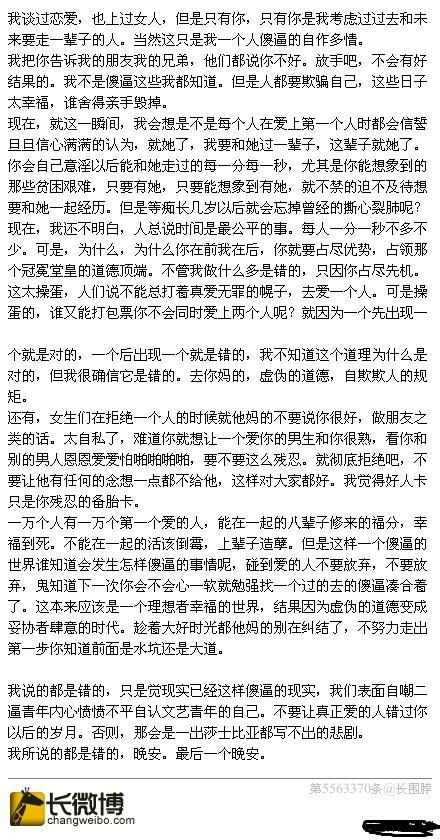

[toc]

# 问题

提问者：**<a href="https://www.zhihu.com/people/">匿名用户</a>**
提问时间: 2013-1-12 15:49:44
总回答数: 0
总访问量: 0

改个题目，换个角度讨论下  
\_\_\_\_\_\_\_\_\_\_\_\_\_\_\_\_\_\_\_\_\_\_\_\_\_\_\_\_\_\_\_\_\_\_\_\_\_\_\_\_\_\_\_\_\_  
  
第一次和一个女孩子相处的这么自然开心。  
  
今年大二，她是我同班同学，异地恋，不过是相距很近的两个城市。我还没有过恋爱经历,和她的关系是最近两个多月才开始进展的。我们会每天聊电话，发短信，一起吃饭，一起自习，一起看电影，一起出去玩。一个月之前和她去过一次酒吧，送她到宿舍门前，和她拥抱吻别。  
就在昨天，我们一起出去吃火锅，然后去看电影。  
  
我送她至宿舍门前是，我抱着她，然后吻她，在她耳边说我怕我是喜欢上你了。  
她没回答只是接着吻我，然后她说可是我有男朋友啊，他对我很好，我找不到不要他的理由啊。  
我说可是我就是爱上你了。分别的时候她拉着我的手说从今天开始不要再喜欢我了。  
  
之后我们又传了几条短信。这是她的回复：  
「不要这样，是我不好，我太把你对我的好看作是自然的了，不要对我这么好了，这样对你太不公平」  
「你怎么就这么固执，你一定要受伤才会拐弯吗，你是想看到我伤害了我的朋友，然后明明知道她难过，还要装作不问不理吗」  
「我现在的感觉好复杂，我还是会想之前一样和你相处，希望你也是，晚安。」  
  
说我矫情也好，博同情也好。可是我真的喜欢上她了，活了这么大是第一次。真不知道现在该怎么办。只想听一些建议。  
  
可是我真觉得女孩子的人品没有问题，没有不靠谱。  
\_\_\_\_\_\_\_\_\_\_\_\_\_\_\_\_\_\_\_\_\_\_\_\_\_\_\_\_\_\_\_\_\_\_\_\_\_\_\_\_\_\_\_\_\_  
  
到了如今，我更爱她了。  
但是已经没有可能了。  
她是我第一个真真真真真正爱上的女孩。  
  
下面我们讲清楚那天我写下的一些文字和疑惑。  

  
——————————  
  
2013年3月24日更新：  
  
楼主成功了。这之间太多故事，有时间来填坑吧。  
对于大家对于女生的评论我也不想辩解什么。我喜欢而已。  
  
我记得张公子曾经写过一篇文章，大致意思是说，这个世界这么复杂，文字玩的再好的作家也只能描述出它的千万分之一。那对于我来说也只是能描述出这段感情在我心中的一点点的感觉。  
既然你们得到的信息只是一些很很少很少甚至是不靠谱的碎片。那么我们应该对这个世界美好的推断。不要随随便便对一个你不了解的女孩下侮辱性的论断。  
  
谢谢。  
  
——————————  
2014年5月18日更新：  
  
大家都不要关心了。  
  
我现在和女主角关心很好很恩爱。也许有些人会说我是贱人，破坏别人感情。但是这个世界就是这样。女孩子总会跟着对他好的人。  
  
我也不知道我的所作所为对不对。但是我爱她，我认为我能给她更好的。  
  
你们就不要瞎操心了。

# 回答

回答者： **<a href="https://www.zhihu.com/people/mi-lu-de-mi-lu-87-42">医心漫漫</a>**
回答时间: 2026-10-3 8:8:41
点赞总数: 152
评论总数: 18
收藏总数: 540
喜欢总数：6

百分百撬走你女朋友的两个套路。

说真的，不管多坚定的女生，大概率都躲不开这个套路，当年我身边就有好几个兄弟栽在这个上面，连我自己都差点被这种话术逻辑带偏，但是我必须先把丑话说在前头，这期的内容我绝不是提倡你去学这种套路去破坏别人的感情，但你最好吃透，不然当你的女朋友中招了，她的心一旦跟那个人跑了，你再想把她拉回来就难如登天了。

第一招，先帮她消除愧疚感。

你想想，就算你女朋友只是有点越界的念头，心里多少会有点愧疚感吧，这是人的本能，但外面那个男的只靠一句话就能让她的愧疚感瞬间清零，甚至会让她觉得自己动摇都合情合理。

这句话就是：“你真的是个好女孩，好到让人心疼。”

接着他再补刀：“因为他，你付出了那么多，他却不珍惜，不懂你的委屈，换做别人早走了，也就是你还在扛。”

说实话，我真佩服这种话的阴险，既把你女朋友捧到天上，又悄悄踩了你一脚，最狠的是他还把她的动摇给合理化了，这句话潜台词很明确“你不是变心，是受了太多委屈，这是应该的”。

本来你女朋友还在纠结对错，突然有个人这么懂她，她瞬间就把对方当成知音了，往后她有什么心里话，遇到什么烦心事，她还会跟你说吗？答案不用我多说了吧。

紧接着第2句就来了，直接击碎她的道德底线，当她的愧疚感彻底消失后，那男的会趁热打铁抛出这句话，让她把恋爱里的责任和底线全部抛到脑后，他会这么说：“没遇到你之前，我早就不相信爱情了，更不敢盼着真爱，可认识你之后，我才懂什么叫相见恨晚，我知道我们这样不合适，大概率没结果，但我就是控制不住对你动心，我从来没有对谁有过这种感觉，明知道不该打扰，可我就是放不下，或许这就是命，在错的时间遇到对的人。”

这种深情人设的套路我见过太多了，一整套话下来，直接把自己塑造成了为真爱不顾一切的角色，你女朋友听完只会觉得“原来他才是最懂我的人”，她不会觉得自己是背叛，只会觉得是在追求真爱，往后对这段暧昧关系只会越来越理直气壮。

然后就是第二招，利用戒断反应彻底勾住她的心。

等前2句话让她彻底陷进去，那男的就会使用最狠的欲擒故纵抛出第3句话：“我知道你善良，我不想因为我们的事影响你们的感情，我不想让你为难，我是真的爱你，不忍心看你左右纠结，以后我不会再联系你了，你一定要好好照顾自己，记住，这世上永远有人在默默的爱着你。”

他先让你的女朋友认定“全世界只有他懂我”他再用“不再联系”刺激她的恐惧，让她害怕失去这份独一无二的真爱。

到了这一步，你女朋友大概率会不顾一切想要抓住他，哪怕抛下你和你们的这段感情，一门心思的想跟他走。

说到底，这些招数根本不是什么高深技巧，就是靠甜言蜜语消除愧疚，再用欲擒故纵激发占有欲，精准拿捏了女生怕委屈、怕不被懂、怕失去的情感弱点。

我必须提醒大家，一旦发现你女朋友有什么不对劲的苗头，比如说她突然对你冷淡，总躲着你聊手机，频繁吐槽你的不好，那你一定要趁早把她的这个念想掐死在摇篮里，别等到人家把这套流程都走完了，你辛苦经营好几年的感情可就真的保不住了。

好了，如果大家遇到感情方面的问题，有不懂的，可以联系我，我会帮你答疑解惑，做好你情感道路上的良师益友。

  

原文地址：[(医心漫漫)喜欢一个有男朋友的女孩，我该怎么办？](https://www.zhihu.com/question/20710154/answer/2089627927570814593) 

