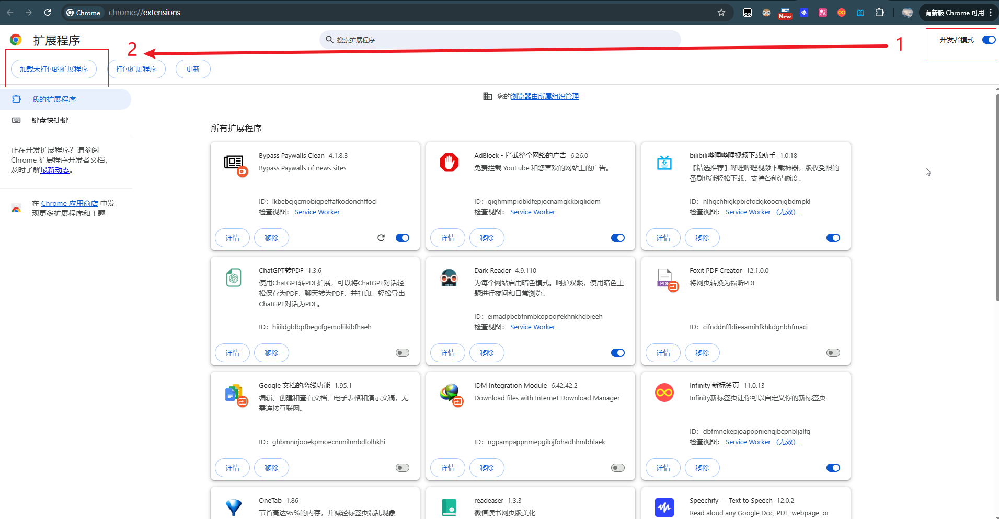
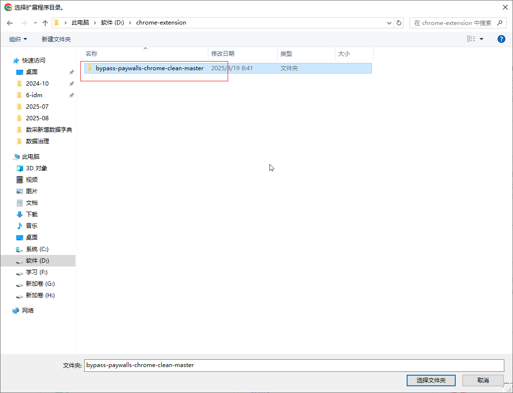
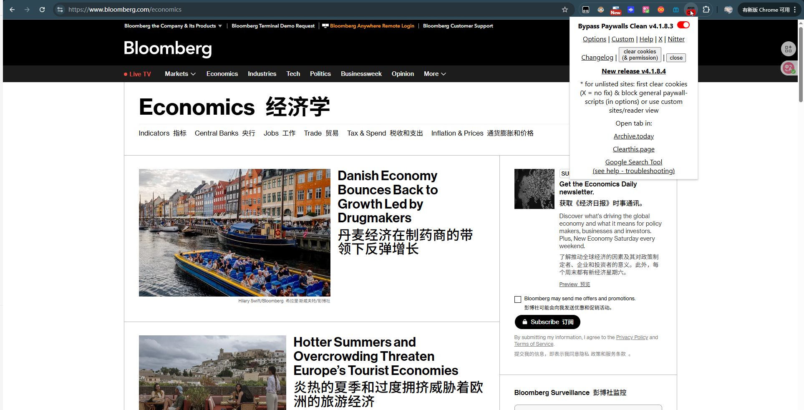
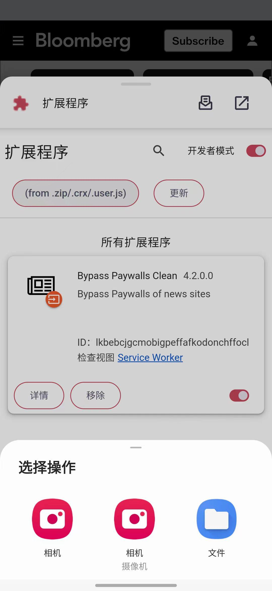

[toc]

# 问题

提问者：**<a href="https://www.zhihu.com/people/tu-zi-92-66-87">兔子</a>**
提问时间: 2025-7-28 18:9:2

美国情报系统现在属于什么水平？

# 回答

回答者： **<a href="https://www.zhihu.com/people/wo-xin-ruo-chen">夜来风雨</a>**
回答时间: 2025-8-20 8:50:2
点赞总数: 41582
评论总数: 1259
收藏总数: 110151
喜欢总数：1615

很多人因为订阅费用的问题，看不了《彭博社》《华尔街日报》《经济学人》等知名媒体的文章。这里推荐一个由俄罗斯大神 **magnolia1234**  开发的开源项目  **bypass-paywalls-chrome-clean** 。这是一个浏览器插件，可以帮助用户绕过大多数知名网站的付费墙，直接阅读内容。该项目目前已持续更新一年，最新版本发布于  **2025 年 9 月 4 日** ，因此短期内不用担心失效问题。  
 **项目地址：** 

[https://gitflic.ru/project/magnolia1234/bypass-paywalls-chrome-clean](https://gitflic.ru/project/magnolia1234/bypass-paywalls-chrome-clean)

 **项目原始安装包地址：** 

[插件原始安装包地址](https://gitflic.ru/project/magnolia1234/bpc_uploads)

 **项目介绍** ：该项目可以绕过大多数知名网站的付费墙。支持网站如下：  

  
 **安装过程** ：通过项目地址获取插件压缩包；压缩包解压之后，需要通过浏览器开发者模式（不同浏览器略有差异）加载未打包的扩展程序。有些知友可能会出现加载插件失败的情况，再重复操作加载一次即可解决。如果访问不了项目安装包地址，请直接访问以下蓝奏云地址，获取压缩包。访问 **密码:zhihu** 

[插件安装包](https://wwpl.lanzouw.com/i4EZP35t0n9a)

很多人不会安装插件，下面给出以谷歌浏览器为例的 **具体过程** ：

1.在地址栏里里输入chrome://extensions/，或者在设置里找到扩展程序，弹出以下界面，然后打开开发者模式后，点击加载未打包的扩展程序。

2.选择解压后的压缩包（网盘里下载的是压缩包，解压即可）

3.敲重点，第一次加载这个文件，有些知友可能会出现加载失败的情况，如图所示，但只要 **重复操作上面的第2步步骤** 就能加载成功。

4. 插件正常运行状态，如下图所示，彭博社也可以正常浏览。

  

 **回答评论区知友一些疑问：** 

1.   **火狐、360、Edge浏览器，安卓手机上可以用吗？** 其实 火狐、360、Edge 这些浏览器，还有安卓手机， **都是可以用的** ，按原项目页面里的说明一步步操作就行。火狐浏览器主要使用xpi格式插件， xpi,360/Edge/谷歌浏览器可以使用的crx,以及安卓使用的crx插件都被整合到下面这个链接。供知友下载。

[火狐谷歌安卓插件](https://wwpl.lanzouw.com/iHIMm33zgw4j)

2.  **安卓手机具体如何使用？** 得先安装可以支持安装crx格式扩展的手机浏览器。项目原地址的俄罗斯作者推荐的安卓浏览器是 **Quetta手机浏览器。** 打开Quetta浏览器  _设置---> 扩展--->开发者选项--->from .zip/.crx/user.js--->选择crx插件导入_ 。 即可告成

 **Kiwi浏览器** 或许也可以,但它已经不更新了.

3. 有知友 [@黄小胆](https://www.zhihu.com/people/397d3e15159df7bffb6d93d64ec8faa6) 提出：解压缩后的文件拖到那个浏览器界面就能直接安装了，这种方法也可。

  
4.  **《华尔街日报》不能访问？** 实际上华尔街日报需要登录账号之后，才可以破解付费墙。请注意区分wsj和wsj中文网，后者并未破解。

  
5.  **答主使用的双语翻译插件是什么?** 回答是 **沉浸式翻译** ，可以配合deepL的API（性价比很高）使用，翻译更加强大。这个插件曾被爆料出泄露用户隐私，用户需要留心。

6.  **我的谷歌浏览器怎么安装不了crx格式插件？** 原因是谷歌浏览器在35版本之后，禁止了非应用商店插件，在扩展列表中，被禁用的扩展右侧启用的选项已变成不可勾选状态。要么回到老版本谷歌浏览器，要么解决方案可参考如下

[该扩展程序未列在 Chrome 网上应用店中，并可能是在您不知情的情况下添加的”的方法](https://github.com/xiaodongxier/iTools/issues/50)

7. **Mac,iphone或者ipad是否能绕过付费墙？** MAC安装谷歌浏览器是可以破解的.iphone和ipad答主也没测试过,建议用户看看项目提供的 iOS 教程自行测试.

8. **Science,Nature等论文期刊能否绕过付费墙?** 不幸的是,国外传统高影响力期刊基本采用硬付费墙.这个插件只能帮助阅读一些免费文章.知友可以尝试使用 **SCI-HUB** 或者 **arXiv** 网站寻找论文.

9. **这个浏览器插件有后门吗?** 答主使用chatgpt codex审查了源代码,目前源代码中没有明显的代码用于窃取用户信息和恶意请求.

  
10.这个插件破解不了 **明镜周刊** Der Spiegel怎么办？可以通过存档网站寻找

[https://archive.ph/](https://archive.ph/)

  
 **注** ：  
1. **部分网站仅支持免费文章** ；一些有“限量阅读”的网站可通过清除 Cookie 继续访问。

2.部分网站需要登录账号之后，才可以破解付费墙

3.访问国外网站肯定需要ladder,请自行寻找.  
  
答主写这篇文章整合资料良久，麻烦知友们多多点赞一下， **谢谢。**

  

原文地址：[(夜来风雨)美国情报系统现在属于什么水平？](https://www.zhihu.com/question/1933227451481323222/answer/1941421698881681174) 

