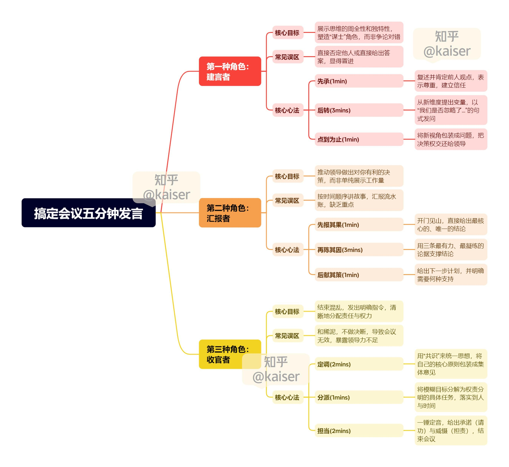

[toc]

# 问题

提问者：**<a href="https://www.zhihu.com/people/jia-fei-ai-shang-qing-tian">特特的资料库</a>**
提问时间: 2025-8-17 8:4:24

如何提升会议上五分钟发言的思路和水平？

# 回答

回答者： **<a href="https://www.zhihu.com/people/densen">Kaiser</a>**
回答时间: 2025-10-21 9:50:58
点赞总数: 84
评论总数: 5
收藏总数: 247
喜欢总数：6

我亲眼见过一个天才是如何在五分钟内，毁掉自己前途的。

那是一场决定公司下半年冲刺年度目标的方案会，几个部门负责人吵得不可开交，会议陷入了僵局。

大领导为了转移下火力，随手点了角落里那个刚入职1年多的年轻人问，你有什么想法建议？

那年轻人一看这机会不就来了吗，于是开始居高临下地点评起了刚才各位部门总的方案，然后再提出了一个自己思考了很久破局之法，逻辑缜密，数据也算详实，最后用一句“综上所述，我认为(我)这个方案才是唯一可行的”为自己做了个总结。

会议室瞬间安静了。大领导脸上没有任何表情，看了一眼他，然后就转向旁边的一位部门总，说，老张，我们继续讨论A方案。

那个年轻人，还愣在那里满脸通红，直到会议结束他可能都没想明白自己错在哪了，他搞错了自己的角色，领导让他提建议，他却替领导做了总结。

一场会议，就是一个小小的权力场，

题主这个问题问的贼好，把思路放在水平前面，不同场景角色下的发言目标完全不一样，思路一旦错了，你说得再有水平再妙也可能满盘皆输。

（温馨提示：嫌字多的可以拉到底下看总结和思维导图～）

##  **场景一：问你想法和建议** 

会议正在讨论一个方案遇到了卡点，或者领导直接点名问你有什么想法建议。

这时候你的目标是什么？是证明你的领导或者同事都是错的，还是避免枪打出头鸟不发言最好？

都不是。

 **你的唯一目标是展现你思维的周全性和独特性，塑造一个值得信赖的“谋士”角色，同时不要得罪人。** 

最容易犯的错，有两个，一个是把自己当吃瓜群众啥想法都没有，另一个是直接否定别人，这两种都显得过于稚嫩和冒进。

高手的建言从来不直接给答案，而是提供视角，这个心法，叫 **先承后转，点到为止** 。

这五分钟，你要看似闲庭信步，实则暗藏机锋。

###  **先承** 

用一分钟把你前面同事或领导的观点，用你自己的话，复述一遍，并给予肯定。这证明了你在认真听，并且尊重他人。这是建立信任的第一步。

###  **后转** 

然后，花3分钟从一个所有人都没有想到的角度，提出一个新的变量，不要说“对”或“错”，而是说“我们是不是还忽略了另一个维度？” “我认为还没有分析什么？” “其他优秀企业做过什么？”

###  **点到为止** 

最后，把这个新维度包装成一个问题，而不是一个结论（因为还轮不到你下结论），然后把球重新踢回给会议和领导。

我们上个案例感受一下。

假设大家正在激烈讨论是否要为了抢占市场，而进行一轮大力度的降价促销。

一个没有章法的人会说：我觉得不行，降价会损害我们的品牌。

而一个有章法的高手会说：

> 领导，我非常同意刚才几位同事的看法。通过降价，我们确实能在短期内迅速地冲高销量，抢占市场份额。这个思路非常直接有效。  
> 与此同时，我在想另一个层面的问题，我们这次降价，会不会引发竞争对手，更激烈的价格战？如果他们跟进，甚至比我们降得更狠，我们有没有预案？另外，我们那些刚刚原价购买了产品的老用户，会不会产生被背叛的感觉？这部分用户的口碑，我们要如何去维护？  
> 这几个风险，可能会给我们长期的品牌价值，带来一些不确定性。这个问题，我觉得我们应该也要考虑进来，看看应该如何权衡？

虽然没有给出任何答案，但已经不动声色地向所有人展现了你思维的深度，你看问题的广度和你对潜在风险的预判能力。

##  **场景二：汇报工作或方案** 

这几乎是最常见的场景，领导让你汇报一个项目的进展。

你的目标是什么？是让领导知道你过去一周有多努力，加了多少班，克服了多少困难吗？

显然不是。

你的唯一目标，是推动领导做出一个对你有利的决策。可能是给你更多的资源，可能是批准你下一步的计划，也可能只是让他安心不再过多地干预你。

而新人最容易犯的错就是 **讲故事** ，他会从头到尾，按时间顺序把自己做的每一件事，都事无巨细地讲一遍。他以为这是详尽，但在领导眼里这是没有重点，是浪费时间，是思维混乱。

高手的汇报，从来不讲故事，只讲章法。这个章法，叫 **先报其果，再陈其因，后献其策** 。

这五分钟，你要像刺客，招招致命，绝不拖泥带水。

###  **先报其果** 

不要铺垫，不要讲故事，开门见山，在第一分钟直接把你这阶段工作最核心的、唯一的结论，像一颗钉子一样，钉在所有人的脑子里。

###  **再陈其因** 

用三条最有力、最凝练的论据来支撑你的结论，这三条论据，就是你结论的梁柱，必须坚实、有力，有理有据。

###  **后献其策** 

最后一分钟，告诉领导，基于以上结论，你下一步的打算是什么，需要什么样的支持，这展现的是你的思考和担当。

我们用一个案例来推演，假设领导让你去调研一下市面上的三款竞品。

一个没有章法的人会说：

> 领导，这周我调研了三个竞品，我先看了竞品A，它的官网是…，功能有…，然后我又去看了竞品B……嗯，大概就是这些情况。您看看怎么选择？

领导听完一头雾水，因为他只得到了一堆零散的信息，没有任何重点和结论。

而一个有章法的高手会说：

> 领导，关于竞品调研，我的结论是：竞品A目前对我们威胁最大，应作为我们未来一段时间的重点盯防和研究对象。  
> 我得出这个结论，主要基于三点发现：  
> 第一，竞品A的市场份额和用户好评度，都显著高于B和C；  
> 第二，我实际体验后发现，A的用户留存设计，比我们领先了至少半个版本；  
> 第三，B和C还在模仿我们，而A已经开始在核心功能上做微创新了。  
> 所以我建议，我们下一步可以集中力量，对竞品A做一个更深度的拆解，这是我做的一个初步框架，您看是否可行？如果可以，我希望能申请一些预算再多找几位用户做一下访谈。

同样的工作，后一种汇报方式，清晰有力并且充满了主动性，没有在被动地等待指令，而是主动地引导你的领导进入你为他设定好的决策轨道。

##  **场景三：总结发言** 

一场会议讨论了很久，众说纷纭，下属们争得面红耳赤，依然没有结论。

所有人的目光都投向了你，这个会议的主持、这个团队的最终决策者。

你的目标是什么？是把所有人的观点都复述一遍，做一个不得罪人的和事佬吗？强行输出自己的观点和结论吗？

都不是。

 **你的唯一目标，是结束这场争论、发出明确的指令并且把责任和权力清晰地分配下去。** 

一个平庸的领导，最容易犯的错就是 **和稀泥** 。他会说，我觉得大家的意见都很好，都很有道理，我们回去再消化消化。这种总结看似圆滑实则是领导力的破产。

好的收官从来不和稀泥， **靠的是定调与分派。** 

###  **定调** 

花2分钟用“共识”这个词，把所有人的不同意见，都统一到你的框架里来，把你最想强调的几个原则，包装成“大家的共 "识”。

###  **分派** 

把一个模糊的目标，变成几个清晰的、权责分明的、甚至略带一丝制衡意味的任务包，明确到人，明确到时间。

###  **担当** 

用一分钟，总结并结束会议，给出承诺也给出威慑，别忘了给大家打打气。

比如，他会说：

> 刚才大家讨论得很充分，大家准备得很充分。我听下来，感觉我们在三个点（做领导的基本功：凡事讲三点）上基本是达成了共识的。  
> 第一，目标必须拿下。  
> 第二，资源是有限的。  
> 第三，风险要可控。  
> 基于这几点，我来做个分工。张三，你负责主攻，人财物我给你最大的权限。李四，你负责风控，有一票否决权。王五，你负责后勤。  
> 这件事就这么定了，会后落到纪要里。干好了，我为你们请功，干砸了，我带头和大家一起挨板子。

短短几分钟把一场混乱或失控的讨论变成了一次权责分明、有明确时间节点、并且赏罚清晰的作战部署，因为作为收官者，你要展现的是决断力是担当，是一个统帅最核心的价值。

___

会议上的那几分钟从来就不是一次简单的发言，你得当成是一次精准服务于你特定目的的出手。

建言，是为了不得罪人地展示你的潜力。

汇报，是为了抬高你的身价，争取到资源支持。

总结，是为了宣示你的权威并把活安排下去。

先想清楚了图什么，再想该怎么说。

___

## 完整方法论思维导图

  

原文地址：[(Kaiser)如何提升会议上五分钟发言的思路和水平？](https://www.zhihu.com/question/1940323048856191058/answer/1963905081045915321) 

