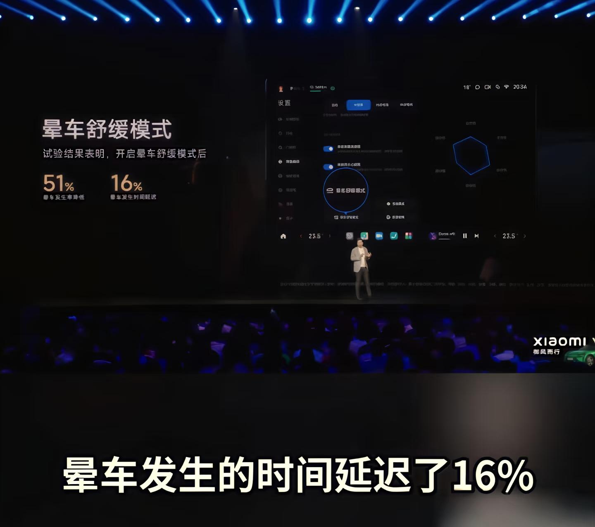
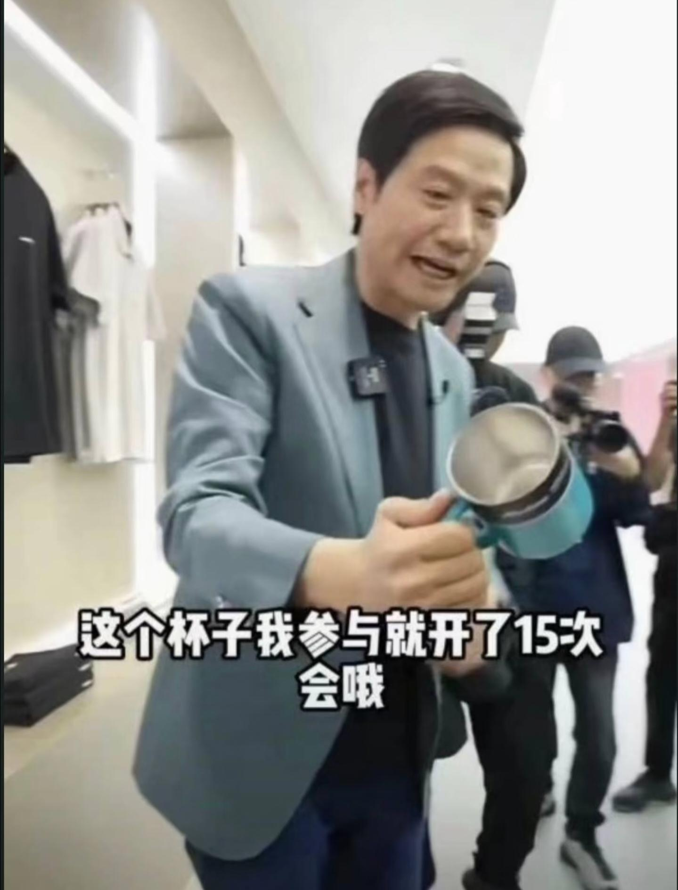

[toc]

# 问题

提问者：**<a href="https://www.zhihu.com/people/ai-ying-ying-ying-si-tan-64-43">爱嘤嘤嘤斯坦</a>**
提问时间: 2024-2-7 6:22:46

领导说你的材料写得太虚，怎么办？

# 回答

回答者： **<a href="https://www.zhihu.com/people/densen">Kaiser</a>**
回答时间: 2025-11-21 15:41:52
点赞总数: 948
评论总数: 94
收藏总数: 2446
喜欢总数：41

现在你是领导，看两段关于“优化营商环境”的工作总结。

 **一：**   
今年以来，我局高度重视营商环境建设，深入贯彻上级决策部署，坚持以人民为中心的发展思想，全面深化“放管服”改革。通过加强组织领导，强化责任落实，广泛宣传发动，营造了浓厚的干事创业氛围。各项工作取得了显著成效，服务质量大幅提升，企业满意度不断增强，为全区经济社会高质量发展奠定了坚实基础。

 **二：**   
今年以来，我局共优化3项不必要的审批环节，将企业开办时间从5个工作日压到了2个工作日。全区12个办事大厅全部实现了“午间不打烊”，累计为企业延时服务超400小时。针对去年投诉集中的“办证难”问题，开展了专项整治，开展暗查抽查25次，通报批评了1名科级干部，全年新增注册企业1500家，同比增长12%。

把这两段放在一起，你觉得哪个虚，哪个实？

材料一读起来朗朗上口，四六句对仗工整，词汇也很高级，但看完之后脑子里一片空白。不知道到底干了什么，也不知道干成了什么，这就是典型的虚。

材料二大白话，甚至有点流水账，但每一句话都像砖头一样硬。砍了多少环节，压了多少天，处理了谁，增长了多少，这就是实。

当然，一份上好的材料肯定是需要虚实结合，但今天我们主要讲如何让材料更实。

##  **为什么领导会觉得材料“虚”？** 

在体制内，评价一篇材料好坏的标准，从来不是文采，而是功能。

领导说材料写得虚，不是嫌弃内容少，也不是觉得词藻不够华丽，本质上，是因为这篇材料 **既不能帮他向上邀功，也不能帮他向下施压** 。

向上邀功，需要的是独家性和硬通货。上级领导每天看几十份材料，那些放之四海而皆准的套话，在他眼里就是空气，他想看的是你这里到底有什么别人没有的招数，有什么实打实的数据支撑。

向下施压，需要的是抓手 **和** 痛感。如果材料里全是加强、促进这种软绵绵的词，下面的人看了根本不当回事。只有明确了谁来干、干什么、干不好怎么罚，这篇材料才具有行政效力。

所谓的虚，在行政逻辑里，等同于无效。

这种无效，通常表现为三个层面的病灶。

###  **病灶一：放之四海而皆准** 

很多笔杆子写材料有个习惯，喜欢套模板。

写开头就是“高度重视、精心组织”，写过程就是“扎实推进、强化措施”，写结尾就是“成效显著、再创辉煌”。

这些词本身没错，但问题在于它们太通用了。

把标题里的“公安局”换成“环保局”，把“环保局”换成“妇联”，里面的内容竟然完全通顺，甚至不用改一个字。

这就是最大的问题。

这种缺乏“单位辨识度”和“业务颗粒度”的材料，在领导看来就是偷懒。

每个单位的职能不同，痛点不同，工作方法也应该截然不同。公安讲究的是“打击”，环保讲究的是“治理”，信访讲究的是“化解”。如果用一套通用的行政话术去套所有的业务工作，写出来的东西必然是面目模糊的。

领导拿到这种材料，心里会发慌，因为他没法拿着这个去跟别的局长比拼。别人都在讲具体的战法、讲独特的创新，他拿出一篇万能模板，这就等于在政治舞台上失去了面目。

###  **病灶二：只有形容词，没有度量衡** 

这是最常见的通病。

通篇都是“效果良好”、“大幅增长”、“得到广泛好评”、“迈上新台阶”。

这些形容词在行政语境里，是最廉价的。

什么叫“良好”？是及格还是优秀？什么叫“大幅”？是增长了1%还是100%？什么叫“广泛好评”？是有锦旗，还是有感谢信，还是有媒体报道？

没有数据和事实支撑的形容词，在领导眼里就是欺骗，至少是心虚。

领导是要拿着材料去开会的。如果上级领导突然问一句：“你这个大幅增长，具体是多少？”

他答不上来，那个场面就是灾难。

体制内的信任链条非常脆弱，一旦你在材料里用了过多的模糊性词汇，领导就会默认你没干实事，或者干了但拿不出手，他不敢用你的材料，因为他承担不起被上级问住的风险。

###  **病灶三：只有原则，没有动作** 

写工作打算或者部署任务时，最容易犯这个毛病。

“下一步，我们要狠抓落实，强化责任担当，确保任务完成。”

这句话听起来正气凛然，实际上一点用没有。

谁来抓？是局长抓还是科长抓？怎么落实？是开会落实还是现场检查落实？责任怎么强化？是纳入绩效考核还是搞末位淘汰？

 **缺乏主语和动词的材料，无法转化成具体的行政指令。** 

领导看完这种材料，会觉得很累。因为你只告诉了他“要去哪里”（目标），但没告诉他“怎么去”（路径），他还需要自己脑补所有的执行细节。

 **如果一篇材料不能让阅读者产生具体的画面感和压迫感，那它就是废纸。** 真正的实材料，是看完之后，相关责任人会后背发凉，知道再不干活就要挨板子了；或者是看完之后，大家心里有了底，知道接下来第一步迈哪条腿，第二步迈哪条腿。

___

## 如何让材料变得更“实”？

诊断清楚了病灶，接下来得开方抓药。

把一篇虚头巴脑的材料变实，不需要重起炉灶，只需要做三次改造转化，核心逻辑就一条：

 **把所有模糊的定性描述，全部转化为精确的定量描述和动作描述。** 

###  **一、把好变成数** 

这是最基础也是最快的转化方式。

很多笔杆子怕写数据，怕数据不好看或者觉得有些工作（比如思想建设、组织协调）没法量化。

这是一种误解，也说明还没有真正入门，在行政逻辑里，就好比在雷军眼里，没有不能量化的工作。

  

 **如果绝对值不够大，就找相对值。** 

比如今年的经济指标增长不明显，写“增长平稳”就很虚，这时候要找排名。虽然只增长了3%，但在全市的排名从第10名进到了第8名，这就叫进位争先，这就是实打实的成绩。

 **如果连排名都没优势，就找覆盖率和频次。** 

比如搞理论学习，写“学习氛围浓厚”是废话，要写“全年组织集中研讨12次，班子成员人均撰写心得体会5篇，基层支部覆盖率达到100%”。

这些数字堆上去，哪怕学习的效果还是看不见摸不着，但学习的动作被坐实了。领导拿着这个数据，就能证明他履职尽责了。

 **还有一种更高级的量化，叫负面清单清零。** 

有时候没出成绩就是最大的成绩。比如安全生产、信访维稳，这时候不要写“形势平稳”，要写“连续300天无重特大事故”、“积压三年的骨头案全部清零”。

数字是材料的骨架，有了骨架，这篇材料才能站得住，经得起推敲。

###  **二、把想变成干** 

虚材料满篇都是“想法”，实材料满篇都是“做法”。

 **要对材料里的动词进行一次大清洗。** 

把那些软绵绵的词，统统剔除出去，慎用少用“加强、促进、推动、鼓励”，多用“建立、实施、关停、否决、纳入”。

 **每一个观点后面，必须跟着一个具体的载体。** 

这是检验材料实不实的最简单标准。

比如写“加强作风建设”，如果后面跟着的是“提高思想认识”，这就是虚的。如果后面跟着的是“在办公楼大厅设立曝光台，每周通报迟到早退名单”，这就是实的。

这个曝光台，就是载体。

再比如写“优化审批流程”，如果后面跟着“提升服务效率”，也是虚的。如果后面跟着“推行‘容缺受理’机制，对13项非关键材料实行先办后补”，就是实的。

这个容缺受理，就是载体。

写材料的时候，要逼自己一把。每写到一个大原则，就问自己一句： **通过什么抓手来实现？** 

如果没有抓手，这个原则就别写，写了也是凑字数，反而稀释了整篇材料的浓度。 **领导看材料，找的就是这些抓手** ，因为只有抓手，才能变成他布置工作的具体指令。

###  **三、把面变成点** 

宏大叙事有时候是苍白且无力的。

当你要论证一个工作成效显著时，列了一堆数据可能还不够直观。这时候，需要用一个具体的案例来点睛。

 **这就是点面结合。** 

比如在汇报招商引资成果时，讲完引进了多少亿资金、多少个项目之后，紧接着要讲一个故事：

“特别是针对XX龙头企业落地难的问题，成立了专班，XX局长亲自挂帅，用3天时间解决了困扰企业半年的用地指标问题，企业十分感动，当场追加了投资。”

这个案例一放上去，整篇材料瞬间就活了。

它不仅证明了成绩，还展示了作风，更突出了主要领导的功劳。

领导在会上念材料，念到数据时往往是枯燥的，但念到这个具体案例时，他会停顿一下，甚至会脱稿发挥两句。

为什么？

因为这个案例给了他 **画面感** ，也给了他谈资。

一个好的案例，胜过一千字的理论论述，它能让听汇报的上级领导瞬间记住你们单位。

###  **最后，例行小结一下** 

作为笔杆子，要牢记一个点，把材料写实，不是为了炫技，而是为了好用。

当一篇材料里，有扎实的数据撑腰，有强硬的抓手落地，又有生动的案例点缀，它就从一篇干巴巴的公文变成了一把趁手的兵器。

领导拿着它，向上能理直气壮地要荣誉、要资源，向下也能不怒自威地压担子、追责任。

这才是体制内笔杆子该有的段位。

  

___

## 体制内公文语料库（供收藏）

为了让你手里的这支笔真正变成冲锋枪，我把自己整理收集的压箱底语料库分享出来。

建议直接收藏，打印出来压在办公桌的玻璃板底下，卡壳的时候，扫一眼，灵感马上就来。

我把它们分成了四大门类：

 **动词（动作）、名词（概念）、短语（气势）、句式（逻辑）** 。

###  **一、 动词篇：把干活写出雷霆万钧的力度** 

写材料最忌讳动词贫乏。别只会用“做、搞、弄、抓”。在体制内，不同的力度，对应不同的动词。

 **1. 表示开始和启动** 

 **启动、部署、谋划、筹备、起草、酝酿、构建、搭建、打造、设立、铺排、拉开、吹响。** 

-    _例句：_   **拉开** 了改革的序幕； **吹响** 了攻坚的号角； **构建** 了全方位的防控体系。

 **2. 表示“推进”和加强** 

 **推进、推动、推行、实施、践行、深化、强化、细化、优化、实化、量化、硬化、催化、督导、督办、协调、统筹、加持、赋能、加码、提速。** 

-    _例句：_  以数字技术 **赋能** 传统产业；层层 **压实** 责任； **倒逼** 工作落实。

 **3. 表示攻坚和解决** 

 **攻克、破解、破除、革新、整治、整顿、清理、出清、铲除、遏制、扭转、兜底、补齐、填补、矫正。** 

-    _例句：_   **破解** 了长期制约发展的瓶颈； **补齐** 了民生领域的短板； **兜底** 保障困难群众生活。

 **4. 表示结合和联系** 

 **对标、对表、聚焦、聚力、融合、耦合、嵌入、嫁接、贯通、衔接、联动、呼应、契合。** 

-    _例句：_  主动 **对标** 先进地区；实现产业链与创新链的深度 **耦合** ；坚持问题导向与目标导向相 **契合** 。

###  **二、 名词篇：把琐事包装成战略的高度** 

材料有没有高度，全看名词用得响不响。要学会造概念或者借用这些现成的概念。

 **1. 关于目标与方向** 

制高点、排头兵、领头羊、先行区、示范区、试验田、桥头堡、主阵地、主战场、主引擎、压舱石、定盘星、风向标、指挥棒、路线图、时间表、任务书。

 **2. 关于手段与方法** 

抓手、载体、切入点、着力点、结合点、关键点、引爆点、突破口、硬骨头、拦路虎、绊脚石、组合拳、连环招、先手棋、杀手锏、基本盘。

 **3. 关于状态与格局** 

新常态、新格局、新高地、新赛道、新动能、新优势、深水区、攻坚期、窗口期、黄金期、关键期、快车道、加速度、满负荷、全天候、全方位、全覆盖。

###  **三、 四字短语篇：把流水账变成排比句的气势** 

体制内写材料，讲究的是四六句，讲究的是音韵铿锵。这些四字短语，是用来撑门面的。

 **1. 形容工作态度** 

只争朝夕、不负韶华、夙兴夜寐、闻鸡起舞、披荆斩棘、乘风破浪、激流勇进、迎难而上、背水一战、破釜沉舟、久久为功、善作善成、抓铁有痕、踏石留印。

 **2. 形容工作成效** 

成效显著、亮点纷呈、硕果累累、捷报频传、稳中有进、进中向好、好于预期、超出预期、焕然一新、落地生根、开花结果、蔚然成风、行之有效、可圈可点。

 **3. 形容形势严峻** 

错综复杂、波谲云诡、风高浪急、任重道远、不进则退、慢进亦退、前有标兵、后有追兵、迫在眉睫、刻不容缓、千钧一发。

 **4. 形容思想统一** 

凝心聚力、同频共振、同向发力、步调一致、众志成城、上下一心、心往一处想、劲往一处使。

###  **四、 句式模版篇：把散沙构建成大厦的逻辑** 

有了词，还得有架子。这些经典的句式模版，就是你的骨架，只要往里面填肉，出来的就是一篇标准的公文。

 **1. 动宾结构的小标题模版（最常用，最稳）** 

-   坚持……导向，强化……意识。
-   聚焦……重点，破解……难题。
-   立足……实际，谋划……长远。
-   紧扣……目标，落实……举措。
-   夯实……基础，筑牢……防线。

 **2. 三字诀式的提炼模版（朗朗上口，好记）** 

-   在“深”字上下功夫，在“实”字上做文章，在“新”字上求突破。
-   念好“严”字经，打好“查”字牌，唱好“改”字戏。
-   突出一个“快”字，狠抓一个“准”字，落实一个“稳”字。

 **3. “不仅……而且……”的递进模版（体现全面性）** 

-   既要埋头拉车，又要抬头看路。
-   既要做大蛋糕，又要分好蛋糕。
-   既要有“功成不必在我”的精神境界，又要有“功成必定有我”的历史担当。
-   不仅是数量的增长，更是质量的飞跃。

 **4. “从……到……”的转变模版（体现改革成效）** 

-   实现了从“跟跑”到“并跑”再到“领跑”的转变。
-   实现了从“大写意”到“工笔画”的转变。
-   实现了从“单打独斗”到“握指成拳”的转变。
-   变“群众跑腿”为“数据跑路”；变“被动应付”为“主动出击”。

 **5. 结尾表态的万能模版（升华专用）** 

-   让我们以“咬定青山不放松”的韧劲，“不破楼兰终不还”的拼劲，“天工人巧日争新”的闯劲，奋力谱写……新篇章。
-   蓝图已经绘就，号角已经吹响。我们将以此次会议为契机，……，为……作出新的更大贡献！

###  **五、使用说明** 

这套语料库，不要生搬硬套，是给你在没词的时候找灵感。

 **初级阶段** ，可以照猫画虎，把你的工作内容往这些词里套；  **中级阶段** ，可以排列组合，把不同的动词和名词搭配出新花样；  **高级阶段** ，就会形成语感，这些词会自然而然地从你脑子里流淌出来，这时候，你就真正出师了。

 **建议收藏，常读常新~**

  

原文地址：[(Kaiser)领导说你的材料写得太虚，怎么办？](https://www.zhihu.com/question/643340756/answer/1975227409637872352) 

