[toc]

# 问题

提问者：**<a href="https://www.zhihu.com/people/hai-ru-xian">夏奈</a>**
提问时间: 2015-10-28 14:21:4

《纸牌屋》和《大明王朝1566》哪个权谋更深刻？

# 回答

回答者： **<a href="https://www.zhihu.com/people/wo-zai-zhe-94-35">水清濯缨</a>**
回答时间: 2023-8-24 22:33:40
点赞总数: 17118
评论总数: 345
收藏总数: 22280
喜欢总数：2455

《大明王朝1566》比较深刻。

年轻人要记住，权谋不是一个人耍连环套。阴谋诡计有效但也有限。为什么呢？因为任何一个想做事的人，都厌恶条件的不稳定。

这个千万要记住，塞脑海里。

《纸牌屋》是现代剧，很多手段以利用现代条件形成，虽然眼花缭乱，但无可厚非，毕竟我们确实花样多。但千万别以为权谋就是利用报纸、丑闻搞一波突袭，主持人三言两语带动了风向搞得国务卿下台。

这是不对的。因为“人”是不可控的。而大明王朝正是讲各个生态位上“人”最大限度的不可控会导致什么样的结果的故事。

剧一开始就是国库亏空，然后延展到改稻为桑。这是客观条件，是可控的。不可控的第一个因素，是稻农不肯改。

稻农是一个生态位。但这个生态位的极端上限就是闹事。在条件未形成之前，没有人造反。其实明朝造反的事那么多，很多都失败了，所以稻农桑农这个生态位的上限也不过是举事，单纯农民的造反，成功几率很小，相对是可控的。只不过影响大，会造成舆论，所以决策者和执行者们会尽量避免。

于是决策者和执行者们第一个解决方式就是“抓通倭”。注意，这已经是权谋了，教你怎么对付这个生态位上的人的：分化加惩治典型。

第二个不可控的因素，是执行者们。胡宗宪反对踏苗，反对诬陷，而农民们又不肯改，事情执行不下去，怎么办？于是第二个权谋就出现了：拉胡宗宪的亲信马宁远下水，搞毁堤淹田。

这一招是决策者们的极端上限，试问，几百万生民，千秋之罪，这么大的事故，哪个政权敢包庇？按正常来说，胡宗宪这个总督应该被一撸到底，枪毙。

但是胡宗宪稳住了，通过说服马宁远来获得制衡手底下郑何杨三方，让他们一起上书抵制改稻为桑。这也是个权谋，讲的是执行者们如何化解危机的，组建统一战线，迫使小阁老和司礼监这些决策者们松口的。

当然，胡宗宪还通过改决堤口来使得这场灾难只淹了一个半县，并且通过尽人事（官兵送死）来化解百姓怨气，再通过说服最终裁决者嘉靖不要动摇国本来掩盖这场人祸，使之成为天灾。

但就这一系列操作，足以在大明联赛拿到亚军。郑泌昌说：胡宗宪，高明啊！嘉靖帝说：什么叫公忠体国？这就叫公忠体国。

公忠体国：公正、忠诚、体面、为国。

对于胡宗宪来说，小阁老是不可控的因素。但小阁老对于胡宗宪的极端上限，是撤职，是排出严党小圈子，是穿小鞋。于是胡宗宪辞掉了巡抚，保留总督，一心抗倭。

到此时，这部剧其实已经非常精彩了，官场教科书也不过如此。知道处理极端上限的办法，再弄清自己的生态位，还获得了处理案例，这还不够权谋么？平时那些小事，不过如此。

这部剧涉及的人、位太多，就不一一列举了，剧中的实操，只要领悟了，是可以用到中国任何一个领域的，就这点，《纸牌屋》不如《大明王朝》。

最后，当所有生态位在极端环境中发挥到极致时，海瑞横空出世。单凭基本逻辑拆穿了封建统治的本质，基操还贼6。嘉靖说：一个小小的七品知县，竟有如此霹雳手段，可见也是个至阳至刚之人。足以证明海瑞的MVP身份。大明联赛冠军嘉靖也感到了对手的厉害。

最最后，看懂这部剧的，很多人都粉了海瑞，因为那是理想主义的美好状态。不过事实上，中国两千年来，只有一个海瑞。

我在“我的文章”栏目里，写了关于海瑞的事，有疑问的同学可看看，算这篇文章的解释。

那篇文章可能被屏蔽了，截图发出来看看能否看到

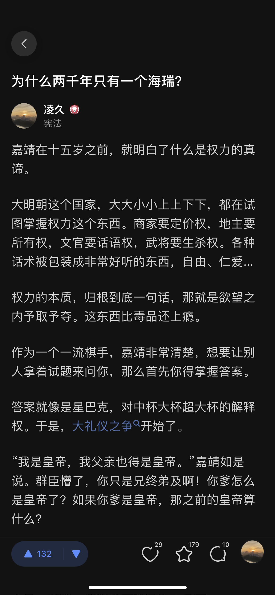

  

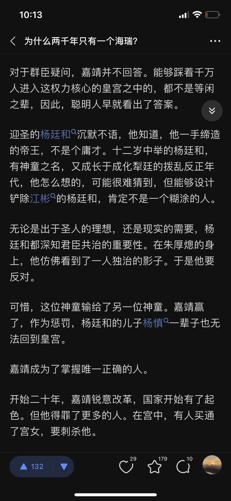

  

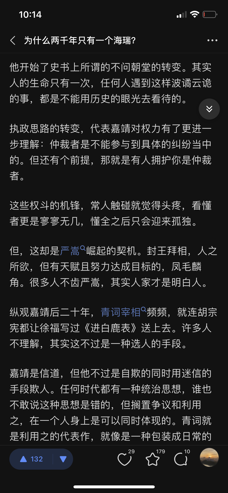

  

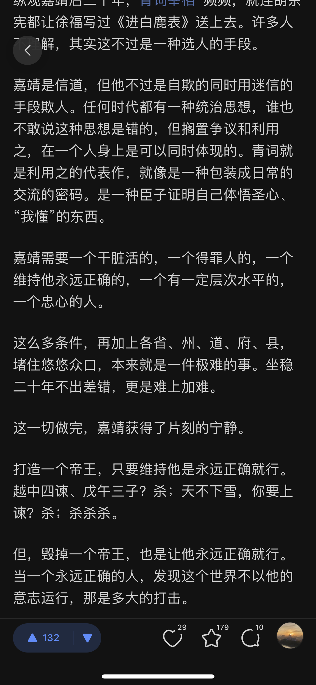

  

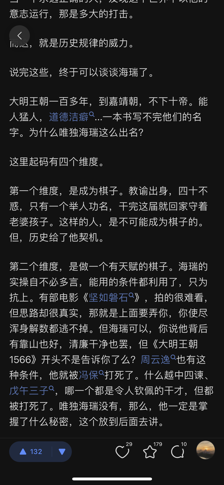

  

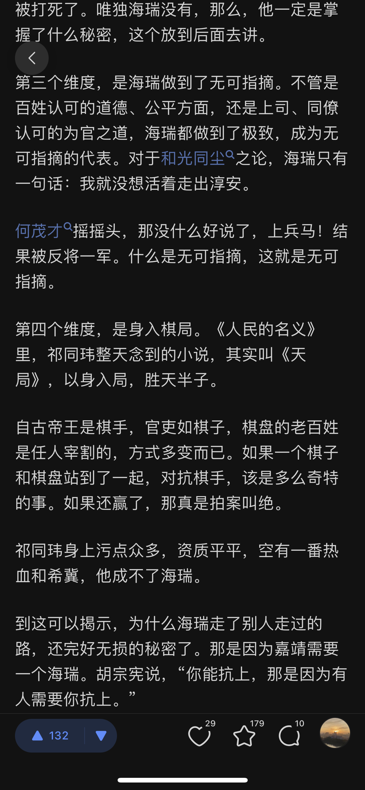

  

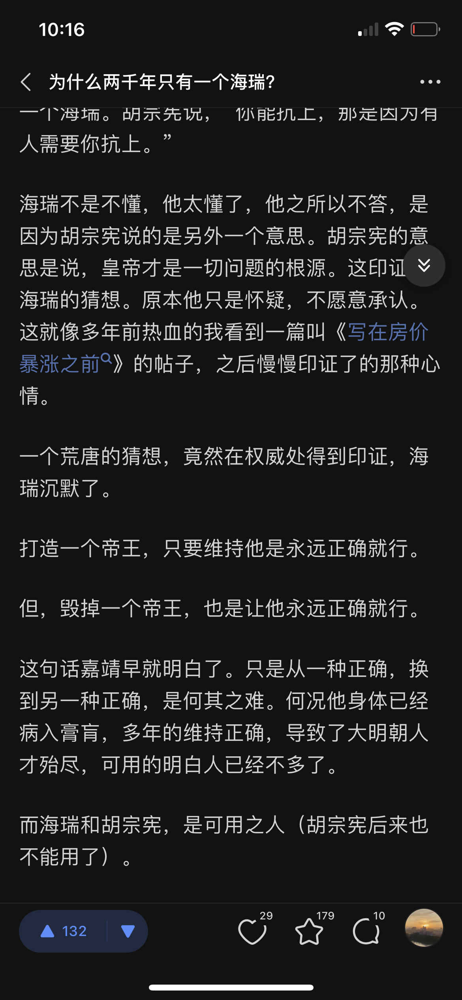

  

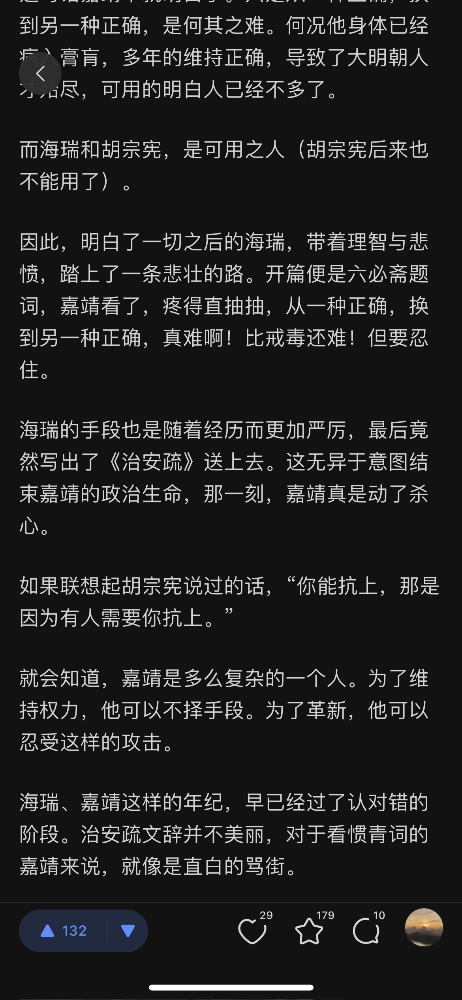

  

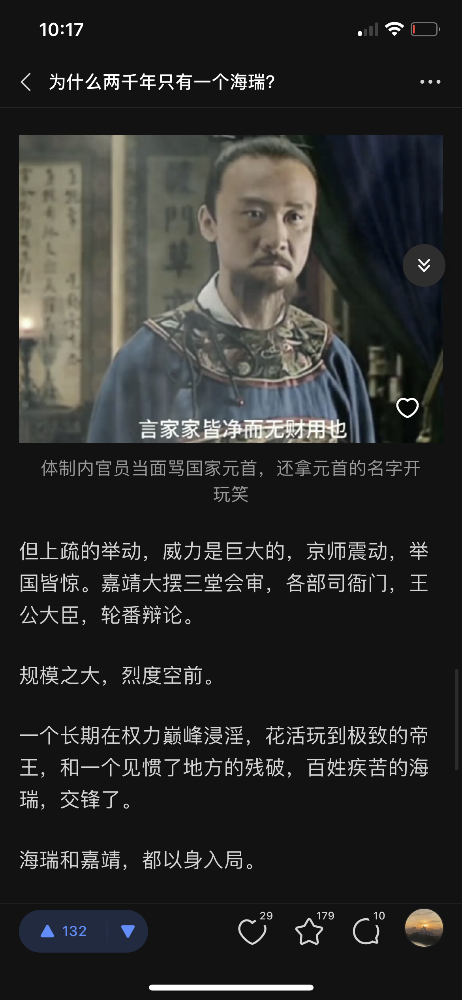

  

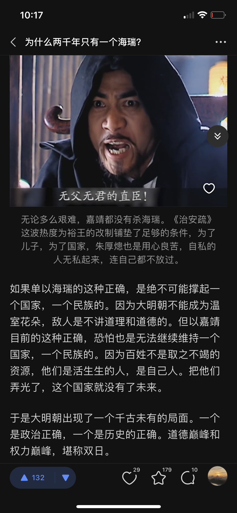

  

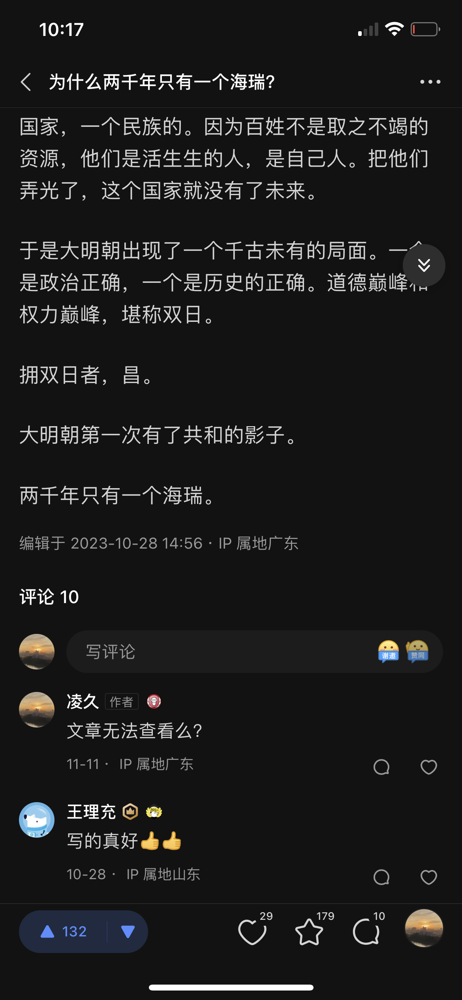

  

原文地址：[(水清濯缨)《纸牌屋》和《大明王朝1566》哪个权谋更深刻？](https://www.zhihu.com/question/36955346/answer/3181163357) 

