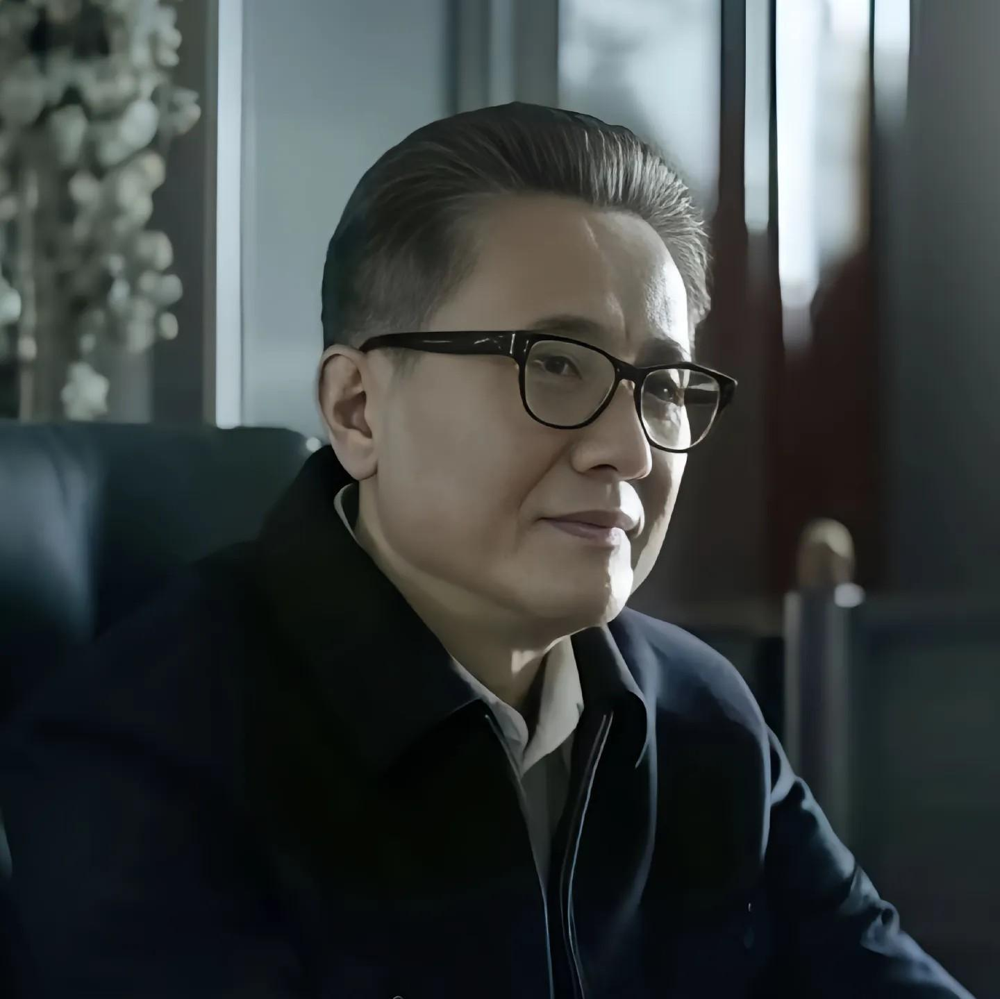

[toc]

# 问题

提问者：**<a href="https://www.zhihu.com/people/wang-yuan-hui-14">森美</a>**
提问时间: 2022-1-16 12:50:24

为什么看了那么多权谋剧却一点权谋都没学会？

# 回答

回答者： **<a href="https://www.zhihu.com/people/52-91-61-66">汉东省植物学家</a>**
回答时间: 2024-8-28 23:26:49
点赞总数: 1249
评论总数: 67
收藏总数: 3220
喜欢总数：87

我想让你认真看一下我接下来说的话，然后反思自己是否具备作为谋划者的核心特质。

  

  

（一）

1.权谋的首要核心在于忍耐。谋划之人在多数时候并不占优势，故而他们绝非羽扇纶巾、谈笑间樯橹灰飞烟灭那般的形象。他们唯有谨小慎微、不出风头，在各种情境之下保持足够沉稳，才可能挺进最终的“决赛圈”。

在由弱至强的过程中，谋划者靠的并非一路打怪升级、四处惹事，而是韬光养晦、培植势力、静待时机。而这恰是权谋中最为艰难且无趣之处。就像《雍正王朝》里的四阿哥以及《大明王朝 1566》中的徐阁老，皆为能屈能伸、懂得低头隐忍之人。自古以来，成就大事者往往如此。

2.最可贵最为难，同时也是普通人最难想象之处在于，谋划者他们自己也全然不知这般忍耐要持续至何时。

好比卧薪尝胆的故事，勾践在隐忍之时，不知道要忍多少年，更不知道自己能不能成功。说实话，要是以上帝视角告知勾践，只需忍耐十年就能复仇成功，那他必然愿意。

可是问题就在于，很多大佬在低头时是看不到丝毫希望的。所以，这种在不确定状态下的坚持，是普通人难以体会的极致痛苦。

  

  

（二）

1.权谋的第二要点在于操作不能多，也不可瞎折腾。因为越复杂的计划涉及的人就越多，而当事人无法保证那些看似与自己同一阵营的人绝对忠诚。

你看《雍正王朝》里，像年羹尧这种老四的左膀右臂，也有自己的小心思，会去其他阿哥那里走动。

人都是趋利避害的，古代朝堂上的那些人更是精明。在没有必胜把握时，不会有人拿自己的身家性命陪你去玩命。

  

  

（三）

1.真实的权谋往往通过“造势”来获取胜利。正如孙子兵法所言，战场上不可随意乱打，需不断调整以积累“势”。当“势”达到一定程度时，方可放手一搏、一决雌雄。

在权谋斗争中，唯有到了这般境地，那些尚处于观望状态的人，才会顺应大势与你站在同一阵线，对对手落井下石、墙倒众人推。

2.造势的过程犹如春雨润物般无声无息，极为考验布局能力。绝不可以直接下令让人去做何事，那样极易留下把柄和线索，说不定人家转手就把你出卖了。

所以造势者需要通过对环境以及敌我双方的深入理解，逐步影响一个又一个目标，让他们按照你的思路行动。如此一来，看似你好像什么都没做，实则一切尽在掌握。

就如《大明王朝 1566》中的徐阁老等人，他们看似并无大动作，但从第一集开始，借助一次次一桩桩事件，每次都只对皇帝产生一点点影响，每次都让皇帝对严家多增添一点点厌恶。

再通过对众多人的潜移默化，直至第 33 集，才使得皇帝对严家集团表现出失望与怨恨。要知道这部剧一共才 40 集出头。

在这个剧中当时机出现后，短短几集，盘踞朝堂 20 多年的严家集团便迅速土崩瓦解。

  

  

（四）

1.在权谋斗争中，对于敌对目标发起攻击的时机至关重要，早了不行，晚了更不行。时机的把握，无疑是对谋划者的重大考验。

或许站在上帝视角的我们，能够分析各个时机出手的合理性，但身处局中，面对众多真真假假的机会，要一眼找到那个关键时机，实在是难上加难。

  

  

（五）

1.总之，在进行权谋谋划时，大方向必须足够准确，确保路径清晰；

2.姿态要足够低调谨慎，心态要足够沉稳；

3.过程要足够缓慢，不可急躁冒进；

4.下手要足够果断狠辣，一旦时机成熟绝不可以手软。

权谋之中没有那么多快意恩仇的情节，也不存在那么多奇迹般的良谋妙计。毕竟站在你面前的人，不可能是傻子。

  

作为普通人，我们难以达到那样的境界，我们没有足够的耐性，也缺乏如他们般深远的布局与随机应变的能力，甚至在关键时刻会显得优柔寡断，所以我可以断言，我们几乎不可能成为真正的谋划者。事实上，我从自己对权谋的理解中，不是学会如何运用它，而是更清楚地认识了自己，认清了自己是什么样的人。

  

总结一句话：权谋是一场隐忍与等待的博弈，它强调布局、造势、精准把握时机，而非急功近利；对于普通人而言，权谋的意义更多在于让人认清自己的位置，通透地看待人性与局势，而不是实际运用这些技巧。

  

原文地址：[(汉东省植物学家)为什么看了那么多权谋剧却一点权谋都没学会？](https://www.zhihu.com/question/511800222/answer/3609158767) 

