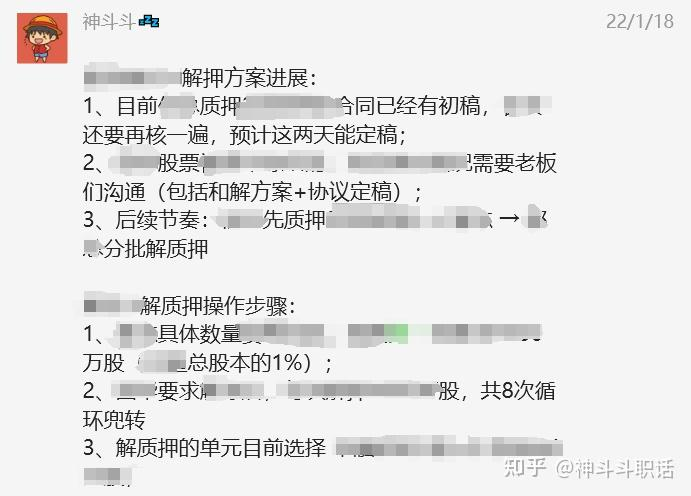
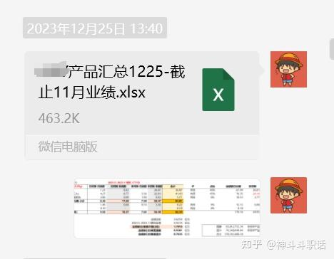

[toc]

# 问题

提问者：**<a href="https://www.zhihu.com/people/vbq0je">公路人职场</a>**
提问时间: 2025-5-4 16:36:33

有错别字

# 回答

回答者： **<a href="https://www.zhihu.com/people/shen-dou-dou-0511">神斗斗</a>**
回答时间: 2025-6-11 10:50:11
点赞总数: 140
评论总数: 8
收藏总数: 299
喜欢总数：7

我第一天当高管助理的时候，高管跟我简单聊了两句，有两点我记忆很深刻，领导说：

> “你现在多了个核心资源，就是你能联系到我。别人找不到我、催不动我，但是你可以。”  
>  **“你发我的消息我都会看，但不一定会回你。你要知道，上下级沟通，领导回复你是难得的，领导不回复你才是正常的。”** 

第二点在实操中很真实，很多时候跟领导汇报工作都不回复。

有时候需要领导拍板的时候，我发一段汇报信息，连发两天领导也不回复，后来改成选择题，大概写了俩方案给领导选，领导回复得很快。

或者再不回复，你找个机会“抓”住领导当面汇报这事，也能顺利得到你要的结果——领导拍了板。

这个过程的相互拉扯因人而异、因事而异，但有一点是可以参考的，那就是 **领导不回复不代表没看到** 。

每次当面汇报，总是觉得领导是忙忘了或者没时间看我消息不回复，其实领导心里还是很清楚的。

  

人总是习惯性地会先解决简单的事情，领导也一样。几个任务同时汇报给他的时候，那些简单可以立马拍板的，他会很快回复下指示。

 **【情况1】** 如果比较复杂，需要他三思的，又或者需要他去请示其他高管的，那么这个过程就会无限期延长。这时候领导不会回复你“让我先想想”几个字，他犯不着，你也配不上。所以很多情况就这么晾着你了。

 **【情况2】** 还有一种情况是，领导正在忙，结果你汇报了一个比较复杂的事情，他来不及认真看，就把手机锁屏继续跟人讨论去了，结果就把你这事给忘了。

而题主要做的，其实是缩短领导的决策链条，【情况1】下面，你要让他尽可能快速get到一件复杂工作的核心要点，这样他跟自己领导汇报的时候，也可以提高效率。【情况2】下面，你要做的就是多在合适的时候提醒他再次关注这个事情，也得提醒他这件事的紧迫性，让他在心里自己排一个优先级然后回复你。

  

有两个小诀窍是可以给你参考的：

## 1、汇报时要突出重点

汇报的时候重点一定要突出。特别是一些非正式场合的汇报，如果没有重点抓住领导的眼球和耳朵，可能你说了半天以后，领导让你再复述一遍，可能你自己都会乱了节奏，失去耐心，导致你自己都想长话短说交代不清。

> 比如你汇报的事项涉及到3个问题，那就要事先准备好这3个核心问题的逻辑关系，分点汇报，话术可以是：  
> “领导，这件事主要有 **3个事情** 要跟您汇报以及确定。 **第一** 、……。 **第二** 、……。 **第三** 、……。”

比如这是我某次通过微信汇报的时候梳理清楚的流程和事项：

这样就会显得很清晰，领导也会知道需要讨论和做决策的重点在哪，以及需要做几个决策，关注几件事。

## 2、辅助材料注意格式，拿捏细节

有时候，讲一些数据的时候，需要有Excel等汇总表格的支持，或者说一些合同，需要word文档。但是，现在微信用作工作汇报非常普遍，领导很多都喜欢手机看材料。那么这时候， **数据类型表格，最好截图发送；文字类最好pdf格式（必要的话带上修改痕迹）** 。

我经常跟领导远程汇报，除了发送Excel表格以外，我会重新截图一份表格发送出去，就是怕领导收到我信息的当下不方便开电脑，而手机打开Excel看是很不友好，截图就属于是一种小体贴：

Word也一样，手机打开word有时候甚至会看不到修改痕迹，这时候用pdf就一目了然。同样的，PPT用手机（特别是苹果手机）打开，格式会乱，转成pdf也会很友好。

  

希望对你有帮助。

  

原文地址：[(神斗斗)职场上，给领导通过微信请示报告工作，领导不回复你，你该怎么办？](https://www.zhihu.com/question/1902401209874257506/answer/1916084783622119826) 

