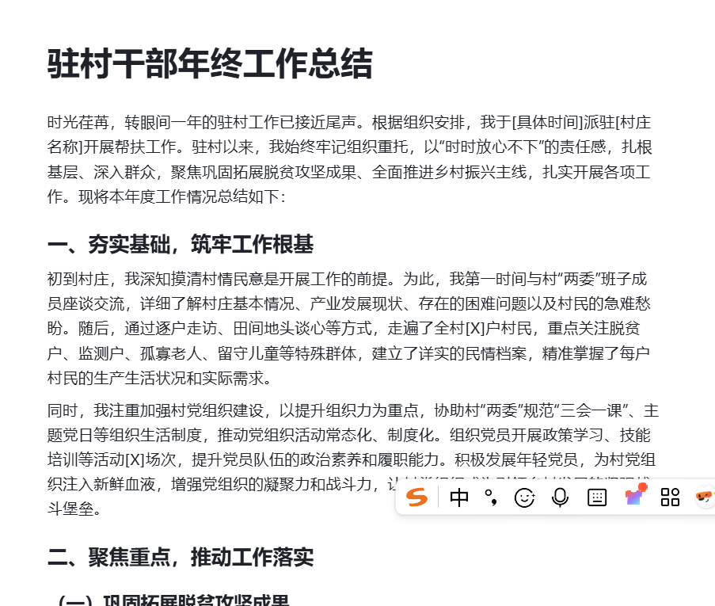
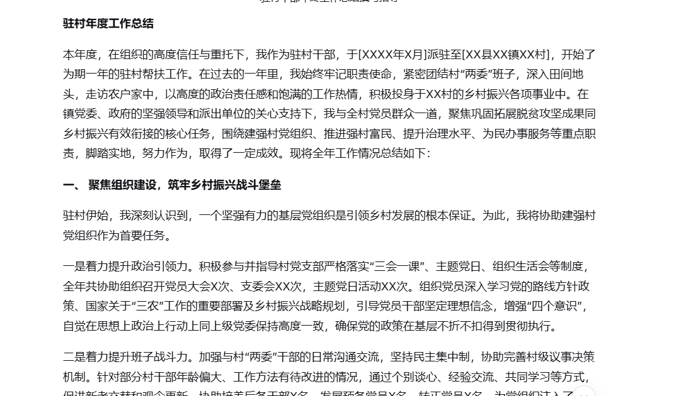

[toc]

# 问题

提问者：**<a href="https://www.zhihu.com/people/luo-man-xie-66">观辙成我</a>**
提问时间: 2025-7-16 8:42:13

现在体制内年轻人越来越多，很多高学历人才考进来后，即便除去一些主动表示不想写材料的人，机关里能写材料的人也比以前要更多。

另外，AI的广泛应用大大降低了写材料的难度，提升了写材料的效率。虽然大部分公文材料依然需要根据地区和单位的实际情况去调整，但至少一些务虚的文字材料可以直接生成框架模板，不需要再像以前一样字斟句酌，苦苦熬灯油。

领导越来越重视能做成项目、能提供情绪价值的干部，在这个大背景下，体制内笔杆子还有提拔优势吗？

# 回答

回答者： **<a href="https://www.zhihu.com/people/43-32-94-21">寒冰射手祁同伟</a>**
回答时间: 2025-12-22 22:46:9
点赞总数: 2179
评论总数: 264
收藏总数: 4902
喜欢总数：76

用AI写材料两年了，从一开始用生成的语句不通，逻辑混乱。到现在上周生成的一篇讲话被分管厅长表扬，全省系统内通报学习，从下达指令到润色修改，总用时不超2小时。

当然AI在进步，我也在学习，光积累的各种文体指示词就攒了18页了……

12.24日更新

大家不要再私信问我要文件了，文件只是一些积累的指示词与试错的记录。年底了，手头的活比较多，过段时间我会写一些用AI写作公文的一些体会，也算是一个工作方法的总结吧，请大家不要急。

另外，我认为使用AI可以极大的提高工作效率，缩短写八股材料的时间，可以让我们有更多的时间和精力去投入到其它创造性、服务性的工作中去。

___

12.28（星期日）更新

针对于这几天大家问的比较突出的问题就是指示词，但是在谈指示词以前，我想先分析一下几个常用AI的特点，便于大家在写作时自己灵活选择。

 **一是豆包。** 生成的语言比较流畅、比较自然，很多时候接近于口语化的表述，生成的文字比较务实。适用于通知、方案、小总结、非正式材料等，也可以在没有思路的情况下提供灵感与框架。问题也很明显，输出的文字缺乏公文语感，材料结构不够清晰，逻辑不顺畅。

 **二是deepseek。** 逻辑性结构严密，分论点的能力很强，用词书面化。缺点是有时表现为“学术化”，尤其是机关公文要求的都是务实、精炼。很多时候deepseek给的可能更像一个论文，而并非一篇公文材料。但是可以用来写大材料，给出规范的指示词再慢慢打磨，例如报告、讲话、部门总结这种。

 **三是通义千问。** 这个AI的延伸能力很强啊，给它一个要点，它能从给定要点中衍生出更多相关内容，并且很合理，扩充内容、丰富段落时可以使用。缺点就是容易跑偏，整体材料会距离核心目标越来越远。

 **四是新华妙笔。** 差不多两年前刚出的时候我就充了会员，因为打着新华社的名头，当时期待值很高。但是实际使用很一般，操作复杂、交互不流畅，要填一堆繁琐的基础信息表单。并且生成的材料经常南辕北辙，理解和输出之间存在明显偏差，不是很推荐。

举个例子，在同样指示词命令下，三个AI的回答如何。

投喂给豆包、deepseek、通义千问的要求，“帮我写一份驻村干部的年终工作总结，字数2000字左右。”

  

通过开头与第一节可以看出，在同样指示词的要求下，DeepSeek的规范性与逻辑性是最好的，结构框架很清晰，几乎没有废话，公文语感也可以，但是缺乏了一些工作细节。豆包的结构框架、规范性弱一些，语言不够正式，但是有很多过程描述，感觉更适用于口头汇报。千问比较大胆，细节上直接生成数据，应该是套用了网络上2023年的一些总结，结构、规范上与deepseek类似。

所以在写作时，我建议大家多管齐下，把素材、指示词准备好了，同时发给不同的AI，选择越多的情况下，出精品的概率也越高。（指示词请大家先别急，还在整理。

……被和谐了什么情况，我也没写啥啊）

___

1.14更新

根据之前用AI写材料的经验，我总结了 **8个方面** 的指示词。不一定每篇材料都要提供，但是自己一定要想清楚，哪些是必须给的，哪些是可以给的。同时，越大、越综合的材料，指示词一定要越全面、丰富、具体。

### 一、“角色”指示词

角色身份，这都是我给AI投喂指示词的第一句话，代表“我”有什么身份。俗话说 **，** 出门在外身份都是自己给的，跟AI对话也不要客气，大胆的假设身份。必须 **明确是谁在写。** 

我是XXX省xxx市xxx单位xxx部门的 **科长/主任/处长/厅长/局长/主要领导/** ，具有 **XX年的文字工作经验与XX年一线基层工作经验，曾担任过xxx单位法规市场处副处长；xxx县长；xxx副厅长。** 

 **（身份原则就是 ：职务准确，经历具体，年份拉长。）** 给出讲话者的身份与经历，可以让AI在写作过程中增加对职务经历的思考。

### 二、“类型”指示词

现在要起草一份通知、会议纪要、讲话稿、请示、公函、活动方案（大家自己写吧）.....用于部署专项工作；用以统一思想、明确方向；向上级机关汇报阶段性进展；“起草一份  **报请上级机关审阅转发的《意见》** 。”“写一篇  **在年度工作会议上的主报告（讲话稿）** 。”“准备一份  **向巡视组提交的专题汇报材料** 。”“撰写  **政策解读稿** ，用于新闻发布会配套发布。”  
（类型指示词很简单， **作用就是确定文种。可以写的具体些，也可以简单一些，我个人习惯于一句话内解决，因为后续还有很多指令。）** 

### 三、“场景”指示词

场景包含具体 **情境场合，写作视角/语气。** 

不同的场合要用不同的语气，一般有三种：  
①  **材料采用 向上汇报 的谦恭、务实视角。② 体现 向下指导的权威性和部署性③ 材料保持平行协商的尊重与对等语气。** 

场合可以加上具体情境就比较丰富了：

 **此稿用于年初全市工作部署大会**   **的主报告。** 

 **·**   **场景是向上级巡视组进行的专题工作汇报。** 

 **·**   **这是在紧急突发事件发生后，拟向社会发布的首次单位通报。** 

 **·**   **用于接牌活动仪式上的致辞。** 

### 四、目的与站位

目的、站位是定调子、把方向的，主要是让AI能明白写到什么程度。

必须有目的/意图、站位组成。

 **（一）站位：** 

“材料必须紧扣  **中央/省/市关于XX的最新精神与部署** 。”

“必须要提高站位，目的在于 统一思想、提高认识，将大家的思想行动统一到上级决策部署上来。”

“材料要体现  **‘两个xx’/‘国之xx’**  的政治自觉，服务于全省/全市/全系统高质量发展。”

（这里可以更具体，结合实际情况套用即可。）

 **(二）意图/目的** 

“ **核心目的** 是  **解决当前存在的XX突出问题** （如：效率不高、责任不实）。”

“旨在  **动员部署** 下一年 的 **重点工作** 。”

“目的是  **总结经验、表彰先进、剖析问题、部署任务** 。”

“为了  **争取上级在政策/资金/项目上的支持** 。”

“主要用于  **明确责任分工、划定时间节点、督促工作落实** 。”

### 五、接受者/参与者

材料的收听收看人员。帮助AI明确对象，决定它起草的话语方式和内容详略。

这个跟第四条场景语气不是一回事，这个涉及到AI给出材料的深度，是具体操作还是宏观务虚指导。

 **（一）上行（对上级）** 

“材料要报送给XX办公厅 / S委、S政府.....”

“阅读对象是  **上级领导或专家组** ，需注重逻辑严谨、数据翔实、依据充分。”

“需考虑到领导  **时间有限** ，内容要  **精炼** ，摘要至关重要。”

 **（二）下行（对下级）：** 

“材料要下发至 各市（县、区）xxx，各有关单位......。”

“受众是 地市、县区、基层 **执行单位** ，指令必须  **清晰、无歧义** ，具有可操作性。”

“要考虑到基层的理解水平和执行条件等。”

 **（三）平行（对同级/外部）：** 

“递XX兄弟（市）XX厅（局）征求意见......。”

“语气需  **诚恳、谦和、对等** ，重在协商与合作。”

 **(四) 多维度受众：** 

“材料将在  **大会上宣读** ，听众既有领导也有普通干部，需兼顾高度与易懂，既要有理论高度，又要有具体举措。”

“此件  **公开发布** ，面向社会公众，用语需规范、严谨且避免过度专业术语。”

### 六、 **具体内容** 

 **（一）具体内容如有思路可以填入自己的想法，没有的话建议大家去问分管领导的想法，记得录音，整理成文字后再把具体思路给到AI。** 

-   在请教领导前，自己先根据  **“主题与目的”**  ，草拟一个初步的、粗线条的提纲（哪怕只有三四个大标题）。这能引导谈话，也显示你的思考。
-   准备几个核心问题，例如：

-   “XX领导，关于这个材料，我初步思考的是这几个方面，您看需要怎么调整”

-   “材料分为哪几个部分最合适？是成绩-问题-打算，还是认识-任务-保障？”  
      
     **（二）讲话稿具体内容指示词示例(举个例子)**   
      
    请按以下四部分结构撰写，并将领导思路要点融入相应部分：
-    **第一部分：深化认识，写重要性。（约占总篇幅30%）**   
    

-   领导录音的思路要点融入 **：**  一是高质量发展的必然要求，引用全国和我市经济数据对比；二是提升治理能力的必然要求.....
-    **要求：**  论述要有高度，也要接地气，用数据和身边事例引发共鸣。

-    **第二部分：聚焦重点，写要求与工作思路（约占总篇幅40%）**   
    

-   领导思路要点融入： “这是重中之重，分四方面来写：”
-   1. 在基础设施一体化上.....
-   2. 在治理服务数字化上....
-   3. 在产业数字化融合上....
-   4. 在要素保障体系化上... **.** 
-   要求： 每条举措都要实在，有抓手、有目标，避免空话，小标题要排比等。  
    

-    **第三部分：齐抓共管，写各部门要求（约占总篇幅30%）**   
    

-   领导思路要点融入.....
-   要求......

核心作用就是防止AI写的跑偏，与领导的思路有偏差。

 **七、风格和格式** 

 **要 给领导风格“画像”。领导有不同的特征，我感觉一般有学者型、教师型、务实型、亲和型，不同的领导讲话风格也不同，** 

具体列举一些指示词：

“领导是学者型的，注重理论深度与系统性，逻辑链条。适当运用比喻（如‘施工图’‘责任田’）和排比句式（‘要…要…要…’）增强气势。可融入领导常用口语，如‘这件事，必须抓实抓细抓严......

“领导比较务实，句子要短，避免复杂从句。多用四字、六字短语，如‘认清形势、聚焦重点、狠抓落实’。语气坚定，少用‘可能’‘或许’等模糊词。”

“语言要有理论高度和战略视野，善于运用‘格局’‘大势’‘逻辑’等词，段落开头常进行宏观判断。”

“风格务必务实，多用‘要’字句直接部署，每项工作最好有量化目标或时限，多引用基层具体案例和最新数据。”“这就好比我们种树，不能只栽不养...”我给大家讲一个上次调研看到的真实例子...”“理解这件事，关键要抓住三个关键词：...”

 **八、背景信息** 

提供参考文献，确保材料“应运而生”、“有的放矢”。

一是 现实与工作背景。  
二是写事件由来，政策与历史背景。  
三是提供往年材料，相关联材料等。（注意抹去敏感词语与真实信息。）

___

其实真没多难，整理了半天，只是给大家提供一些思路。

说白了，用AI写材料， **指令要全面具体，参考材料要丰富多样。** 

 **愿世界上再也没有被材料折磨的年轻人** 

 **欢迎大家留言指导。**

  

原文地址：[(寒冰射手祁同伟)大家觉得现在体制内写材料的笔杆子还有提拔优势吗?](https://www.zhihu.com/question/1928736156536795376/answer/1986568209097308041) 

# 评论

1. <a href="https://www.zhihu.com/people/yang-yang-yang-59-16-44">首如飞蓬</a> (<small title="陕西">2025-12-24 10:23:5</small>): 叽里咕噜说啥呢，把指示词发我［滑稽］
   - <a href="https://www.zhihu.com/people/annunaki-37">annunaki</a> (<small title="江苏">2025-12-25 13:47:3</small>): 让ai帮你生成提示词。都比问楼主要好
   - <a href="https://www.zhihu.com/people/wu-la-wei-52">乌拉喂</a> (<small title="回复于 2025-12-25 22:36:32/山东"> ✉️:annunaki</small>): 怎么可能？提示词是为了对齐需求，ai在没对齐你的需求之前，怎么能生成提示词😅
   - <a href="https://www.zhihu.com/people/li-chun-yi-63">醉卧凭栏听雨</a> (<small title="回复于 2025-12-26 0:30:50/广东"> ✉️:乌拉喂</small>): 喂给他文件啊
   - <a href="https://www.zhihu.com/people/annunaki-37">annunaki</a> (<small title="回复于 2025-12-26 13:22:0/江苏"> ✉️:乌拉喂</small>): 你先口语化需求告诉ai。然后再让ai帮你添油加醋。不满意再修改
   - <a href="https://www.zhihu.com/people/fei-ben-de-hei-hu-zi">什么时候更新</a> (<small title="山东">2026-1-6 15:51:55</small>): 哈哈哈哈，就是，叽里咕噜的，发文档过来给我们参阅［百分百赞］
2. **寒冰射手祁同伟** (<small title="山东">2025-12-23 20:53:4</small>): 统一回复大家，文件无法直接发送。后续有时间专门写两篇AI写作公文的指示词专栏。［拜托］
   - <a href="https://www.zhihu.com/people/zhang-tian-lun-63-52">庸人自扰</a> (<small title="河南">2025-12-24 16:25:2</small>): 已关注，求分享
   - <a href="https://www.zhihu.com/people/yanzhi-44">yanzhi200807</a> (<small title="回复于 2025-12-24 17:23:54/江苏"> ✉️:庸人自扰</small>): +1
   - <a href="https://www.zhihu.com/people/mu-feng-84-98">柳如风</a> (<small title="山东">2025-12-24 21:30:14</small>): 已关注，求催更
   - <a href="https://www.zhihu.com/people/an-hei-76-17">暗黑</a> (<small title="天津">2025-12-24 22:6:17</small>): 已关注 求分享
   - <a href="https://www.zhihu.com/people/h-perseverance">H.Perseverance</a> (<small title="陕西">2025-12-24 22:32:20</small>): +1
   - <a href="https://www.zhihu.com/people/jiu-zhe-yang-ba-50-13">名字</a> (<small title="黑龙江">2025-12-24 22:42:24</small>): 蹲
   - <a href="https://www.zhihu.com/people/wo-you-bu-luan-lai-92-6">我又不乱来</a> (<small title="广东">2025-12-24 23:18:55</small>): 跪求大哥分享
   - <a href="https://www.zhihu.com/people/chen-shi-qi-69-53">辰十七</a> (<small title="浙江">2025-12-24 23:49:23</small>): 已关注，求分享
   - <a href="https://www.zhihu.com/people/chen-da-da-22-68">明月</a> (<small title="江西">2025-12-25 0:14:55</small>): 发了以后踢我一下，用力踢，别客气
   - <a href="https://www.zhihu.com/people/brazy-52">momo</a> (<small title="湖南">2025-12-25 0:57:44</small>): 等待😋
   - <a href="https://www.zhihu.com/people/kou-kou-kou-kou-kou-kou-94-25">Ongchen</a> (<small title="四川">2025-12-25 1:32:21</small>): 蹲
   - <a href="https://www.zhihu.com/people/augustus-13-14">Augustus</a> (<small title="湖南">2025-12-25 2:53:47</small>): 求分享
   - <a href="https://www.zhihu.com/people/pandahd">熊猫万象</a> (<small title="安徽">2025-12-25 8:51:20</small>): 关注了，不写这个专栏的话一辈子不提拔。
   - <a href="https://www.zhihu.com/people/guo-ke-bai-2">过客白</a> (<small title="安徽">2025-12-25 8:55:35</small>): +1
   - <a href="https://www.zhihu.com/people/huang-mu-bai-17">学习再学习</a> (<small title="安徽">2025-12-25 9:10:48</small>): 关注了，没写我天天催你
   - <a href="https://www.zhihu.com/people/ng-he-he-98">嗯呵呵</a> (<small title="山东">2025-12-25 9:17:56</small>): 礼貌求带飞，求分享
   - <a href="https://www.zhihu.com/people/shen-he-jun-yuan">神河骏原</a> (<small title="山西">2025-12-25 9:47:18</small>): 已关注，求分享
   - <a href="https://www.zhihu.com/people/Karl-Hung-1989">Karl.Hung</a> (<small title="广西">2025-12-25 9:56:48</small>): 蹲［滑稽］
   - <a href="https://www.zhihu.com/people/ming-yun-gong-tong-ti-94">命运共同体</a> (<small title="四川">2025-12-25 10:5:22</small>): 求分享
   - <a href="https://www.zhihu.com/people/he-shuo-47">禾硕</a> (<small title="浙江">2025-12-25 11:8:14</small>): +1
   - <a href="https://www.zhihu.com/people/crush-64-58-88">Crush</a> (<small title="广东">2025-12-25 11:14:33</small>): 叽里咕噜说啥呢，把指示词发我
   - <a href="https://www.zhihu.com/people/zhou-zi-70-10">周子</a> (<small title="江苏">2025-12-25 11:16:39</small>): 已关注 求分享
   - <a href="https://www.zhihu.com/people/w-22-49-85">病病</a> (<small title="湖北">2025-12-25 11:23:33</small>): 已关注，求分享［赞同］
   - <a href="https://www.zhihu.com/people/xiao-yu-la-li">我是猪</a> (<small title="浙江">2025-12-25 12:9:8</small>): 爹，求分享
   - <a href="https://www.zhihu.com/people/liu-niu-40">刘妞</a> (<small title="江苏">2025-12-25 12:25:24</small>): 已关注 求
   - <a href="https://www.zhihu.com/people/wu-long-bai-tao-92">乌龙白桃</a> (<small title="四川">2025-12-25 13:32:51</small>): 蹲
   - <a href="https://www.zhihu.com/people/sui-sui-nian-8-12">碎碎念</a> (<small title="山东">2025-12-25 14:0:56</small>): 求分享
   - <a href="https://www.zhihu.com/people/zhang-yun-nuo-5">不四敲莓四巧莓</a> (<small title="江苏">2025-12-25 15:48:27</small>): 写了吗 我来催更了［小情绪］
   - <a href="https://www.zhihu.com/people/liu-yu-xuan-43-92">会飞的鸡老板</a> (<small title="山东">2025-12-25 17:6:0</small>): 关注了哥 求分享
   - <a href="https://www.zhihu.com/people/farewell-44-80">hhhhh</a> (<small title="湖北">2025-12-25 19:25:4</small>): 期待
   - <a href="https://www.zhihu.com/people/littleicecandy">小丸子</a> (<small title="湖北">2025-12-25 20:34:39</small>): 已关注
   - <a href="https://www.zhihu.com/people/xing-zou-de-ji-tang-16">行走的荷尔蒙</a> (<small title="宁夏">2025-12-25 20:44:14</small>): 已关注，求分享。
   - <a href="https://www.zhihu.com/people/zhao-meng-95-47">赵萌</a> (<small title="河南">2025-12-26 8:41:44</small>): 求分享求分享
   - <a href="https://www.zhihu.com/people/hua-shi-jian-jiu-shi">一颗橙子</a> (<small title="湖北">2025-12-26 9:25:22</small>): 抓紧写~年底文件太多等着你呢
   - <a href="https://www.zhihu.com/people/lao-xu-18-86">老徐</a> (<small title="江西">2025-12-26 9:45:6</small>): 我也需要，这简直太棒了
   - <a href="https://www.zhihu.com/people/kao-la-meng-meng-60">考拉梦梦</a> (<small title="河南">2025-12-26 11:51:14</small>): 已关注，求催更
   - <a href="https://www.zhihu.com/people/xing-zhao-zuo-meng-4-25-94">醒着做梦</a> (<small title="重庆">2025-12-26 16:41:22</small>): 已关注，求催更
   - <a href="https://www.zhihu.com/people/yang-mi-mi-87">杨喵喵</a> (<small title="云南">2025-12-26 17:8:52</small>): 关注了，厅长，等你
   - <a href="https://www.zhihu.com/people/turboooo-26">turboooo</a> (<small title="江苏">2025-12-28 2:42:10</small>): 蹲［蹲］［蹲］［蹲］
   - <a href="https://www.zhihu.com/people/93-60-18-39">莉阿</a> (<small title="福建">2025-12-28 10:36:35</small>): 催更！
   - <a href="https://www.zhihu.com/people/fei-ben-de-hei-hu-zi">什么时候更新</a> (<small title="回复于 2026-1-6 15:52:36/山东"> ✉️:熊猫万象</small>): 不是，哥们，求人帮忙你是个狠人啊 哈哈哈
   - <a href="https://www.zhihu.com/people/bao-qin-18">摩拉克斯</a> (<small title="浙江">2026-1-6 16:26:56</small>): 祁厅，我那个指示词，你看［害羞］
   - <a href="https://www.zhihu.com/people/fu-guan-ni-hao">副官你好</a> (<small title="河北">2026-1-7 0:9:13</small>): 已经关注您 大佬
   - <a href="https://www.zhihu.com/people/zhi-hu-yong-hu-86186-81">是绎心吖</a> (<small title="山东">2026-1-7 9:3:26</small>): 已关注，求分享［赞同］
   - <a href="https://www.zhihu.com/people/miao-xiao-miao-12-37">喵小喵</a> (<small title="美国">2026-1-7 12:45:2</small>): 求指示词
   - <a href="https://www.zhihu.com/people/woyvot">知乎用户wOyvOt</a> (<small title="甘肃">2026-1-7 17:52:7</small>): 记得踢我
   - <a href="https://www.zhihu.com/people/li-li-61-28-4">夏天的风</a> (<small title="湖南">2026-1-7 20:20:52</small>): 已关注 求发
   - <a href="https://www.zhihu.com/people/wu-jian-39-21-41">我的很大你忍一下</a> (<small title="回复于 2026-1-9 9:24:38/江苏"> ✉️:熊猫万象</small>): 还是好人多啊［打招呼］
   - <a href="https://www.zhihu.com/people/xin-hua-31-16">新华</a> (<small title="河南">2026-1-10 7:10:35</small>): 1
   - <a href="https://www.zhihu.com/people/bei-xia-79">懂动次打次</a> (<small title="广东">2026-1-11 22:36:30</small>): 大哥求分享［害羞］
   - <a href="https://www.zhihu.com/people/21-22-43-92">热忱</a> (<small title="河南">2026-1-13 4:40:14</small>): 求［可怜］
3. <a href="https://www.zhihu.com/people/ye-feng-heng-di">短盖巨脂鲤</a> (<small title="广西">2025-12-24 18:19:17</small>): 其实训练好了真的很有用，不急的我都是让它出个大纲慢慢改，急的就自己写完丢进去理顺一下［大笑］
   - <a href="https://www.zhihu.com/people/wo-shi-wo-ge-ta-di">行远天空</a> (<small title="江苏">2025-12-25 12:32:57</small>): 求问你用的哪个［捂脸］
   - <a href="https://www.zhihu.com/people/mei-you-63-26">没有</a> (<small title="回复于 2025-12-25 16:40:33/浙江"> ✉️:行远天空</small>): 不要只用一个 要学会多个一起用 a写 b改 c出大纲 这种 然后交叉弄 然后让a点评b b点评a 这样
   - <a href="https://www.zhihu.com/people/wo-shi-wo-ge-ta-di">行远天空</a> (<small title="回复于 2025-12-25 17:7:34/江苏"> ✉️:没有</small>): 可以私信请教一下吗［捂脸］
   - <a href="https://www.zhihu.com/people/bian-xiang-yu-70">如花佳眷似水流年</a> (<small title="安徽">2026-1-12 11:8:58</small>): 请问一下你怎么训练的呢？
4. <a href="https://www.zhihu.com/people/tu-zi-31-14">工作不快乐</a> (<small title="江西">2025-12-25 10:18:33</small>): ai真的好好用好好好好用，自从用它处理文字材料和ppt之后，我的工作量从超饱和，到有时间摸鱼，真的极大提升工作幸福感
   - <a href="https://www.zhihu.com/people/gan-gan-ju-hao">举豪</a> (<small title="广西">2025-12-26 15:18:16</small>): 我现在上班都用着gemini，先给ai审一遍我再审文件，以前一天的活现在不到半天搞定
   - <a href="https://www.zhihu.com/people/47-18-89-23-54">米哈伊尔</a> (<small title="回复于 2025-12-27 7:29:14/江西"> ✉️:举豪</small>): Gemini，是不是必须得科学上网？
   - <a href="https://www.zhihu.com/people/davidkoch">davidkoch</a> (<small title="回复于 2026-1-7 10:47:13/福建"> ✉️:米哈伊尔</small>): 不止科学上网那么简单，科学上网解决的只是能访问. 还要让GEMINI判定你是非限定地区的IP，才能让你用。等于多了一步
   - <a href="https://www.zhihu.com/people/jun-mo-xiao-15-61-44">雪花酥海咸蛋家</a> (<small title="回复于 2026-1-16 10:38:9/山东"> ✉️:举豪</small>): 你们单位用Gemini不会被查吗
   - <a href="https://www.zhihu.com/people/yu-shao-81-66">北辰</a> (<small title="江苏">2026-1-16 16:57:23</small>): 确实方便快捷，生成个初稿，修改打磨一下齐活
5. <a href="https://www.zhihu.com/people/wang-bin-bin-40">你怎么不吃鱼</a> (<small title="上海">2025-12-25 8:14:54</small>): 这种其实需要拿大模型再加很多公文专门ai训练一下，肯定比一般人写得好
   - <a href="https://www.zhihu.com/people/tianxiawuyuan-38-91">朝花夕拾</a> (<small title="河南">2026-1-6 21:42:20</small>): 这个方法效率很高的
   - <a href="https://www.zhihu.com/people/an-an-99-89-87">小阿桃</a> (<small title="上海">2026-1-8 15:17:31</small>): 这事做不成，谁来牵头做？
   - <a href="https://www.zhihu.com/people/libinhi">libinhi</a> (<small title="回复于 2026-1-15 11:1:6/云南"> ✉️:小阿桃</small>): 我觉得你得自己买显卡安装模型来自己做，要不然很多文件不适合发网上
6. <a href="https://www.zhihu.com/people/momo-52-50-50-67">momo</a> (<small title="重庆">2025-12-24 14:19:38</small>): 知识改变命运
   - <a href="https://www.zhihu.com/people/da-da-91-15-3">哒哒</a> (<small title="北京">2025-12-25 11:36:58</small>): 这算啥知识改变命运？
   - <a href="https://www.zhihu.com/people/momo-52-50-50-67">momo</a> (<small title="回复于 2025-12-25 12:32:32/重庆"> ✉️:哒哒</small>): 至少不像上几代笔杆子，直接写东西熬得光头。
   - <a href="https://www.zhihu.com/people/da-da-91-15-3">哒哒</a> (<small title="回复于 2025-12-25 14:0:55/北京"> ✉️:momo</small>): 这和知识改变命运没关系，你只需要会简单的训练并且找到适合你的关键词就可以了。
   - <a href="https://www.zhihu.com/people/momo-52-50-50-67">momo</a> (<small title="回复于 2025-12-25 14:38:27/重庆"> ✉️:哒哒</small>): ［为难］写材料也不是那么简单，反复磨稿也是需要知识的。
7. **寒冰射手祁同伟** (<small title="山东">2026-1-8 11:54:26</small>): 帖子又被放出来了，这周末更新分享指示词。［拜托］
   - <a href="https://www.zhihu.com/people/mu-feng-84-98">柳如风</a> (<small title="山东">2026-1-8 14:20:59</small>): 快快快！
   - <a href="https://www.zhihu.com/people/huang-mu-bai-17">学习再学习</a> (<small title="安徽">2026-1-8 14:24:3</small>): 快快快！
   - <a href="https://www.zhihu.com/people/foreveryoung-35-55">foreveryoung</a> (<small title="湖北">2026-1-8 14:27:14</small>): 学习学习！
   - <a href="https://www.zhihu.com/people/h-perseverance">H.Perseverance</a> (<small title="陕西">2026-1-8 21:3:10</small>): 在线等，挺急的［机智］
   - <a href="https://www.zhihu.com/people/sa-mo-ye-29">CauchyDemon</a> (<small title="陕西">2026-1-8 21:56:56</small>): 插眼
   - <a href="https://www.zhihu.com/people/gao-shu-shu-87">Loveyoulots</a> (<small title="甘肃">2026-1-9 16:22:44</small>): 坐等
   - <a href="https://www.zhihu.com/people/chang-meng-yu-qiu">长梦于秋</a> (<small title="陕西">2026-1-12 9:10:49</small>): 坐等
   - <a href="https://www.zhihu.com/people/bian-xiang-yu-70">如花佳眷似水流年</a> (<small title="安徽">2026-1-12 10:57:10</small>): 等你哦
   - <a href="https://www.zhihu.com/people/a-la-47-82">阿拉</a> (<small title="山东">2026-1-15 19:42:51</small>): 插眼
8. <a href="https://www.zhihu.com/people/an-zhi-46-68-77">安之</a> (<small title="山东">2025-12-23 14:32:12</small>): 求指示词［机智］
9. <a href="https://www.zhihu.com/people/oglala-37">Oglala</a> (<small title="湖北">2026-1-7 4:9:41</small>): 都说训练ai，如何训练呢，每回都说重新开启对话。你和他的交互，也不会计入下一次对话呀。而且每次材料要求都不一样，搞不懂，请教
   - <a href="https://www.zhihu.com/people/gogogo-90-47">GOGOGO</a> (<small title="山东">2026-1-7 10:28:10</small>): 我也是
   - <a href="https://www.zhihu.com/people/knowma">就書</a> (<small title="福建">2026-1-8 11:22:16</small>): ［赞同］［赞同］
   - <a href="https://www.zhihu.com/people/addfddd">addfddd</a> (<small title="广东">2026-1-16 11:4:13</small>): 每次看见训练我就觉得是个云，你要是真微调过你也不会说这种话，很麻烦的，数据集都难搞
10. <a href="https://www.zhihu.com/people/li-tai-bai-98-6">李太白</a> (<small title="江苏">2025-12-24 10:19:29</small>): 这不会泄漏信息吗［大笑］
    - <a href="https://www.zhihu.com/people/zuker">割韭菜机</a> (<small title="上海">2025-12-24 12:24:23</small>): 你不会脱敏？
    - <a href="https://www.zhihu.com/people/pbocpat">pbocpat</a> (<small title="山东">2025-12-24 15:24:3</small>): 用AI的框架和文字，具体工作情况和要求自己加就行。
    - <a href="https://www.zhihu.com/people/chi-bao-bao-shui-jue-jue">大懒小呆</a> (<small title="河北">2025-12-24 17:1:18</small>): AI是打框架的，把想要的方向，结合时下工作需求，设置你想要的文风类型，生成后再改写
    - **寒冰射手祁同伟** (<small title="山东">2025-12-24 17:30:17</small>): 所有数据信息均提前处理过［拜托］
    - <a href="https://www.zhihu.com/people/91-32-59-72-88">小木同学223</a> (<small title="上海">2025-12-24 20:0:13</small>): 泄露的最大风险，是被人知道是你泄露的，所以……怕啥？
    - <a href="https://www.zhihu.com/people/xi-si-41-17">顽强汉堡</a> (<small title="上海">2025-12-24 21:28:46</small>): 你搞一台5090，用ollama本地跑一个ds，就不担心泄密了
    - <a href="https://www.zhihu.com/people/li-tai-bai-98-6">李太白</a> (<small title="江苏">2025-12-24 21:40:48</small>): 这不是很正常的疑问吗？保密意识还是很重要的。
    - <a href="https://www.zhihu.com/people/yang-zhong-yi-83-28">地上足球888</a> (<small title="贵州">2025-12-24 21:41:5</small>): 体制内凡是需要笔杆子来写的东西，都没有秘密。
    - <a href="https://www.zhihu.com/people/lu-yi-shi-qi">路易十七</a> (<small title="回复于 2025-12-25 0:37:24/河北"> ✉️:地上足球888</small>): 说的太对了 真正秘密不会在笔杆子手里
    - <a href="https://www.zhihu.com/people/leehomwang-27">夐出涟漪不染泥</a> (<small title="北京">2025-12-25 8:36:40</small>): 我用chatgpt的，我怕泄密？知道是我泄的吗［笑哭］
    - <a href="https://www.zhihu.com/people/he-tian-dong-55">咚咚锵</a> (<small title="回复于 2025-12-25 8:59:12/广东"> ✉️:李太白</small>): 首先你得在涉密的岗位
    - <a href="https://www.zhihu.com/people/hrgao-8">gaga999222</a> (<small title="日本">2025-12-25 9:42:59</small>): 又泄密了［飙泪笑］体制内打工人能接触到什么密啊
    - <a href="https://www.zhihu.com/people/qian-chen-98-87">玛卡巴卡</a> (<small title="江苏">2025-12-25 10:23:11</small>): 基层能接触到的基本都不是啥秘密
    - <a href="https://www.zhihu.com/people/zi-la-sen">兹拉森</a> (<small title="回复于 2025-12-25 19:20:43/湖北"> ✉️:顽强汉堡</small>): ds不如豆包
    - <a href="https://www.zhihu.com/people/ray-chi-67">随便的粉丝</a> (<small title="江苏">2026-1-6 15:35:4</small>): 把敏感的内容替换或者去掉就行了
    - <a href="https://www.zhihu.com/people/davidkoch">davidkoch</a> (<small title="福建">2026-1-7 10:48:16</small>): 就那些个官样文章放之四海而皆准，AI处理得越好，越说明这些才能水平低要求低
    - <a href="https://www.zhihu.com/people/chen-chuang-87">陈创</a> (<small title="湖南">2026-1-9 10:55:4</small>): 可以买个16g显存的显卡，用ollama进行本地化部署
11. <a href="https://www.zhihu.com/people/30-24-62-35">第一软脚虾</a> (<small title="广东">2025-12-25 1:10:30</small>): 跪求大佬帮帮小登［握手］［感谢］［哇］
12. <a href="https://www.zhihu.com/people/bugsur">bugsur</a> (<small title="浙江">2025-12-25 15:55:52</small>): 叽里咕噜说啥呢，把指示词发我
13. <a href="https://www.zhihu.com/people/you-zi-chao-mei">小八是条狗</a> (<small title="浙江">2026-1-16 11:20:51</small>): 叽里咕噜说啥呢，把指示词发我
14. <a href="https://www.zhihu.com/people/tyt-9">it'sTYT</a> (<small title="北京">2025-12-25 11:46:27</small>): 领导也知道能缩短时间，所以以前让你一下午干完，现在让你俩小时给他。。。。
    - <a href="https://www.zhihu.com/people/he-jin-12-93">鉌锦</a> (<small title="广西">2026-1-16 14:32:18</small>): 我一个小时出一篇我业务外的副市长讲话稿，领导也没怎么修改［大笑］。
15. <a href="https://www.zhihu.com/people/shi-jiu-nian-guang-gun">隔壁村的勇者</a> (<small title="广东">2025-12-24 20:5:13</small>): 已关注，求分享
16. <a href="https://www.zhihu.com/people/zhang-cheng-13-73">zslalala</a> (<small title="天津">2025-12-24 0:27:58</small>): 求指示词
17. <a href="https://www.zhihu.com/people/lu-le-yu-33">文曲鸡丝</a> (<small title="安徽">2025-12-25 8:16:57</small>): 已关注，坐等分享［哇］
18. <a href="https://www.zhihu.com/people/yang-zi-jun-52-35">世外</a> (<small title="浙江">2025-12-25 9:47:42</small>): 求求求［大哭］［大哭］
19. <a href="https://www.zhihu.com/people/chen-shi-yang-5">玉逸</a> (<small title="广东">2025-12-25 9:12:3</small>): 什么指示词，这不是申论写作指南吗［doge］
20. <a href="https://www.zhihu.com/people/liu-yi-di-45">CHillwavee</a> (<small title="广东">2026-1-16 12:59:52</small>): 已关注，求大佬分享
21. <a href="https://www.zhihu.com/people/fu-quan-hao-9">秋小天</a> (<small title="四川">2026-1-16 8:49:47</small>): 公文写作，通义和豆包算好的了。其他都要差一些
22. <a href="https://www.zhihu.com/people/31-27-40-89-81-83">啦啦啦</a> (<small title="黑龙江">2026-1-16 7:42:26</small>): 读了这个帖子如醍醐灌顶、恍然大悟。 ［拜托］
23. <a href="https://www.zhihu.com/people/wang-tai-zi">铁蛋大官人</a> (<small title="北京">2026-1-16 10:11:51</small>): 日常好多发言都可以ai了，穿靴戴帽都很工整。 工作文件层级高，密级高，明确禁止ai了，bw兄弟盼着内网可以上线ai大模型。
24. <a href="https://www.zhihu.com/people/libinhi">libinhi</a> (<small title="云南">2026-1-15 11:3:17</small>): 关注你了，体制内牛马很有帮助。另外想问问你，心得体会这些，有没有可能以后被技术手段检测出抄袭或ai。
    - **寒冰射手祁同伟** (<small title="山东">2026-1-15 11:27:31</small>): 不会
25. <a href="https://www.zhihu.com/people/wang-si-cong-28-32">过期的漫画家</a> (<small title="浙江">2026-1-12 19:17:32</small>): 追更追更
26. <a href="https://www.zhihu.com/people/yang-guang-xiao-liao">嘉明家</a> (<small title="北京">2026-1-11 11:53:47</small>): 就是还是需要找时间慢慢训练，但是可能本身也不咋喜欢写材料，越不喜欢就越不想投入时间，但是到真正需要我写的时候就越需要工具……
27. <a href="https://www.zhihu.com/people/you-qian-yiche-dou">疯狂的大大鱼</a> (<small title="河南">2026-1-10 16:43:46</small>): 用ai写，你得喂他让他学。找近几年的材料，去掉相关涉密内容让他学，然后［思考］
28. <a href="https://www.zhihu.com/people/yu-shen-16-40">钰燊</a> (<small title="山东">2026-1-10 8:59:43</small>): 一看就是老手 我最喜欢用d 其实也很简单，你得让他听懂你自己说的啥，他才能给你一份满意的卷子
29. <a href="https://www.zhihu.com/people/molly-75-20">Molly</a> (<small title="江苏">2026-1-10 5:34:24</small>): 我一直用ds,也被领导夸，稍微改一改，有些确实像学术论文
30. <a href="https://www.zhihu.com/people/le-ju-30-97">乐居</a> (<small title="广东">2026-1-9 14:36:24</small>): 分享一下
31. <a href="https://www.zhihu.com/people/pei-hai-peng-28">燃烧的木质素</a> (<small title="江苏">2026-1-10 3:48:7</small>): 腾讯元宝跟deepseek都是第一梯队，可以试试
32. <a href="https://www.zhihu.com/people/ao-yang-39">快乐的乐</a> (<small title="贵州">2026-1-8 21:26:7</small>): 我都用豆包，其实你可以先给个主题，提示词多给点 最好把你想要的提纲给他，出来的材料基本就能用了，改改数据就行
33. <a href="https://www.zhihu.com/people/qian-jie-19-12">千结</a> (<small title="广西">2026-1-8 20:23:39</small>): 为啥没有文心一言?我蛮喜欢用的，官里官气方面它很在行😄
34. <a href="https://www.zhihu.com/people/zhi-mo-10-76">思夏屿</a> (<small title="浙江">2026-1-8 11:6:15</small>): 听说有不少写材料的人开始用AI了，专门处理一些不敏感又繁琐的事情。好像用文心一言的比较多
35. <a href="https://www.zhihu.com/people/chen-fu-sang-89">青山迎</a> (<small title="广东">2026-1-7 19:54:32</small>): gpt最好用，我用了一年多了
36. <a href="https://www.zhihu.com/people/mr-he-89-82">vongolaprimo</a> (<small title="福建">2026-1-7 13:19:21</small>): 已关注，求分享
37. <a href="https://www.zhihu.com/people/hxp-26">不太清楚</a> (<small title="河南">2026-1-7 22:12:57</small>): 用deepseek比较多，最多一个会话窗口有过上千轮对话，上下文充分的前提下还是非常聪明的，用于检查模型比较合适，写作框架得人提出，填空做的还是又快又好。
38. <a href="https://www.zhihu.com/people/kalbinur-arkin">Kalbinur-Arkin</a> (<small title="新疆">2026-1-7 16:44:31</small>): 求分享
39. <a href="https://www.zhihu.com/people/yang-xu-shan-li">阳煦山立</a> (<small title="山东">2026-1-7 7:48:24</small>): ［拜托］［拜托］［拜托］请来一份提示词
40. <a href="https://www.zhihu.com/people/yue-ran-28-51">悦然</a> (<small title="河北">2026-1-7 7:35:48</small>): 最好谨慎，保密工作还是要注意点
41. <a href="https://www.zhihu.com/people/yuan-shi-80-62">年轻的老男人</a> (<small title="广西">2026-1-7 7:35:46</small>): 八股材料［打招呼］
42. <a href="https://www.zhihu.com/people/78-22-19-48-24">晏安</a> (<small title="甘肃">2026-1-7 15:2:43</small>): 有了AI，笔杆子的重要性会更凸显，最近我们单位提拔的几个人都是写材料的，重要材料不用AI，简单材料没必要用AI
43. <a href="https://www.zhihu.com/people/18-31-4-84">天山秦子</a> (<small title="新疆">2026-1-7 0:9:7</small>): 祁厅长你好［大笑］
44. <a href="https://www.zhihu.com/people/gou-mei-de-xi-que">勾妹的喜鹊</a> (<small title="辽宁">2026-1-7 0:57:18</small>): 用机器远不如自己写。机器写完调整的时间都写完两个了
45. <a href="https://www.zhihu.com/people/tianxiawuyuan-38-91">朝花夕拾</a> (<small title="河南">2026-1-6 21:41:19</small>): 提前让人工智能学习自己的成品和语料库，可能会好一些。
46. <a href="https://www.zhihu.com/people/da-da-da-gua-niu">爱吃肉的大蜗牛</a> (<small title="四川">2025-12-26 23:37:34</small>): 我也觉得ai写作很有用，但是他们总觉得很死板，水平不高，可能是我的提示词不行，［飙泪笑］
47. <a href="https://www.zhihu.com/people/kang-shi-fu-32-32">鲤鱼跃龙门</a> (<small title="甘肃">2025-12-27 16:39:22</small>): 肯定会有机会，如果你没有背景，那么除了人情世故，材料是你和领导拉进距离的最快也是最有效的方式，材料从某些方面能反应你的语言表达能力，组织协调能力，更能反应出你的眼界与认知层次，做事的方法手段，某事的具体思维方式，如果你能如期完成一篇高质量的材料，那么你会得到更多的赏识，因为你已经从领导层面已经完成了一项工作任务。
    - **寒冰射手祁同伟** (<small title="山东">2025-12-28 9:43:54</small>): 确实，材料硬更容易进入领导的视野，获得领导的青睐。只是说AI时代的到来，拉近了普通人与笔杆子之间的距离。我相信不久的将来AI就会完全超越所有笔杆子，因为公文的本质就决定它不需要有太多的创造性。
48. <a href="https://www.zhihu.com/people/da-xiong-mao-du-shi-jin-shi-yan">大熊猫都是近视眼</a> (<small title="浙江">2025-12-27 8:9:7</small>): 已关注
49. <a href="https://www.zhihu.com/people/hao-shi-duo-mo-24-12">好事多磨</a> (<small title="安徽">2025-12-27 11:5:12</small>): 提示词发我一下
50. <a href="https://www.zhihu.com/people/57-61-87">大胡子老爹</a> (<small title="内蒙古">2025-12-26 23:59:49</small>): 最近觉得豆包写材料水平太高了
    - <a href="https://www.zhihu.com/people/li-jun-feng-7-4">君锋</a> (<small title="广东">2026-1-6 23:27:25</small>): 豆包适合写网评或者宣传稿，用词比较生动活跃
51. <a href="https://www.zhihu.com/people/romeozhan">romeozhan</a> (<small title="上海">2025-12-26 15:10:13</small>): 这一段也是AI写的把？［大笑］
52. <a href="https://www.zhihu.com/people/bu-7">不7</a> (<small title="江苏">2025-12-26 11:28:7</small>): 已关注，求分享
53. <a href="https://www.zhihu.com/people/kun-kun-95-13-80">迷离之眼</a> (<small title="江苏">2025-12-26 10:50:58</small>): 以前笔杆子很受重视，晋升提拔也很快，现在科技改变了
54. <a href="https://www.zhihu.com/people/zhang-xin-yue-51-7-62">洋崴崴的汤圆儿</a> (<small title="四川">2025-12-26 8:9:23</small>): 发给我嘛，好不好嘛，［哇］
55. <a href="https://www.zhihu.com/people/jiao-wo-feng-zi-8">月是故乡明</a> (<small title="内蒙古">2025-12-26 8:27:34</small>): 就算是AL，也得有指令，我觉得最起码你得有公文逻辑。
56. <a href="https://www.zhihu.com/people/da-feng-qi-xi-yun-fei-yang-45-13">大风起兮云飞扬</a> (<small title="江西">2025-12-26 11:54:46</small>): 已关注，请分享
57. <a href="https://www.zhihu.com/people/ai-xiu-fei-mi-si">爱秀菲米斯</a> (<small title="黑龙江">2025-12-26 15:45:37</small>): 大佬，求指点请发邮箱593374284@qq.com，好人一生平安
58. <a href="https://www.zhihu.com/people/ding-dang-ding-dang-49-36">momo</a> (<small title="辽宁">2025-12-25 13:23:19</small>): 已关注，求分享
59. <a href="https://www.zhihu.com/people/typtio">Typtio</a> (<small title="浙江">2025-12-26 9:26:54</small>): 关注了，等一波更新［爱］
60. <a href="https://www.zhihu.com/people/cui-she-64">清水梧桐</a> (<small title="江苏">2025-12-26 1:38:30</small>): 有些事情还是需要人去做的，ai再好，到底也是冷冰冰的，需要人去调教。
61. <a href="https://www.zhihu.com/people/xun-ji-71">寻姬</a> (<small title="江苏">2025-12-26 7:20:12</small>): 已关注，求分享，谢谢大佬
62. <a href="https://www.zhihu.com/people/xu-xu-bao-bao-42-1">旭旭宝宝</a> (<small title="山东">2025-12-25 15:8:18</small>): 哥，都在等你发指示词。赶紧摸鱼看看知乎啊。
63. <a href="https://www.zhihu.com/people/zhui-guang-zhe-55-68-74">O3R65</a> (<small title="上海">2025-12-25 12:5:39</small>): 关注了，坐等［滑稽］
64. <a href="https://www.zhihu.com/people/zhangcccc-19">zhangcccc</a> (<small title="重庆">2025-12-25 23:15:13</small>): 快发快发
65. <a href="https://www.zhihu.com/people/lu-chi-25-24">上离在路陆</a> (<small title="重庆">2025-12-25 13:20:19</small>): IP显示在山东，我信，等更新
66. <a href="https://www.zhihu.com/people/powerwolf">powerwolf</a> (<small title="辽宁">2025-12-25 13:41:45</small>): 太行了哥们，等你发动态捏
67. <a href="https://www.zhihu.com/people/yici-yixiao-shi">干就完了</a> (<small title="辽宁">2025-12-25 11:0:59</small>): 已关注，求分享
68. <a href="https://www.zhihu.com/people/sai-bao-zi-di-an">塞包子狄安</a> (<small title="贵州">2025-12-25 13:15:20</small>): 已关注，求分享［害羞］
69. <a href="https://www.zhihu.com/people/wang-bin-yuan-63">光明不正大的汤圆</a> (<small title="黑龙江">2025-12-25 13:3:55</small>): 感觉真的省了很多时间，有一些不必要的东西用AI写，节省下来的时间可以干很多事。
70. <a href="https://www.zhihu.com/people/karlwoo">kkkkwwww</a> (<small title="广东">2025-12-25 10:38:11</small>): 提示词改变命运
71. <a href="https://www.zhihu.com/people/ru-yi-er-82">骑上我的小电驴</a> (<small title="江苏">2025-12-25 12:22:25</small>): 上面好像不觉得自己是八股，还发文让自查ai写材料情况
    - <a href="https://www.zhihu.com/people/he-jin-12-93">鉌锦</a> (<small title="广西">2026-1-16 14:36:57</small>): 你们这些写作平庸的理科生都用ai写的这么好，那不是抢了已经靠写作上位者的饭碗。肯定要下文明令禁止用ai写材料啊。就好比大佬都搞风水，但是基层搞肯定要被通报的。
72. <a href="https://www.zhihu.com/people/hssh-31">Presumptuous</a> (<small title="黑龙江">2025-12-25 14:7:15</small>): 蹲
73. <a href="https://www.zhihu.com/people/li-zi-ang-83-91">Anger</a> (<small title="北京">2025-12-25 10:23:35</small>): 那我关注你了哥们，拜托后面一定要记得发啊［捂脸］
74. <a href="https://www.zhihu.com/people/han-yu-88-96">好好生活</a> (<small title="天津">2025-12-25 9:35:0</small>): 那你这么优秀副省应该没问题了吧［看看你］
75. <a href="https://www.zhihu.com/people/chen-ruo-fan-28-47">楼耘</a> (<small title="福建">2025-12-25 9:5:40</small>): 已关注，求分享
76. <a href="https://www.zhihu.com/people/you-you-50-43-50">又又</a> (<small title="北京">2025-12-25 8:10:51</small>): 已关注
77. <a href="https://www.zhihu.com/people/alenwang2017">Alenwang 2017</a> (<small title="广东">2025-12-25 8:59:40</small>): 新华妙笔
78. <a href="https://www.zhihu.com/people/you-le-41-99">agent</a> (<small title="上海">2025-12-25 17:26:28</small>): 关注了
79. <a href="https://www.zhihu.com/people/21-9-1-50-46">21世纪民工</a> (<small title="北京">2025-12-25 11:33:25</small>): 怎么用公文训练ai呀
80. <a href="https://www.zhihu.com/people/Jufruit">Jufruit</a> (<small title="甘肃">2026-1-16 15:13:27</small>): AI出现，有没有两年？［发呆］
81. <a href="https://www.zhihu.com/people/tian-xuan-tian-ji-kylin">天璇天玑kylin</a> (<small title="贵州">2025-12-25 10:8:41</small>): 蹲
82. <a href="https://www.zhihu.com/people/ya-zhou-65-44">神瑛侍者</a> (<small title="安徽">2025-12-24 23:56:6</small>): 求指示词
83. <a href="https://www.zhihu.com/people/xiao-lou-shang-kong-huang">小楼赏箜篁</a> (<small title="湖南">2025-12-25 1:32:41</small>): 求提示词
84. <a href="https://www.zhihu.com/people/han-mu-shui">中国杰</a> (<small title="河北">2025-12-24 20:1:51</small>): 跪求［感谢］
85. <a href="https://www.zhihu.com/people/awing-42-12">Awing</a> (<small title="山东">2025-12-25 13:57:58</small>): 最后一句话水平极高
86. <a href="https://www.zhihu.com/people/nai-xin-deng-dai-34-32">耐心等待</a> (<small title="广东">2025-12-23 13:39:41</small>): 厉害厉害
87. <a href="https://www.zhihu.com/people/jiang-jia-wei-78-94">一块生姜</a> (<small title="吉林">2025-12-25 11:2:27</small>): 蹲一个，忙好了赶紧发来［看看你］
88. <a href="https://www.zhihu.com/people/lu-ren-yu-yijie-gu-du-de-che-xiang">旅人与一节孤独的车厢</a> (<small title="上海">2025-12-25 9:48:56</small>): 哥，专栏什么时候出
89. <a href="https://www.zhihu.com/people/zhi-qiu-chan-27">知秋禅</a> (<small title="湖北">2026-1-16 12:22:52</small>): 我没看完，怀疑是卖会员的
90. <a href="https://www.zhihu.com/people/you-feng-lai-yi-53-32">花花世界</a> (<small title="山东">2025-12-25 21:38:39</small>): 哪款ai好用呀［大笑］
91. <a href="https://www.zhihu.com/people/miao-mo-li-ceng-yun-58">簌簌</a> (<small title="陕西">2025-12-25 13:10:41</small>): 关注了，蹲指示词
92. <a href="https://www.zhihu.com/people/gao-xian-lu-shi-yu-xuan">小徐的絮絮叨</a> (<small title="安徽">2025-12-25 8:25:50</small>): 求指示词［爱］
93. <a href="https://www.zhihu.com/people/91-32-59-72-88">小木同学223</a> (<small title="上海">2025-12-24 19:59:21</small>): 细说创造性和服务性
94. <a href="https://www.zhihu.com/people/zhen-zhen-gong-zi-32">木青</a> (<small title="广东">2025-12-24 17:4:24</small>): 大佬，跪求［哇］
95. <a href="https://www.zhihu.com/people/elaijw">ELAIJW</a> (<small title="北京">2025-12-25 10:47:0</small>): 别的先不说，18页干货能不能先分享一下
96. <a href="https://www.zhihu.com/people/peng-peng-peng-zuo-bian">华山落日</a> (<small title="山东">2025-12-24 18:32:8</small>): 查眼
97. <a href="https://www.zhihu.com/people/ye-chuang-ji-wo">一勺跳跳糖</a> (<small title="浙江">2025-12-25 8:23:32</small>): 求指示词
98. <a href="https://www.zhihu.com/people/zheng-hu-60-36">郑湖</a> (<small title="四川">2025-12-25 9:36:55</small>): 起号呢 大方发嘛
99. <a href="https://www.zhihu.com/people/liang-lu-26-10">濯枝雨</a> (<small title="北京">2025-12-25 1:22:21</small>): 求
100. <a href="https://www.zhihu.com/people/ye-bi-15">耶比</a> (<small title="广东">2025-12-24 20:52:49</small>): 求求求 拯救万千体制选手于水火
101. <a href="https://www.zhihu.com/people/liu-wen-bo-de-ge">刘文薄的哥</a> (<small title="湖北">2025-12-24 15:58:14</small>): 大佬，求提示词［哇］
102. <a href="https://www.zhihu.com/people/monster-12-32">sintax</a> (<small title="河北">2025-12-25 10:24:49</small>): 蹲蹲蹲
103. <a href="https://www.zhihu.com/people/na-ke-shu-kan-qi-lai-sheng-qi-liao-55">那棵树看起来生气了</a> (<small title="四川">2025-12-24 17:33:7</small>): 已关注，好人一生平安
104. <a href="https://www.zhihu.com/people/bu-jie-qing-chun-33">whoandwho</a> (<small title="山东">2025-12-24 22:50:0</small>): 求分享［赞同］［赞同］
105. <a href="https://www.zhihu.com/people/therainman-86">门卫室老朱</a> (<small title="云南">2025-12-25 10:30:18</small>): 求分享［赞］［感谢］
106. <a href="https://www.zhihu.com/people/liu-ming-yi-29">复古色的闲杂</a> (<small title="江西">2025-12-24 22:41:43</small>): 求个提示词库
107. <a href="https://www.zhihu.com/people/misaka-1-63">Misaka</a> (<small title="山东">2025-12-24 18:24:2</small>): 求指示词捞一手小登［大哭］
108. <a href="https://www.zhihu.com/people/huan-shi-na-ge-luo-bu-26">还是那个萝卜</a> (<small title="未知">2025-12-25 8:15:52</small>): 分管厅长是什么意思？
109. <a href="https://www.zhihu.com/people/w-50-49-77-84">我是梅茜茜</a> (<small title="黑龙江">2025-12-25 6:57:53</small>): 先用AI生成，自己再去修改
110. <a href="https://www.zhihu.com/people/gang-yi-48">刚毅</a> (<small title="海南">2025-12-24 23:13:15</small>): 为了拿提示词，关注了［感谢］［感谢］［感谢］［飙泪笑］［飙泪笑］［飙泪笑］
111. <a href="https://www.zhihu.com/people/luan-si-rui">三儿</a> (<small title="福建">2025-12-24 15:57:15</small>): 等你文章，先关注了［拜托］
112. <a href="https://www.zhihu.com/people/kan-cheng-10">玩味</a> (<small title="江苏">2025-12-24 15:48:28</small>): 关注了 等更［感谢］
113. <a href="https://www.zhihu.com/people/ming-zi-you-dian-nan-qu-26">名字有点难取</a> (<small title="云南">2025-12-24 18:51:31</small>): 期待［赞同］
114. <a href="https://www.zhihu.com/people/xiao-zheng-18-1">石楠树下养君子</a> (<small title="浙江">2025-12-24 16:57:18</small>): 刚被领导DISS过材料的求求求
115. <a href="https://www.zhihu.com/people/81-87-29-3-73">源天师</a> (<small title="江西">2025-12-25 0:9:19</small>): AI改变生活，不是一句空话，而是一句实实在在的真话。科技是第一生产力，人才是第一资源，在这一刻具象化了。
116. <a href="https://www.zhihu.com/people/61-37-95-51">风岚</a> (<small title="甘肃">2025-12-24 17:58:43</small>): 求指示词［感谢］［感谢］
117. <a href="https://www.zhihu.com/people/chen-yu-81-36-20">辰宇</a> (<small title="安徽">2025-12-25 0:16:2</small>): M一下，等更新
118. <a href="https://www.zhihu.com/people/zi-chen-jing-guo">MarvellousWalter</a> (<small title="广东">2025-12-24 17:26:33</small>): 哥，我这辈子没求过人
119. <a href="https://www.zhihu.com/people/yifan-47-92">一凡</a> (<small title="山西">2025-12-24 21:49:9</small>): 暴露你们厅长的水平了
120. <a href="https://www.zhihu.com/people/yue-ye-bu-shou-58">月夜捕手</a> (<small title="湖南">2025-12-24 15:52:37</small>): 求指示词，好人一生平安，282120238@qq.com
121. <a href="https://www.zhihu.com/people/kun-kun-19-67">焜焜</a> (<small title="山东">2025-12-24 15:51:37</small>): 求提示词［惊喜］
122. <a href="https://www.zhihu.com/people/ju-chi-23-40">夜幕山庄</a> (<small title="新疆">2025-12-24 14:8:44</small>): 求指示词，谢谢
123. <a href="https://www.zhihu.com/people/wa-jia-jia-70">哇戛戛</a> (<small title="广西">2025-12-24 15:58:8</small>): 求提示词［爱］2890398393 [@qq.com](http://www.zhihu.com/people/9f9be6962a0ca7b05e254a5818171a64)
124. <a href="https://www.zhihu.com/people/bryan-15-65">苏苏爱喝咖啡</a> (<small title="四川">2025-12-24 16:57:56</small>): 蹲一个指示词
125. <a href="https://www.zhihu.com/people/xian-chu-guang-yin-73">望星人</a> (<small title="贵州">2025-12-24 13:19:34</small>): 谢谢大佬，跪求给我一份3986146660@qq.com
126. <a href="https://www.zhihu.com/people/lao-nian-chi-ai-62">老年痴呆</a> (<small title="云南">2025-12-24 18:45:24</small>): 大哥 求一下提示词 也是材料狗
127. <a href="https://www.zhihu.com/people/pan-pan-pan-79-89">dream-holder</a> (<small title="宁夏">2025-12-24 11:42:57</small>): 求一份提示词
128. <a href="https://www.zhihu.com/people/yu-fei-74-10">之乎者也</a> (<small title="湖北">2025-12-24 10:27:36</small>): 求指示词
129. <a href="https://www.zhihu.com/people/dan-bo-jun-88">澹泊君</a> (<small title="江苏">2025-12-24 8:18:27</small>): 求指示词
130. <a href="https://www.zhihu.com/people/fei-yi-bai-83">费衣白</a> (<small title="湖南">2025-12-24 15:40:56</small>): 已关注，莫辜负［惊喜］
131. <a href="https://www.zhihu.com/people/zhang-jie-4-77">张杰</a> (<small title="湖北">2025-12-24 14:53:26</small>): 大佬，请
132. <a href="https://www.zhihu.com/people/liu-nian-66-48">流年</a> (<small title="中国香港">2025-12-23 23:20:29</small>): 求指示词
133. <a href="https://www.zhihu.com/people/zhang-hao-ge-89">孤鸿横江东去</a> (<small title="山东">2025-12-24 0:37:47</small>): 收藏下，好奇且期待
134. <a href="https://www.zhihu.com/people/mu-mu-mu-37-12">木木木</a> (<small title="浙江">2025-12-24 14:54:4</small>): 求一份指示词，好人一生平安
135. <a href="https://www.zhihu.com/people/666666-24-55-23">有所作为张益达</a> (<small title="湖北">2025-12-24 13:44:16</small>): 跪求
136. <a href="https://www.zhihu.com/people/april-19-17">April</a> (<small title="云南">2025-12-24 10:22:26</small>): 牛，求求指示一下［酷］
137. <a href="https://www.zhihu.com/people/shuai-qi-lang-92">川普</a> (<small title="四川">2025-12-24 8:38:45</small>): 求一份
138. <a href="https://www.zhihu.com/people/fei-yang-20-41-6">飞扬</a> (<small title="安徽">2025-12-24 11:36:20</small>): 求一份
139. <a href="https://www.zhihu.com/people/zhao-xie-13">云枝</a> (<small title="辽宁">2025-12-24 12:1:11</small>): 求提示词［可怜］
140. <a href="https://www.zhihu.com/people/huan-yu-12-4-59">环宇</a> (<small title="吉林">2025-12-24 11:54:18</small>): 求指示词
141. <a href="https://www.zhihu.com/people/wei-wei-wei-87-7-88">congratulation</a> (<small title="黑龙江">2025-12-23 18:19:49</small>): 求指示词
142. <a href="https://www.zhihu.com/people/wo-wang-95-47">我王</a> (<small title="重庆">2025-12-23 20:37:25</small>): 求分享指示词
143. <a href="https://www.zhihu.com/people/86-14-63-63-34">这颗吧</a> (<small title="北京">2025-12-23 17:22:31</small>): 求分享
144. <a href="https://www.zhihu.com/people/zhu-xie-cheng-93">路人的视角</a> (<small title="江苏">2025-12-24 11:25:29</small>): 哥，求分享
145. <a href="https://www.zhihu.com/people/heng-xing-93-65">流水不争先</a> (<small title="四川">2025-12-24 10:57:53</small>): 求提示词
146. <a href="https://www.zhihu.com/people/james-bond-58">weller</a> (<small title="江苏">2025-12-24 8:39:41</small>): 请问用的是什么ai？
     - **寒冰射手祁同伟** (<small title="山东">2025-12-24 17:32:53</small>): deepseek+豆包，两个AI的特性不同，需要结合具体文体决定。
147. <a href="https://www.zhihu.com/people/shan-zhong-shi-ren">石中山人</a> (<small title="山东">2025-12-24 9:51:10</small>): 求指示词
148. <a href="https://www.zhihu.com/people/kami-76-34">kami</a> (<small title="北京">2025-12-24 9:16:22</small>): 求提示词
149. <a href="https://www.zhihu.com/people/qing-shui-liu-60-27">知乎用户</a> (<small title="江西">2025-12-23 18:4:53</small>): 求指示词
150. <a href="https://www.zhihu.com/people/allen-19-46-87">Allen</a> (<small title="浙江">2025-12-23 16:7:22</small>): 指示词求分享
151. <a href="https://www.zhihu.com/people/nico-47-32">夏秋</a> (<small title="重庆">2025-12-23 21:42:50</small>): 求一份！！！！［捂脸］［捂脸］我们领导是作协会员，他看得出我们用AI没有
152. <a href="https://www.zhihu.com/people/47-60-17-82">海浪吖</a> (<small title="湖北">2025-12-23 15:32:44</small>): 啥指示词，可以分享嘛［赞同］
153. <a href="https://www.zhihu.com/people/sa-mo-ye-29">CauchyDemon</a> (<small title="陕西">2025-12-25 0:37:40</small>): 插眼
154. <a href="https://www.zhihu.com/people/rich-zz">Rich cc</a> (<small title="四川">2025-12-25 9:6:42</small>): ai广告
155. <a href="https://www.zhihu.com/people/liu-si-ji-71">刘斯基</a> (<small title="河南">2025-12-25 8:59:59</small>): 卖AI的，你一个写材料，写讲话怎么可能因为“写的好”得到领导的表扬，这是你应该干的

=[评论](./attachments/comments.json)

