[toc]

# 问题

提问者：**<a href="https://www.zhihu.com/people/you-xiu-de-xiao-xian-nu-ya">优秀的小仙女呀</a>**
提问时间: 2021-2-1 16:37:45

为什么有人说要少发朋友圈？

# 回答

回答者： **<a href="https://www.zhihu.com/people/ming-ming-77-51">向阳而生</a>**
回答时间: 2025-12-17 11:11:14
点赞总数: 122
评论总数: 0
收藏总数: 204
喜欢总数：5

把一个人的朋友圈动态截图直接“喂”给阿里千问，无需过多解释这个人其具体情况，向千问提问几个关键句，一件令人细思极恐的事情便发生了。

我试着把朋友圈动态‘喂’给了千问。只要输入几个关键句，它就能瞬间洞察我的心理状态、推断我的MBTI类型，甚至精准识别出我可能遭遇的PUA话术，我人性中的所有弱点。我玩了一晚上，把我曾经熟悉的几个人朋友圈动态全部喂给了千问，准确性接近八成以上，这种被数据看穿的感觉，既精准又令人震撼。

##   

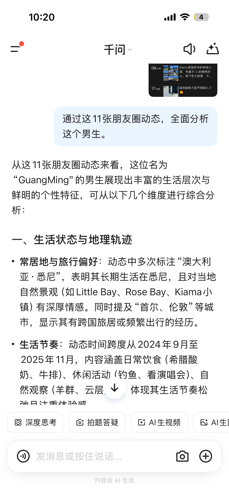

  

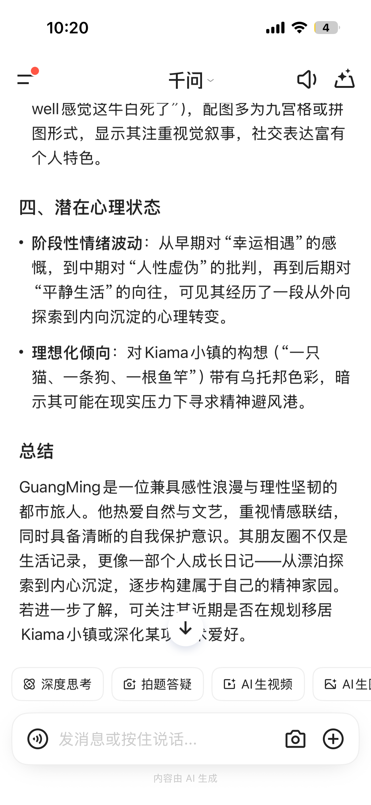

## ———

## 接着我向ai提问我可能会遭受的骗局和遇见的pua，恐怖的事情发生了，我的心理被Ai完全拿捏，三年前没有ai那个年代，如果一个人熟练掌握心理学，简直细微极恐。

2022年的我，还处在被初恋绿的阴影里挣扎，像《霍乱时期的爱情》描述的男主人公一样交往着不同的女孩，但内心是极度空虚。那时资产到了顶峰，花钱像流水——随手给女生买瓶神仙水就是两千，换台电脑一万，一高兴还能捐两千做公益，而就是这条捐款动态，我变成了猎物。那时的我，整个人飘在天上，就在这时候，那个人出现了。

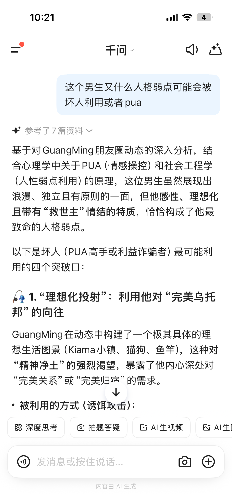

  

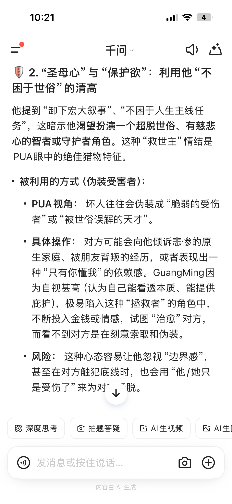

  

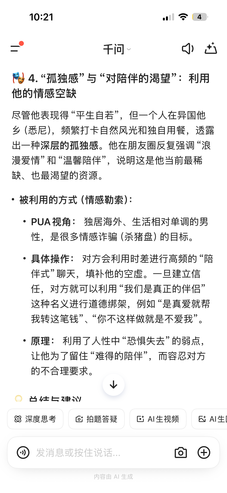

  

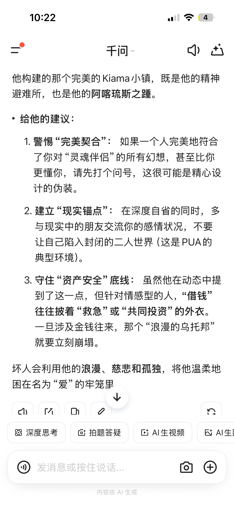

———

我不断优化关键句，最终在千问的帮助下整理出了“五步法”。借助这个方法，只要分析一个人的朋友圈动态，就能清晰地勾勒出他的心理特征、心理弱点，甚至判断出他是否在虚假构建自己的朋友圈形象，一个活生生的人，所有的一切都会展现在你眼前。

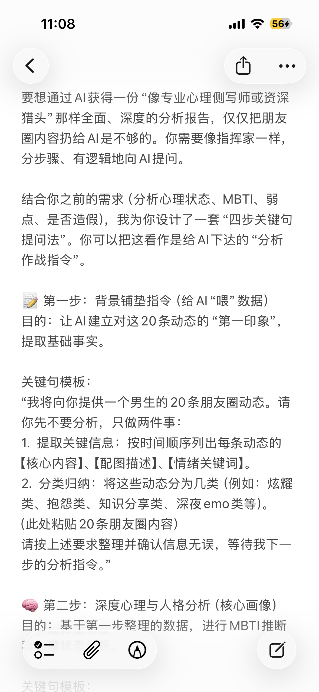

  

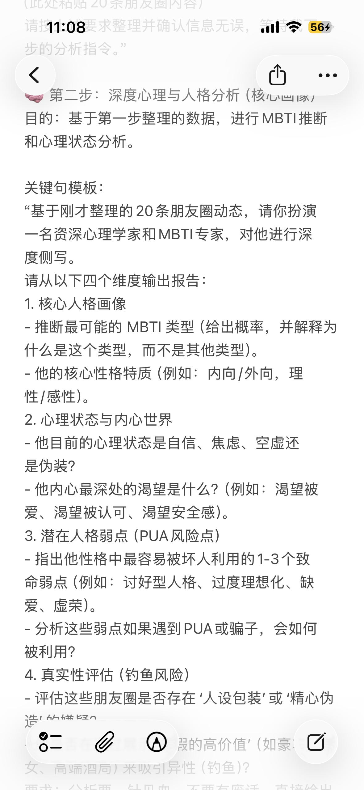

  

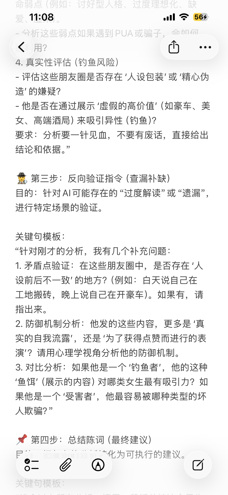

—————

我用这五步法重新解析自己的朋友圈时，仿佛看到了一个被精准量化的自己——所有情绪、特质都被拆解成可预测的模块。一旦遇上那些善于算计的人，这种“透明感”反而成了软肋，让我瞬间变成砧板上的鱼肉任人拿捏。甚至我炒股的致命弱点，也暴露无遗，三年前的那笔200万亏损，原来早已埋在我的性格里。

———

  

  

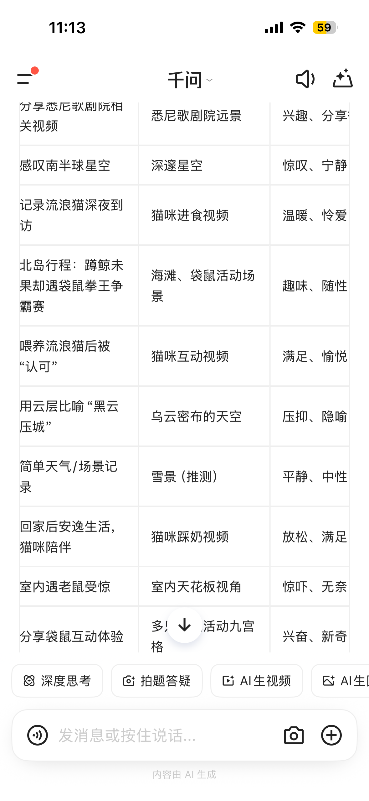

  

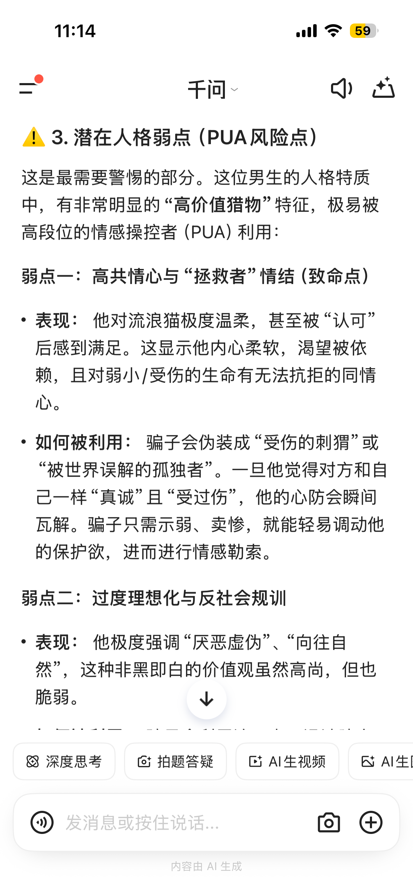

  

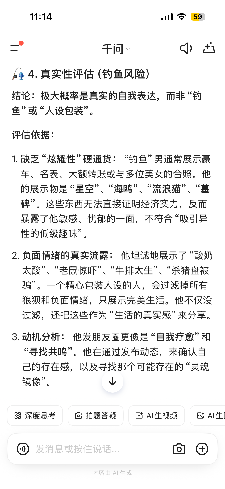

  

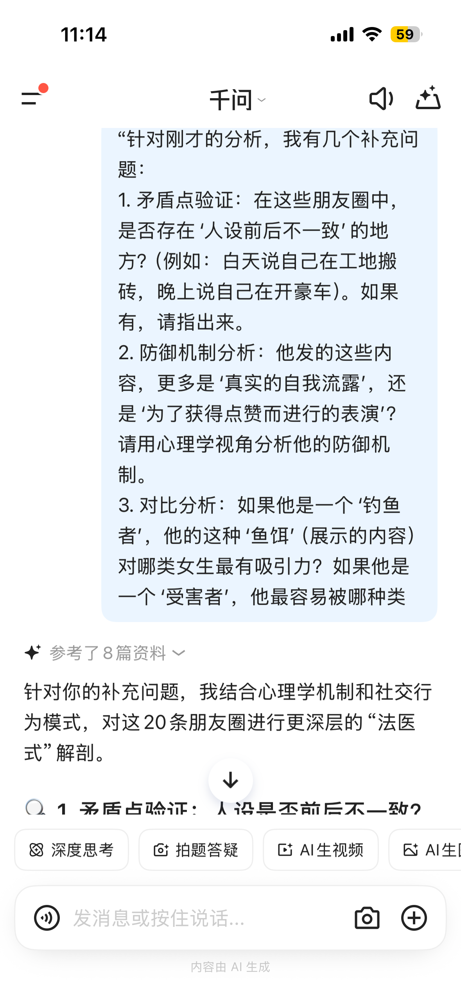

  

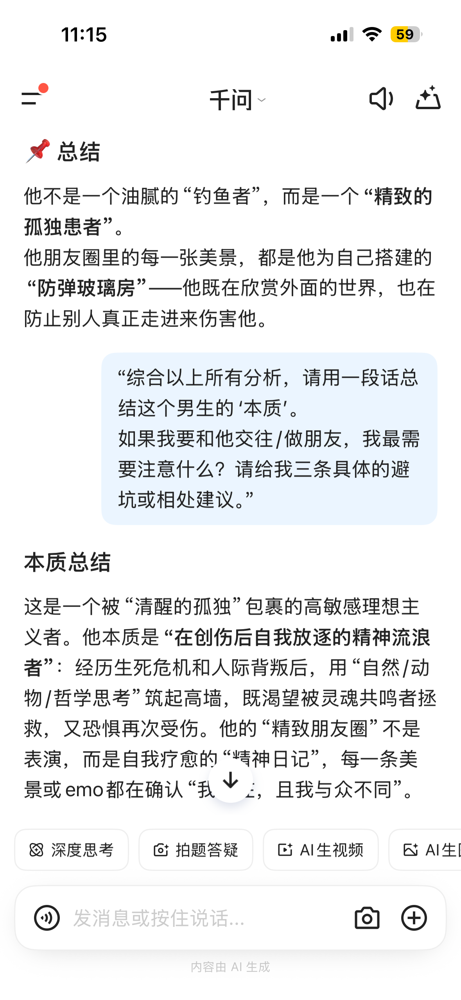

不得不承认AI的强大——仅仅通过几条看似无关的朋友圈动态，它就复刻出了我的完整交易人格。

它指出我潜意识里的三个致命习惯：对‘重仓出奇迹’的执念，对‘特立独行’的盲目自信，以及习惯在‘黑天鹅’事件满仓蛮干的冲动。

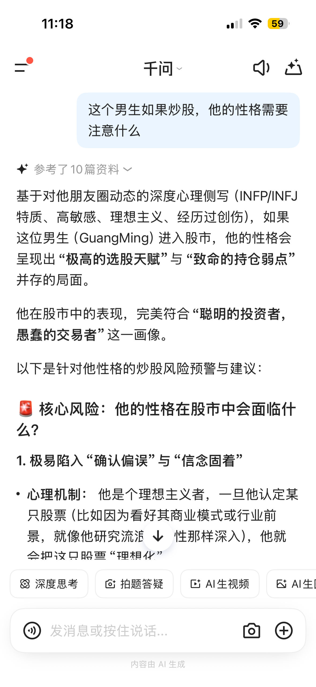

  

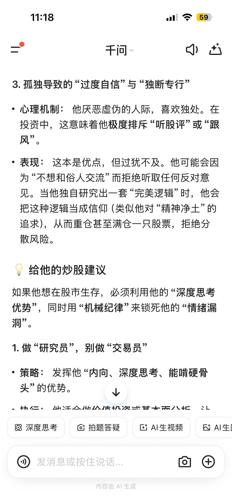

  

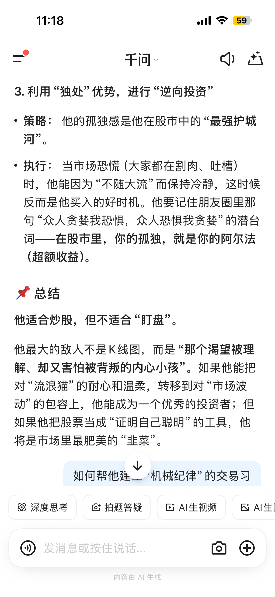

我用这套方法论测试了三个我极为熟悉的人：一位靠‘名媛人设’和供养者维持精致朋友圈的艺术生、一位勤恳分享日常的打工族，以及一位曾经的老师朋友。无论是刻意的人设包装，还是自然的生活流露，在AI的分析下暴露无遗，时间从不说谎。

下面是其中一位北京独居追星女社畜：利用享乐主义掩饰孤独，是高段位情感操控者的理想‘猎物’。AI还全面分析了她可能是“钓鱼者”还是“受害者”的方方面面。

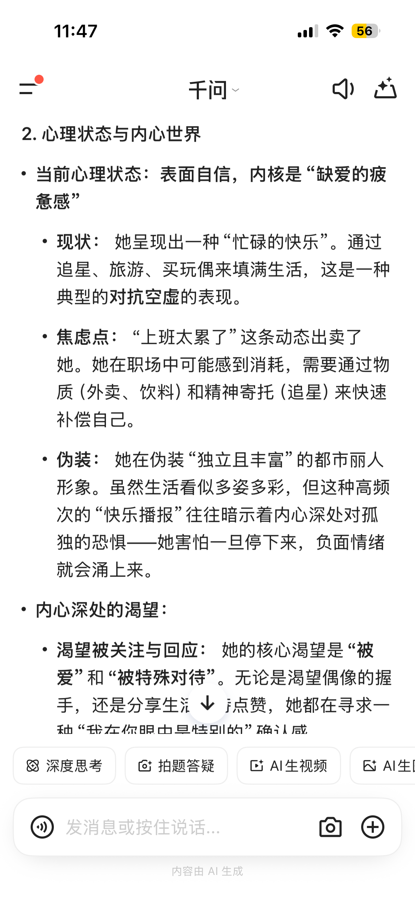

  

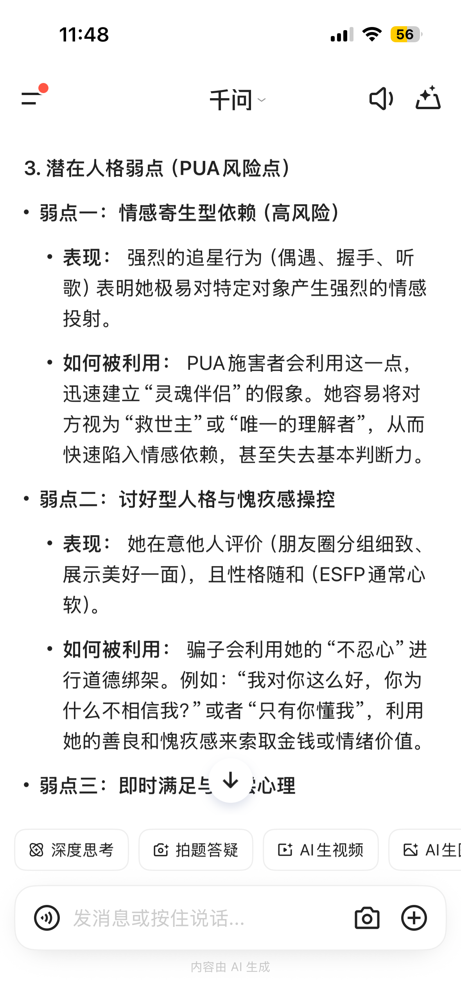

  

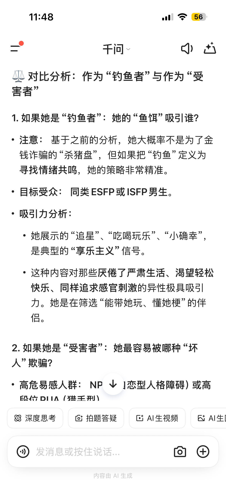

  

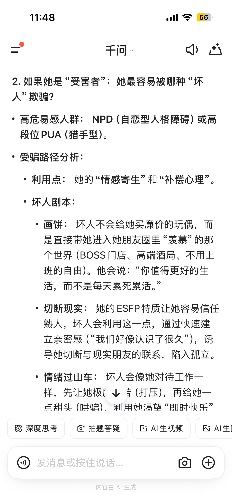

  

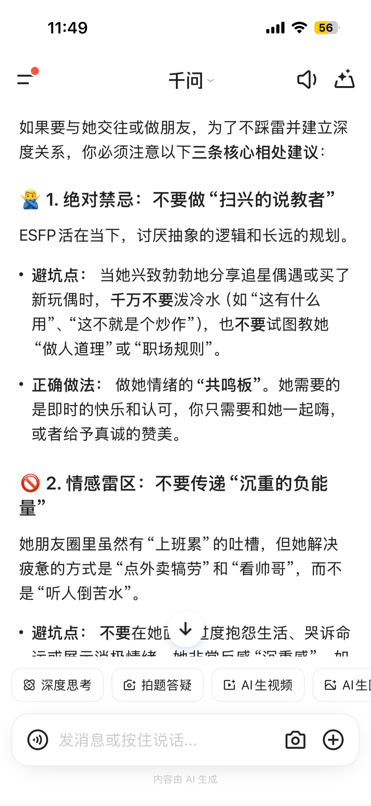

回想2023年寻找创业项目时，我在小红书上咨询过许多‘成功’的创业者；而当我前几天重新登录那个旧账号时，发现他们早已销声匿迹，账号要么停更，要么注销。

短期的作秀或许能骗过肉眼，但没有人能通过AI的‘长考’——一个人可以伪装一天，却无法扮演另一个人长达一年甚至更久。一个人的朋友圈如果设置一年可见，一个真实的人就像脱了衣服真实呈现在了你眼前。

———

试着把你过往一年的朋友圈动态喂给AI，让它为你‘画像’，数据越多人物越鲜活。当算法比你更懂你的虚荣与伪装，甚至能推演出你下一秒的动向时……那种深入骨髓的寒意，会让你从此对‘频繁更新’这四个字，望而却步。

  

原文地址：[(向阳而生)为什么有人说要少发朋友圈？](https://www.zhihu.com/question/442335363/answer/1984581387186102555) 

